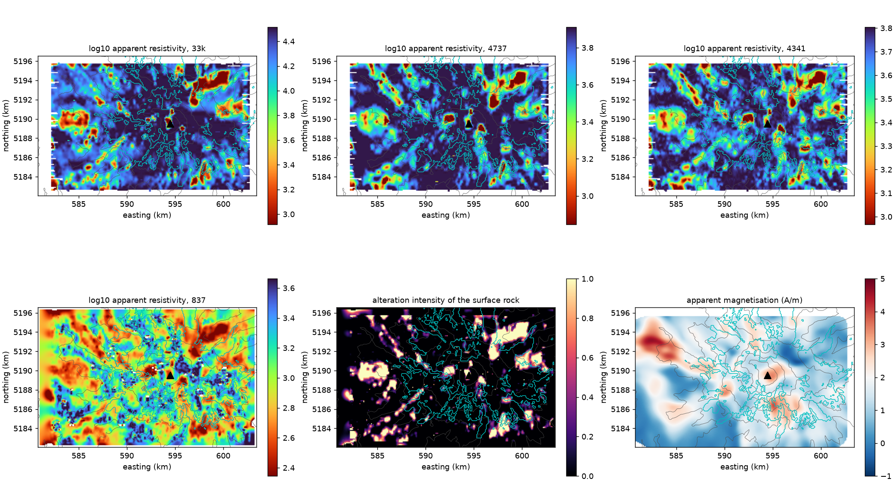
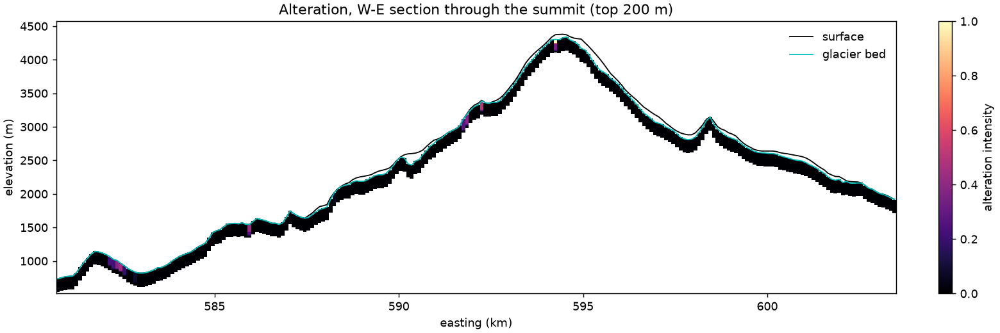

<!-- Pandoc Markdown. Citations [@key] resolve through docs/references.bib (pixi run bib). -->

# Near-surface hydrothermal alteration of Mount Rainier from the 1996 helicopter EM survey

**Script:** S22 (`scripts/22_alteration_finn2001.py`, `pixi run s22`). The code is in `src/rainier3d/alteration/`, and the thresholds are in `configs/units.yaml` under `geometry.alteration.finn_2001`.
**Products:** `data/processed/alteration_finn2001.zarr` (maps on the model surface grid, read by S3) and `outputs/grids/rainier3d_alteration_finn2001.nc` (3D, for download).
**Status of the numbers:** all come from `outputs/alteration/summary.json` and the runs described here, 24 September 2026.

## Summary

Finn, Sisson and Deszcz-Pan [-@finn_2001] mapped hydrothermally altered rock on Mount Rainier with a 1996 helicopter electromagnetic (EM) and magnetic survey [@rystrom_2000]. They found that appreciable thicknesses of mostly buried altered rock lie in the upper west flank, that little highly altered rock lies in the core, and that the exposed alteration follows an east–west dyke belt through the summit.

We reprocess the public survey grids into a near-surface alteration field for rainier3d. Clay-bearing altered rock is conductive, while fresh lava and ice are resistive. The field uses the apparent resistivity at four frequencies, each down to its own depth of investigation below the glacier bed, and it replaces the conduit-centred placeholder of the first model version.

Over the 126 km² of surveyed edifice lava, 10.6 km² reaches an intensity of 0.5 or more. That corresponds to about 1.4 km³ of equivalent fully altered rock in the top 200 m. On the model grid it is 1.9 km³, against 8.1 km³ for the placeholder. The surface alteration is concentrated east of the summit and around it (25% and 19% of the area at intensity ≥ 0.5) and is sparse on the west flank (8%). This agrees with the exposed east–west belt. It cannot see the buried west-flank alteration that Finn et al. modelled from the magnetics, which this version does not reproduce.

## 1. Data

| Grid | Content | Spacing | Source |
|---|---|---|---|
| `33k.gxf` | apparent resistivity, 33 kHz coplanar (log10 Ω·m) | 50 m | Rystrom et al. (2000) |
| `4737.gxf` | 4737 Hz coplanar (log10 Ω·m) | 50 m | same |
| `4341.gxf` | 4341 Hz coaxial (log10 Ω·m) | 50 m | same |
| `837.gxf` | 837 Hz coplanar (Ω·m) | 50 m | same |
| `rp.gxf` | total-field anomaly reduced to the pole (nT) | 62 m | same |
| `flight_line_mag.gxf` | flight elevation, DEM, total field | along lines | same |

The grids are in NAD27 / UTM 10N and are resampled to the model's WGS84 / UTM 10N. PROJ's NAD27 → WGS84 transformation is accurate to about 20 m, and the shift is about 95 m west and 200 m north. Median sensor clearance is 82 m.

**Georeferencing is checked, not assumed.** GDAL places the magnetic grid (`#SENSE -2`) with its origin at the top edge. The GXF header gives the lower edge, and reading it that way is confirmed by the data:

| Grid | Checked against | Correlation as read | Correlation if flipped north–south |
|---|---|---|---|
| Magnetic anomaly | high-passed topography | 0.60 | 0.08 |
| 33 kHz resistivity | ice thickness (ice is resistive) | 0.23 | 0.13 |
| 837 Hz resistivity | ice thickness | 0.16 | 0.07 |

## 2. Method

**Relative thresholds.** The survey saturates at a different resistivity at each frequency. The flight-line caps are 10^3.2 Ω·m at 837 Hz and 10^4.5 Ω·m at 33 kHz. So fresh rock reads about 10^3.0 Ω·m at 837 Hz but 10^4.35 Ω·m at 33 kHz, and a single absolute threshold marks half the edifice as altered. The reference for each frequency is instead the median over the surveyed edifice lavas, which are mostly fresh:

| Frequency | 33 kHz | 4737 Hz | 4341 Hz | 837 Hz |
|---|---|---|---|---|
| Fresh level L_f (log10 Ω·m) | 4.35 | 3.89 | 3.74 | 3.00 |

**Intensity.** a_f = clip((L_f − 0.3 − log10 ρ_a) / 0.7, 0, 1). Intensity starts at half the fresh resistivity and reaches 1 at a tenth of it.

**Depth.** Each frequency senses to a depth of investigation of 0.5 × skin depth (503 √(ρ_a/f) m), capped at 150 m, the depth the survey report gives for 837 Hz. The 3D field is

a(x, y, d) = max_f a_f · taper(d / doi_f),

where d is the depth below the glacier bed (the EM sounds the rock beneath the ice). The taper is 1 down to doi_f and falls linearly to 0 at 1.25 doi_f. The field is restricted to the edifice lavas and young volcanic rocks (model units 6 and 7) and is 0 outside the survey.

**Rock properties.** S4 applies the existing alteration factors: Vp × (1 − 0.30 a), Vs × (1 − 0.35 a), density × (1 − 0.12 a). These factors remain placeholders [@heap2021].

**Auxiliary magnetic map.** The terrain-correlated apparent magnetisation is a regression, in a 500 m Gaussian window, of the reduced-to-pole anomaly on the anomaly the local topography would produce if uniformly magnetised (1 A/m, vertical, harmonica prism forward model, at the flight elevation). It is published as a map, not used in the field. Over the whole survey the terrain explains the anomaly with correlation 0.70.

## 3. Results

| Area (edifice lavas within 6 km of the summit) | Mean intensity, surface | Share ≥ 0.5 | Median apparent magnetisation (A/m) |
|---|---|---|---|
| West flank (> 1.5 km west of the summit) | 0.08 | 8% | 1.56 |
| East flank (> 1.5 km east) | 0.27 | 25% | 1.33 |
| Summit (< 1.5 km) | 0.21 | 19% | 1.73 |





**Effect on the velocity model.** The field replaces the placeholder in S3, and S4 and S5 carry it into the fused model. With all 88 PNSN events relocated in each model (S14), the RMS is:

| Model | P (s) | S (s) |
|---|---|---|
| With the survey-based field | 0.093 | 0.190 |
| With the placeholder | 0.095 | 0.190 |

The velocity calibration of `configs/velocity_calibration.yaml` therefore stands. The fusion low-pass invariant stays at 0.011 (Vp) and 0.012 (Vs) in L1, and all tests pass.

## 4. What this version does and does not show

- **It maps alteration of the surface rock**, from tens of metres at 33 kHz to about 150 m at 837 Hz. Its east–west and summit concentration agrees with the exposed belt described by Finn et al. (2001).
- **It does not reproduce the buried alteration of the upper west flank.** Finn et al. inferred it from magnetic modelling constrained by geology. The terrain-correlated magnetisation cannot see altered rock beneath fresh cover: it gives 1.56 A/m on the west flank, against 1.33 on the east. The paper's thickness maps are needed to add it.
- **Other conductors.** Wet glacial debris, meltwater-saturated moraine and valley fill are also conductive. Restricting the field to the edifice lava units removes most valley fill but not moraine lying on those units, so some patches at glacier margins may not be alteration.
- **The thresholds are placeholders.** They are relative to each frequency (0.3 and 1 decade below the fresh level), not calibrated on altered-rock samples.

## 5. Products and access

| File | Content | Use |
|---|---|---|
| `rainier3d_alteration_finn2001.nc` | 3D alteration intensity, 100 m × 10 m, top 200 m below the bedrock surface; bedrock elevation; per-frequency resistivity and depth of investigation; apparent magnetisation (CF netCDF, UTM 10N, NAVD88) | the alteration model itself |
| `rainier3d_fused_250m.nc` | fused Vp, Vs, density, Qp, Qs and alteration, 250 m × 250 m | 3D tomography starting model |
| `rainier3d_fused_500m.nc`, `rainier3d_nll_500m.tar.gz`, `rainier3d_emc.nc` | the same at 500 m; NonLinLoc grids; EMC-style netCDF | ray tracing, location, model comparison |

The files are attached to the GitHub release `hydrothermal-alteration-em-v1`. In the 3D viewer, the surface layer "Hydrothermal alteration, surface rock" and the below-ground property "Hydrothermal alteration" show the field, and "Apparent magnetisation (terrain-correlated)" shows the magnetic map.

Reproduce with:

```bash
pixi run s22 && pixi run s3 && pixi run s4 && pixi run s5 && pixi run s9
pixi run s11 -- --layers alteration_surface,apparent_magnetization
```

## References

Cited keys in `docs/references.bib`: finn_2001, heap2021, rystrom_2000.
