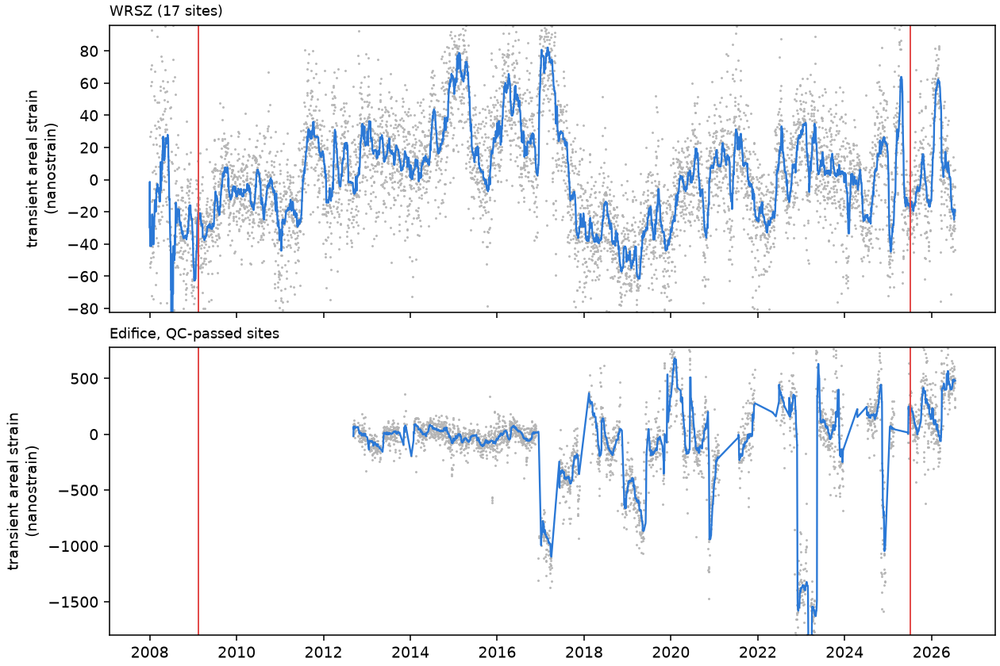

# GNSS surface strain and the edifice load (S17, S18)

**Result, as of 24 September 2026 (data frozen at `as_of` in `configs/gnss.yaml`):**
- **WRSZ.** The GNSS network resolves regional strain, and neither the 2009 nor the July 2025 summit swarm shows a strain transient above about 10 nanostrain.
- **Edifice.** The station network is too small and too snow-affected to resolve transients below a few hundred nanostrain. Its high sites also move inconsistently with PANGA's own velocities.
- **Edifice load.** Its stress is computed on the model grid, for comparison with the hydrothermal system and the magma body.

## Data (S17, `pixi run s17`)

- **Primary: PANGA.** Daily GIPSY positions (North-America-fixed) and the NA20 velocity field, from Central Washington University. There are 188 sites in the network box (124.0–119.8° W, 45.6–48.2° N); the series end on 18 July 2026.
- **Backup: UNR.** Nevada Geodetic Laboratory IGS20 North-America-fixed series for the 54 sites PANGA does not have. Another 20 sites both archives share are used to align the two frames.
- **Caching.** Every file is cached in `data/raw/gnss/`, and `manifest.csv` records its URL, retrieval time, size and SHA-256. Reruns read the cache; `--refresh` downloads again.
- **Totals.** 1,050,643 site-days in 256 series.

## Velocities and quality control (S18, `pixi run s18`)

- **Velocities.** Station velocities come from MIDAS (Blewitt et al., 2016). Steps come from the PANGA fit headers and the UNR steps database.
- **Frame alignment.** A translation + rotation fit of UNR onto PANGA over the 20 shared sites leaves a residual RMS of 0.10 mm/yr.
- **Quality control.** 22 of 203 sites are flagged: their MIDAS velocity differs by more than 1 mm/yr from PANGA's published velocity, or by more than 2.5 mm/yr from the median of neighbours within 40 km. They include the high edifice sites MUIR, CSHR, SNRS, PNHG and PNHR. PNHG moves at 44 mm/yr east, which is not tectonic. Flagged sites stay in `velocities.csv` with their flag and are left out of the strain fits.

## Secular strain rate

Uniform-strain fits to the MIDAS velocities of the sites around each region (region definitions in `configs/gnss.yaml`):

| Region | Sites | Dilatation (nanostrain/yr) | Maximum shear (nanostrain/yr) | Azimuth of e1 |
|---|---|---|---|---|
| WRSZ (polygon + 25 km) | 17 | −16.6 ± 3.5 | 11.1 | 136° |
| Edifice (within 25 km of the summit, QC-passed) | 6 | −27.9 ± 12.4 | 4.3 | 171° |
| Edifice, all sites including the flagged ones | 11 | +120.5 ± 11.8 | 61.2 | 103° |

The grid (`data/processed/gnss/strain_grid.nc`, 5 km, adaptive smoothing) gives −14.6 nanostrain/yr of dilatation at the summit cell, with a smoothing scale of 30 km because the flagged summit sites are excluded. The grid also carries the annual areal-strain amplitude and its peak day, the seasonal (hydrological loading) signal.

## Daily strain and the swarms

- **Method.** The daily uniform strain of each region's stations is fitted to trajectory residuals (trend, annual and semiannual terms, and steps removed per site), so stations joining or leaving do not shift it. Blue lines are 30-day medians; red lines mark the swarms.

| Region | Daily scatter (MAD) | 60-day change across 13 Feb 2009 | 60-day change across 8 Jul 2025 |
|---|---|---|---|
| WRSZ | 20 nanostrain | +6 nanostrain | +7 nanostrain |
| Edifice | 106 nanostrain | no QC-passed coverage | −166 nanostrain, within the 411-nanostrain scatter of the 30-day medians |

- **The edifice scatter.** Winter excursions of up to 1,500 nanostrain since 2017 come from the close-in high sites. With stations a few kilometres apart, a few millimetres of snow-related antenna error become about 1,000 nanostrain of apparent strain. Resolving edifice or magma-body strain needs more sensitive or denser instruments: the Longmire quartz tiltmeters (UW.LON9), borehole strain, or InSAR.

## Stress from the edifice load

- **Method.** Boussinesq point loads on an elastic half-space (`rainier3d.geodesy.load`; Johnson, 1985). The load is the edifice above the pre-volcanic surface of the geology model: 1,131 cells of 500 m, a weight of 2.34 × 10¹⁵ N, equivalent to 95 km³ of rock at 2,500 kg/m³, on a reference plane at 1,789 m.
- **Checks.** The solution passes two tests: the vertical force on a buried plane balances the load within 1%, and the stress field is in equilibrium off the axis.
- **Output.** `data/processed/edifice_load.zarr` holds the six stress components, the mean stress, the maximum shear and the principal stresses on the model levels L1–L3.
- **Under the summit:**

| Elevation (m) | Vertical stress (MPa) | Mean stress (MPa) | Maximum shear (MPa) |
|---|---|---|---|
| 0 | −38.5 | −18.7 | 15.2 |
| −2,000 | −24.0 | −9.4 | 11.2 |
| −5,000 | −13.0 | −4.4 | 6.6 |
| −11,500 (placeholder magma body centre) | −4.9 | −1.5 | 2.6 |

- **Limitations.** Homogeneous half-space; flat reference plane; ν = 0.25 and ρ = 2,500 kg/m³ are placeholders; points within 250 m of the plane are left out.
- **Scale comparison.** The secular geodetic strain rates correspond to stress rates of order 1 kPa/yr (µ ≈ 30 GPa × 3 × 10⁻⁸/yr), against a static load stress of 1–40 MPa.
