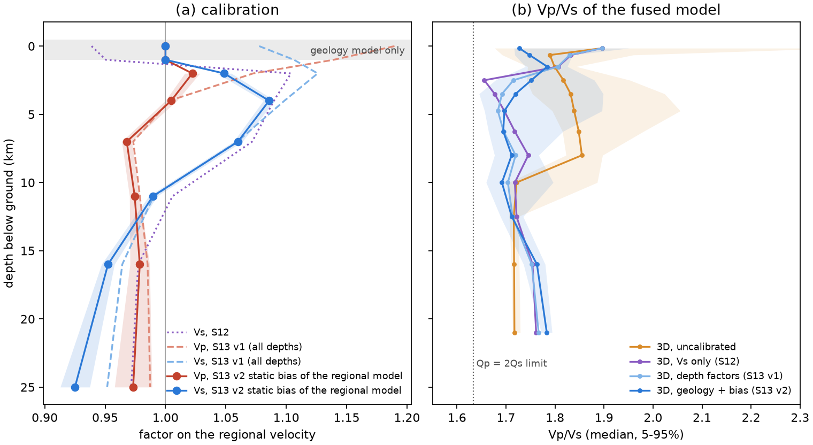
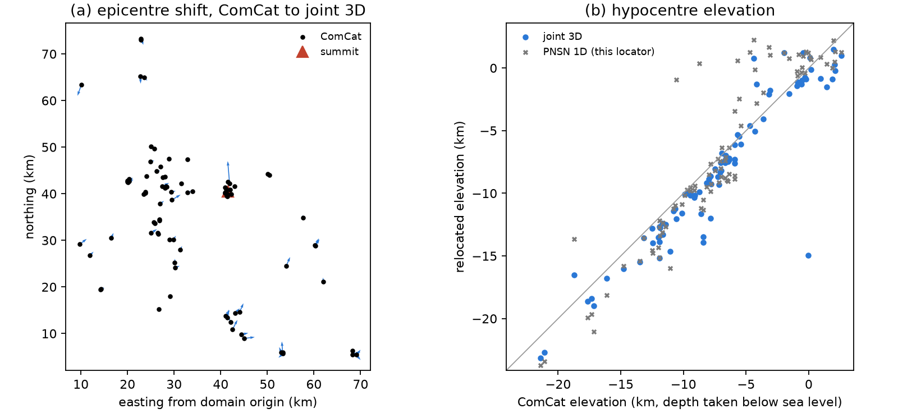

<!-- Pandoc Markdown. Citations [@key] resolve through docs/references.bib (pixi run bib), whose keys are the
     configs/sources.yaml keys. Every number below names the file or command it comes from. -->

# Fitting the geology model of rainier3d to PNSN arrivals with 3D relocation

**Scripts:** S13 (`scripts/13_joint_calibration.py`), S14 (`scripts/14_relocate.py`) and S16 (`scripts/16_relocation_figures.py`). The location and inversion code is in `src/rainier3d/validate/locate.py`. The model assembly that S5 and S13 share is in `src/rainier3d/fusion/build.py`.
**Result:** `configs/velocity_calibration.yaml`, version 2, dated 2026-09-24. S4 applies its `geology` block and S5 its `regional_bias` block. It supersedes the Vs-only calibration of S12 (`configs/vs_calibration.yaml`) and the first S13 run, which used depth factors (`configs/velocity_calibration_v1.yaml`).
**Model:** `data/processed/model.zarr`, rebuilt by S4 and S5; the same model is snapshotted as `data/processed/model_v2.zarr`.
**Status of the numbers:** all were produced by the runs described here on 24 September 2026. The exception is the NonLinLoc cross-check in Section 4.1, which comes from a separate session's record.

## Abstract

The rainier3d velocity model combines a geology model with the USGS Cascadia velocity model v1.7 [@cvm17_article] and CRESCENT Gen0 [@crescent_gen0]. The geology model is built from mapped units and a crack-closure law with placeholder parameters; the two regional models are "the baseline" below. A first calibration (S12) raised Vs by up to 10% at 2–7 km depth to fix a 0.36 s bias in S−P times. It pushed Vp/Vs to 1.60–1.67 at 2–4 km depth.

Here we fit the geology model itself to 1823 P and 1280 S analyst picks from 88 PNSN earthquakes. Every event is relocated in 3D in every trial model. Travel times honour the topography: slow air sits above the digital elevation model (DEM), and hypocentres are bounded below the ground. Three multipliers act on all rock units: zero-pressure Vp (V0), crack-closure pressure (P*) and Vs. A static, depth-dependent bias on the regional models below 1 km depth absorbs what the geology cannot. Hypocentres are removed from the update by parameter separation [@pavlis_booker_1980], and relocation and update alternate as in a minimum-1D-model iteration [@kissling_1994].

On held-out events, the RMS after relocation falls from 0.121 to 0.093 s for P and from 0.317 to 0.188 s for S. The data resolve V0 at ×1.31 ± 0.02. P* stays close to its placeholder, and rock Vs falls by 2.4 ± 1.2%. After calibration, the geology model and the bias-corrected regional model agree within 3.5% between 0.3 and 4 km depth. As a result, the fusion invariant that failed before calibration (0.032) and after the first calibration (0.050) now passes at 0.012. Median Vp/Vs at 2–4 km is 1.74. The calibration takes 26 minutes on a laptop.

## 1. Motivation

The rainier3d model is meant as a best-guess starting model: data gathered and made consistent now, to be refined later with more earthquakes and sensors. Any calibration of it should therefore act on physical parameters that later work can inherit and test, not on factors that only make the numbers fit. Three problems motivated this run.

1. **S12 held the ComCat hypocentres fixed.** S−P time scales as D(Vp/Vs − 1)/Vp, where D is the hypocentral distance. A hypocentre located in another velocity model can therefore be mistaken for a Vp/Vs error.
2. **The geology model was not fitted.** The first S13 run (Section 5.1) found that the data want Vp 7–19% faster in the top 2 km. It expressed this as a factor on the regional model, but the regional model does not control the top kilometre: the fusion keeps the geology model there. Compared with the regional model, the geology model was 21% slower in Vp at 0.3–1 km (Table 6, "before"). The shallow misfit therefore belongs to the geology model's crack-closure parameters, which are placeholders.
3. **The ray tracing ignored topography.** Air cells took the velocity of the rock below them, so rays could cross valleys and the air beneath peaks at rock speed, and four summit events were located above the ground.

## 2. Data

| Item | Value | Source |
|---|---|---|
| Events | 88 (ComCat, PNSN network `uw`, M 2.0–3.4, 2015-01-01 to 2026-09-01) | `configs/validation_events.csv`; one of the 89 events in the domain has fewer than 6 picks or 4 P picks and is excluded |
| Picks | 1823 P, 1280 S analyst picks | ComCat phase-data QuakeML, cached in `data/raw/pnsn/picks.csv` |
| Stations | 50 | EarthScope FDSN station service |
| Pick uncertainty | σ_P = 0.14 s, σ_S = 0.23 s | RMS of PNSN's own location residuals for the same picks (`outputs/pnsn_report.txt`, `rms_pnsn_reported`) |
| Topography | USGS 3DEP DEM on the model surface grid | `/surface/elevation` of `geomodel.zarr` |

Station elevations match the DEM to within ±70 m (median +5 m). M ≥ 2 events from 2025 alone number 15, too few for 15 parameters.

## 3. Method

### 3.1 Forward model

Each trial model is built by running S4 (`rainier3d.properties.assign`) and S5 (`rainier3d.fusion.build`) in memory. At zero calibration this reproduces `model_nocal.zarr` exactly on the travel-time grid (maximum relative difference 0), in 33 s.

The fused model is sampled on the S6 grid: 500 m spacing, 141 × 151 × 70 nodes, from 4.5 km above to 30 km below sea level. Cells more than one cell (500 m) above the DEM get the speed of sound in air (343 m/s). The one-cell skin keeps every station in rock.

Travel times come from pykonal's `PointSourceSolver` [@white_2020], one solve per station and phase, by reciprocity: 100 solves in about 50 s on 8 processes. Air handling was tested against the old rock-filled air on the first calibrated model: the station-mean residuals change by a median of 0.2 ms. The largest change, +0.13 s at station WPW, is a single S pick of one event whose location moved.

### 3.2 Location

Each event is located as in NonLinLoc [@lomax_2000]:

1. an L1 grid search over nodes at or below the DEM, within ±15 km horizontally of the catalogue epicentre;
2. Gauss-Newton refinement on trilinearly interpolated times, with a Huber loss at 1.5σ [@huber_1964], zero weight beyond 5σ, and a stiff penalty (1σ per 10 m) on hypocentres more than 50 m above the DEM.

### 3.3 Parameters

**Geology** (applied in S4 to all 11 rock units; ice and the unconsolidated deposits keep their table values):

| Parameter | Acts on | Prior sd |
|---|---|---|
| ln V0 | zero-pressure Vp of the crack-closure law V(P) = V∞ − (V∞ − V0) e^(−P/P*), capped at 0.98 V∞ | 0.3 |
| ln P* | crack-closure pressure | 0.7 |
| ln Vs | rock Vs after the Brocher (2005) conversion, i.e. a Vp/Vs shift [@brocher_2005] | 0.1 |

These multipliers preserve the unit contrasts. The sourced placeholder table `configs/petrophysics.csv` is not edited.

**Static bias of the baseline** (applied in S5 to CVM v1.7 and CRESCENT before fusion): log-factors on Vp and on Vs at 2, 4, 7, 11, 16 and 25 km below the ground, 12 parameters in all. They are fixed at 0 at 0 and 1 km, so the top kilometre belongs to the geology model alone.

### 3.4 Derivatives, separation and update

The derivatives are computed in two ways:

- **Geology parameters:** finite differences (h = 0.05) through the full S4 + S5 + eikonal chain, recomputed at every fitting iteration.
- **Regional bias:** ray integrals ∂T/∂m_k = −∫ τ φ_k s dl [@thurber_1983], with rays traced down the gradient of the station field. Against a finite difference through S4 + S5, they correlate at 0.96 with slope 0.80. The fusion clamp passes about 80% of a regional change to the fused model, which the iterations absorb.

For each event, the weighted rows are projected onto the null space of that event's hypocentre and origin-time partials [@pavlis_booker_1980].

Each Gauss-Newton step minimises the projected misfit plus three penalties:
- Gaussian priors on the geology parameters;
- second-difference smoothing on the bias, with weight λ_s;
- weak damping of the bias (0.01).

Both bias penalties are scaled by the mean diagonal of the bias block. Relocation and update alternate [@kissling_1994].

### 3.5 Validation

Events alternate between a fitting half and a held-out half in origin-time order. λ_s is chosen by the lowest linearised held-out misfit: 0.1, out of 0.01, 0.1, 1 and 10 (`lam_scan`). Held-out events are relocated in every iterate. After four iterations on the fitting half, two more run on all events, reusing the last geology derivatives.

## 4. Results

### 4.1 Checks

| Check | Result | Source |
|---|---|---|
| In-memory S4 + S5 against `model_nocal.zarr` | identical (max relative difference 0) | smoke test, this session |
| Refactored S5 against the previous S5 | bit-identical in vp, vs, rho, qs on L1–L3 | this session |
| Synthetic location, with and without the ground bound | within 100 m (250 m with the bound) | `tests/test_locate.py` |
| Σ_k ∂T/∂m_k = −T; ray time against r/v | exact; within 1% | `tests/test_locate.py` |
| Calibration hooks: rock-only multipliers, V0 cap, all three file versions | pass | `tests/test_calibration_build.py` |
| Ray time against field time | median relative difference 0.31% | `outputs/joint_calibration/history.json` |
| Rays closed by a straight segment (trapped at the air–rock interface) | 0–1 of about 3100 per iteration | same |
| pykonal against NonLinLoc Grid2Time, P, station OBSR, 85 events | mean 12 ms, RMS 31 ms | separate session record, not rerun |
| Full test suite after the rebuild | 50 passed | `pytest -q tests` |

### 4.2 Convergence and the geology parameters

**Table 1.** Iterations of S13 (`outputs/joint_calibration/history.json`). RMS in seconds after relocation.

| Run, iteration | P, fitting | P, held out | S, fitting | S, held out | ln V0 | ln P* | ln Vs |
|---|---|---|---|---|---|---|---|
| fitting half, 0 | 0.1242 | 0.1205 | 0.3143 | 0.3170 | 0 | 0 | 0 |
| fitting half, 1 | 0.0987 | 0.0938 | 0.1945 | 0.1892 | 0.131 | 0.268 | 0.017 |
| fitting half, 2 | 0.0974 | 0.0931 | 0.1924 | 0.1876 | 0.162 | 0.297 | 0.033 |
| fitting half, 3 | 0.0966 | 0.0922 | 0.1927 | 0.1877 | 0.267 | 0.403 | 0.016 |
| fitting half, 4 | 0.0969 | 0.0926 | 0.1922 | 0.1877 | 0.256 | 0.176 | −0.003 |
| all events, 2 (final) | 0.0945 | 0.0924 | 0.1897 | 0.1877 | 0.270 | −0.099 | −0.024 |

**Table 2.** Final geology multipliers (`configs/velocity_calibration.yaml`, `geology`). The sd is the linearised posterior, scaled by the reduced χ².

| Parameter | ln value | Multiplier | Posterior sd (ln) | Prior sd (ln) | Resolved? |
|---|---|---|---|---|---|
| V0 | 0.270 | ×1.31 | 0.018 | 0.3 | yes |
| P* | −0.099 | ×0.91 | 0.098 | 0.7 | weakly: it wandered from +0.40 to −0.10 while the misfit changed by less than 1 ms |
| Vs (rock) | −0.024 | ×0.976 | 0.012 | 0.1 | marginally (2σ) |

V0 is the parameter the data require. The placeholder rock is too slow near the surface. With V0 raised 31%, surface Vp becomes 3.7 km/s for Rainier andesite and 4.5 km/s for the Ohanapecosh Formation (Figure 4). P* trades off against the regional bias at 2 km and is not resolved; its placeholder value is kept within the uncertainty.

The multiplier is global, and that causes one visible problem. The Miocene plutons start at 4.5 km/s, so ×1.31 reaches the 0.98 V∞ cap (6.08 km/s) and makes them nearly uniform from the surface down. Fractured near-surface granodiorite is likely slower than that. Separate multipliers for volcanic, sedimentary and plutonic rocks need more stations on each; this is the first refinement to test with the 2025 node array.


### 4.3 The static bias of the baseline

**Table 3.** Factors on CVM v1.7 and CRESCENT (`regional_bias`), with the posterior sd of the log-factor. They are fixed at 1 at 0 and 1 km.

| Depth below ground (km) | 2 | 4 | 7 | 11 | 16 | 25 |
|---|---|---|---|---|---|---|
| Vp factor | 1.022 | 1.005 | 0.968 | 0.975 | 0.979 | 0.973 |
| Vp sd | 0.006 | 0.005 | 0.004 | 0.004 | 0.008 | 0.016 |
| Vs factor | 1.049 | 1.086 | 1.060 | 0.990 | 0.952 | 0.925 |
| Vs sd | 0.006 | 0.004 | 0.003 | 0.004 | 0.006 | 0.013 |

This is the correction the baseline needs to match the PNSN arrivals at Rainier, given our geology in the top kilometre:
- Vp within 3% at every depth;
- Vs 5–9% faster at 2–7 km;
- Vs 5–8% slower at 16–25 km.

The formal sds are small because they are conditional on the parameterisation. Only 30 of the 88 relocated events are deeper than 11 km below sea level and 8 deeper than 16 km, and the damping holds the 25 km knot.

**Table 4.** Mean ln(V_geology / V_regional) by depth below ground, over L1–L3 without ice. "After" compares the calibrated geology with the bias-corrected regional model. Sources: `model_nocal.zarr` and `model_v2.zarr`.

| Depth (km) | 0–0.3 | 0.3–1 | 1–2 | 2–3 | 3–4 | 4–6 | 6–8 | 8–10 |
|---|---|---|---|---|---|---|---|---|
| Vp, before | −0.055 | −0.238 | −0.151 | −0.090 | −0.080 | −0.004 | 0.036 | 0.007 |
| Vs, before | −0.073 | −0.234 | −0.094 | −0.001 | 0.023 | 0.093 | 0.118 | 0.079 |
| Vp, after | 0.192 | −0.035 | −0.010 | −0.013 | −0.025 | 0.032 | 0.074 | 0.041 |
| Vs, after | 0.265 | 0.004 | 0.031 | 0.014 | −0.013 | 0.019 | 0.041 | 0.034 |

Between 0.3 and 4 km, the two models now agree to within 3.5%. Below 4 km, the fusion takes the regional model's long wavelengths, so the geology's deeper values carry little weight. The one large disagreement left is the top 300 m: our rock is 21% faster in Vp and 30% faster in Vs than CVM v1.7, whose shallowest layer is a near-surface model with median Vs of about 206 m/s. The arrivals barely constrain the top 300 m. Section 5.3 proposes how to settle it.



### 4.4 Fit after relocation

**Table 5.** Every model scored the same way: all 88 events relocated in that model by S14, with topography and the ground bound (`outputs/relocation/<name>/stats.json`). Depth shift is relocated minus ComCat, positive deeper; σ_z is the median formal depth uncertainty.

| Model | P RMS (s) | S RMS (s) | Epicentre shift, median (m) | Depth shift, median (m) | σ_z (m) |
|---|---|---|---|---|---|
| PNSN 1D | 0.132 | 0.268 | 1157 | +511 | 642 |
| 3D, uncalibrated | 0.122 | 0.316 | 1285 | +257 | 647 |
| 3D, Vs only (S12)¹ | 0.102 | 0.190 | 847 | +306 | 451 |
| 3D, depth factors (S13 v1)¹ | 0.094 | 0.190 | 835 | +727 | 432 |
| 3D, geology + bias (S13 v2)¹ | 0.095 | 0.190 | 856 | +852 | 427 |

¹ Fitted on all of these events; Table 1 gives the held-out scores for S13 v2.

The v1 and v2 models fit equally well. They differ in where the correction sits: v1 scaled the regional model, v2 fits the geology. Only v2 satisfies the fusion invariant (Section 4.6) and leaves the geology unit contrasts in physical parameters.

With the catalogue hypocentres fixed (S6, `outputs/pnsn_report.txt`), the v2 model gives event-demeaned RMS of 0.132 s for P and 0.227 s for S. The PNSN 1D model gives 0.159 and 0.287 s. The station correlation between the 3D − 1D delay and the mean 1D residual is 0.67 for both phases. S6 scores a model with hypocentres located in another model, so Table 5 is the fair comparison.


### 4.5 Hypocentres and topography

**Table 6.** Relocation quality control (`docs/joint_calibration/relocation_qc.csv`, S16). "Above ground" counts events above the DEM interpolated at the epicentre; the location tolerates 50 m.

| Model | Events above ground | At grid top | Depth change > 5 km |
|---|---|---|---|
| PNSN 1D | 10 | 0 | 6 |
| 3D, uncalibrated | 1 | 0 | 0 |
| 3D, Vs only (S12) | 3 | 0 | 0 |
| 3D, depth factors (S13 v1) | 2 | 0 | 0 |
| 3D, geology + bias (S13 v2) | 2 | 0 | 0 |

The ground bound removes the grid-top solutions (1 to 5 per model without it). The relocated catalogue is `outputs/relocation/fused_joint/catalog.csv`, with formal uncertainties and the height above ground.



### 4.6 The fusion invariant and Vp/Vs

**Table 7.** RMS of LP(ln V) − LP(ln V_regional) below 1 km depth in L1 (0 to 4.4 km elevation); the tolerance is 0.03 (`tests/test_invariants.py::test_lowpass_matches_regional`). L2 and L3 stay below 0.005 for every model.

| Model | L1 Vp | L1 Vs | Test |
|---|---|---|---|
| Uncalibrated | 0.0316 | 0.0326 | fails |
| Vs only (S12) | 0.0314 | 0.0265 | fails (Vp) |
| Depth factors (S13 v1) | 0.0501 | 0.0436 | fails |
| Geology + bias (S13 v2) | **0.0115** | **0.0122** | passes |

Sources: `outputs/relocation/s5_nocal.log`, `outputs/vs_calibration/s5_cal.log`, `outputs/relocation/s5_joint.log`, `outputs/relocation/s5_v2.log`.

**Table 8.** Vp/Vs of the fused model by depth below ground (L1–L3, ice excluded).

| Model | Median, 1–10 km | 5th percentile | Median, 2–4 km | Cells < √(8/3) | Cells at the 1.6 floor |
|---|---|---|---|---|---|
| Uncalibrated | 1.817 | 1.753 | 1.825 | 943 | 0% |
| Vs only (S12) | 1.731 | 1.643 | 1.665 | 30,086 | 0.62% |
| Depth factors (S13 v1) | 1.747 | 1.666 | 1.707 | 16,796 | 0.38% |
| Geology + bias (S13 v2) | 1.760 | 1.679 | 1.740 | 11,738 | 0.26% |

The Qp = 2 Qs rule of the model implies a negative bulk quality factor below Vp/Vs = √(8/3). The cells affected fall to 11,738, from 30,086 with S12.

## 5. Discussion

### 5.1 What the first calibration taught

The first S13 run (`configs/velocity_calibration_v1.yaml`) put depth factors on the regional model at all depths and ignored topography. It answered the question S12 left open. Relocation alone leaves the uncalibrated model at 0.316 s S RMS, worse than the PNSN 1D model (0.268 s). The S−P misfit is therefore in the velocity model, not in the catalogue. That run also found Vp 7–19% too slow in the top 2 km, which pointed at the geology model and led to this version.

### 5.2 Physical reading

**Faster V0.** Raising V0 by 31% says the near-surface rock at Rainier is stiffer than the placeholder values, or has less crack porosity. Watters et al. [-@watters2000] measured rock-mass strength on Rainier and Hood lavas, and Heap and Violay [-@heap2021] review how porosity controls stiffness in volcanic rock; either can supply unit-specific V0 values to test against this factor in M3.

**Unresolved P\*.** P* is not resolved by P and S travel times from M ≥ 2 events: the rays spend little length in the 1–3 km where P* acts. Refraction or ambient-noise surface-wave data would constrain it.

**Vs bias of the baseline.** The pattern is +5–9% at 2–7 km and −5–8% at 16–25 km. Its effect is to lower Vp/Vs in the upper crust and raise it in the middle crust (Figure 1b, 1.78 at 20 km). A warm arc middle crust carries higher Vp/Vs than Brocher's Vp(Vs) relation applied to CRESCENT gives (1.72).

### 5.3 Proposal: static bias of the baseline models

For users of CVM v1.7 and CRESCENT at Mount Rainier, and for the model's authors, we propose Table 3 as a static correction of the baseline. It is a single depth profile per phase, fitted jointly with our geology to the PNSN arrivals.

The top 300 m is left open (Table 4). There, CVM v1.7's near-surface layer is 20–30% slower than our rock model. The arrivals constrain it only directly beneath the 50 stations. Two independent data sets can settle it:
- **Vs30 and near-surface Vs:** the node and fiber arrays and site measurements. If they side with CVM, the unconsolidated and weathered layers of the geology model need thickening, not the rock V0 lowering.
- **Receiver-side station terms**, estimated with a prior on their size.

### 5.4 Limitations

- **Station terms were not estimated.** Site effects beneath stations may partly project onto V0.
- **The geology multipliers are global.** Per-lithology multipliers need more stations on plutonic and sedimentary units (Section 4.2).
- **Resolution below 11 km is limited.** Only 30 events are deeper than 11 km and 8 deeper than 16 km (`outputs/relocation/fused_joint/catalog.csv`).
- **Environment hazard.** Every `pixi run` in this checkout reinstalls pykonal, which is built from its source distribution on this platform, and this crashed two runs. S13 was run with `.pixi/envs/default/bin/python` directly. A prebuilt wheel or a conda-forge package would remove the problem.

## 6. Reproducibility

```bash
PY=.pixi/envs/default/bin/python        # avoids a pixi re-sync during long runs (Section 5.4)
$PY scripts/13_joint_calibration.py --iterations 4    # 26.3 min, 10-core laptop, 64 GB
$PY scripts/04_properties.py && $PY scripts/05_fusion.py
$PY scripts/06_validate_pnsn.py && $PY -m pytest -q tests
$PY scripts/14_relocate.py --model data/processed/model.zarr --name fused_joint --skin 1   # 1.5 min per model
$PY scripts/14_relocate.py --model 1d --name pnsn1d --skin 1
$PY scripts/16_relocation_figures.py
pixi run bib
```

S13 needs no base model; it builds the uncalibrated model in memory. The S14 comparison models are the snapshots `model_nocal.zarr`, `model_vscal_20260924.zarr` (S12) and `model_joint_s13.zarr` (S13 v1). `--no-geology` in S13 reproduces the v1 parameterisation, with topography.

## References

The full list is in `docs/references.bib`. The keys cited here are: brocher_2005, crescent_gen0, cvm17_article, heap2021, huber_1964, kissling_1994, lomax_2000, pavlis_booker_1980, thurber_1983, watters2000, white_2020.
