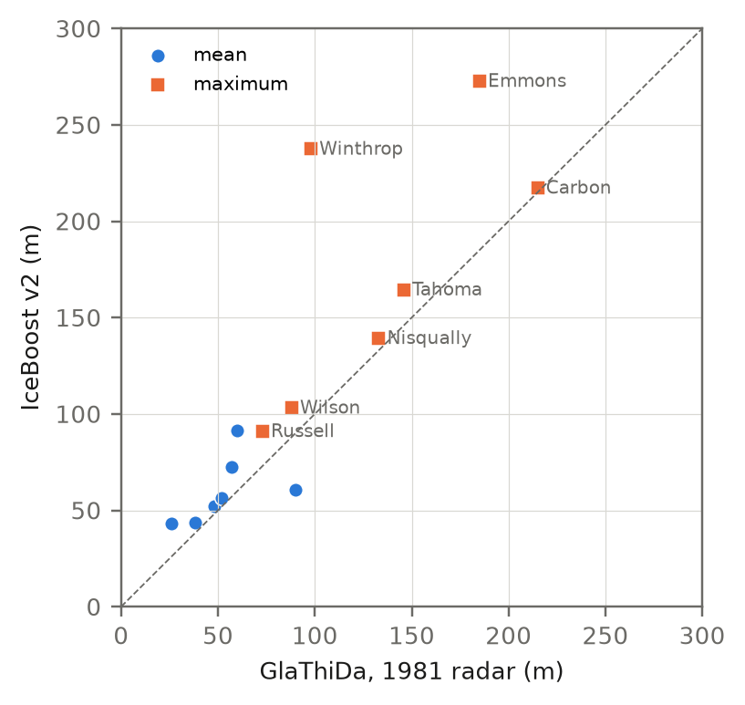
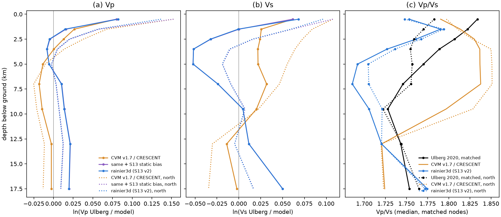
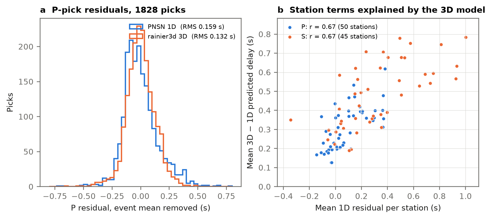
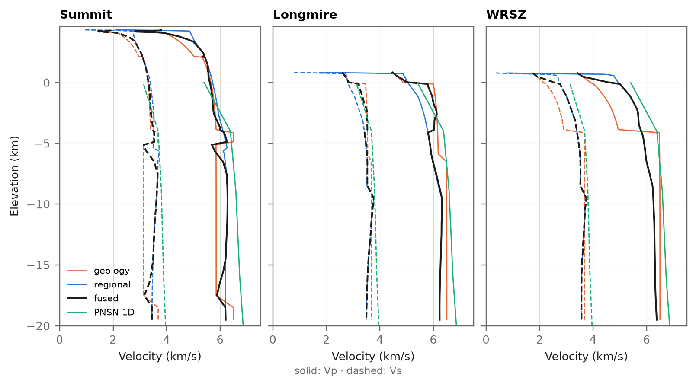
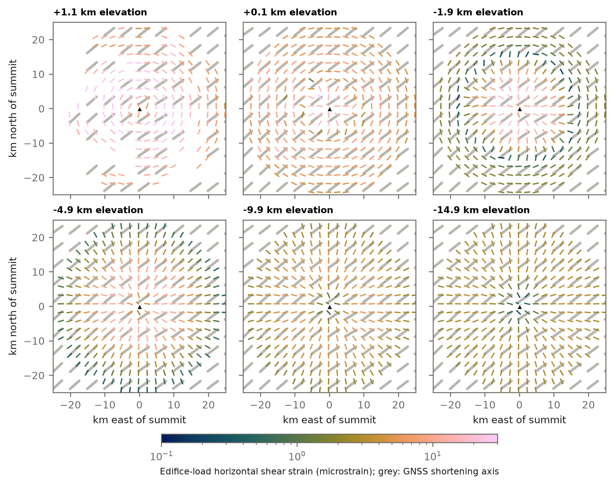

# Introduction {#sec:intro}

Mount Rainier is the most hazardous volcano in the Cascade Range, for two reasons. Its hydrothermally weakened edifice is covered by glaciers, and its lahars reach populated valleys [@hoblitt_1998; @scott_1995]. Seismic monitoring at Rainier relies on one-dimensional velocity models, with station corrections absorbing the effects of topography and near-surface structure. The regional three-dimensional models of Cascadia resolve the crust at wavelengths of several kilometres or more [@cvm17_article; @crescent_gen0]. They do not resolve the volcanic edifice, its altered core, its glaciers or the shallow units exposed around it.

rainier3d connects these scales in one model with three properties:
- it is tied to the mapped geology at the surface;
- it is consistent with regional tomography at depth;
- it reproduces the travel times of the Pacific Northwest Seismic Network (PNSN).

The same grids carry the surface layers that describe soil, water, vegetation and ice, the geodetic strain field, and the stress of the edifice load. The model is a digital model rather than a digital twin: it assimilates no time-dependent data. Only the GNSS product is refreshed on a schedule.

This paper describes, in order:

| Section | Content |
|-----|--------------------|
| [@sec:domain] | Domain and workflow |
| [@sec:data] | How the data are compiled deterministically, and how to rebuild them |
| [@sec:surface] | Surface layers |
| [@sec:subsurface] | Subsurface model, with its calibration and validation |
| [@sec:strain] | Strain and stress |
| [@sec:hydro] | Geohydrology |
| [@sec:mass] | Catalogue of mass movements |
| [@sec:access] | Access to the products |
| [@sec:limits] | Limitations |

: Outline of the paper. {#tbl:outline}

# Domain, grids and workflow {#sec:domain}

The model uses Universal Transverse Mercator zone 10N (EPSG:32610) coordinates, with elevation in metres above NAVD88 (EPSG:5703), positive up.
- **Model box.** Easting 553–623 km and northing 5149–5224 km: the geographic box 122.30–121.40° W, 46.50–47.15° N, projected and rounded outward to whole kilometres.
- **Summit.** Columbia Crest (4392 m) lies at easting 594.5 km, northing 5189.5 km.
- **Single source of the geometry.** All grids are derived from one configuration file (`configs/domain.yaml`), and the code never hard-codes bounds, spacing or coordinate system.

Properties are stored on three stacked regular grids whose spacing coarsens with depth ([@tbl:grids]). Cells above the ground carry no properties. The depth of each cell below the local ground surface is stored with it.

| Level | Elevation range (m) | Horizontal spacing (m) | Vertical spacing (m) | Cells (z × y × x) |
|---|---|---|---|---|
| Surface grid | – | 100 | – | 750 × 700 |
| L1 | 4400 to 0 | 250 | 50 | 88 × 300 × 280 |
| L2 | 0 to −6000 | 500 | 250 | 24 × 150 × 140 |
| L3 | −6000 to −20000 | 1000 | 1000 | 14 × 75 × 70 |

: Model grids. The master product is one xarray DataTree in Zarr v3 format (`model.zarr`) with one node per level and a surface node. {#tbl:grids}

The workflow is a sequence of numbered scripts, S0 to S23, each run as a task of one locked software environment (pixi). [@fig:workflow] shows how they connect:
- the model chain (S1–S5);
- the calibration loop, in which travel-time residuals update the rock-physics parameters and the regional correction (S13, S14);
- the checks and products that read the finished model.

The domain and its sensors are mapped in [@fig:map].

{#fig:workflow width=100%}

{#fig:map width=100%}

# A deterministic data compilation {#sec:data}

## Principles

The database is compiled by code, not by hand, following five rules.

1. **One registry.** `configs/sources.yaml` lists every data set and publication the model uses (78 entries). Each entry gives its DOI or service address, licence, the date and method of verification, and its role in the model. Every number in the configuration files names a registry key. A value chosen by the authors carries the key `m1_placeholder`, so the unsourced values can be listed and replaced. The bibliography of this paper is generated from the same registry (`pixi run bib`), with BibTeX keys equal to the registry keys.
2. **Original archives, cached.** Each stage downloads what it needs from the original archive, clipped to the model box where the service allows it. Examples are a window of a cloud-optimised GeoTIFF, an OPeNDAP subset, a feature-service query or a staged file. Each download is cached under `data/raw/<source>/`, and reruns read the cache. The GNSS stage also writes a manifest with the URL, retrieval time, size and SHA-256 of each file.
3. **A checksum for every cached file.** `scripts/00_data_manifest.py` records the size and SHA-256 of all cached files in the committed table `docs/data_manifest.csv` (2,065 files, 3.30 GB; [@tbl:raw]). `pixi run manifest -- --check` compares a rebuilt cache with it. Some services can return different bytes on a later request: ComCat can revise picks, and the USGS can re-stage NHDPlus. The check lists those files, so any difference between a rebuilt model and the published one can be traced to its input.
4. **One environment.** The software is pinned in `pixi.lock` for Linux and macOS (arm64). Two slim environments serve automation: `gnss` for the weekly strain refresh and `paper` for this report.
5. **Invariants.** The test suite checks the built model against rules that must hold whatever the data:
    - no properties above the ground;
    - Vp/Vs and density within physical bounds;
    - the long wavelengths of the fused model equal those of the regional model within a tolerance;
    - the surface unit matches the unit of the top model cell.

   Tolerances are fixed in the configuration and are not relaxed to make a run pass.

| Source folder | Stage | Content | Files | Size (MB) |
|------------|----|--------------------|----|-----|
| `dem` | S1 | USGS 3DEP 1 arc-second DEM, clipped | 1 | 59 |
| `geology` | S1, S24 | Washington 1:100,000 geology (GeMS) map units and faults; Quaternary faults | 3 | 5 |
| `glaciers` | S1 | IceBoost v2 per-glacier thickness, RGI 6.0 outlines, GlaThiDa | 222 | 44 |
| `ecology` | S2 | ETH canopy height 2020, NLCD 2021, clipped | 2 | 27 |
| `hydrology` | S2 | NHDPlus HR geodatabases (HU4 1703, 1708, 1711), two water-table grids | 7 | 924 |
| `imagery` | S2 | Sentinel-2 L2A median composite | 1 | 96 |
| `regional` | S5 | Cascadia velocity model v1.7, clipped | 1 | 60 |
| `pnsn` | S6, S13 | ComCat origins and phase picks (QuakeML) | 93 | 21 |
| `sensors` | S8 | FDSN station and channel metadata, GNSS sites | 2 | 1 |
| `gnss` | S17 | PANGA and UNR daily positions, velocity fields, manifest | 80 | 218 |
| `emc` | S21 | iMUSH tomography (EMC netCDF) | 1 | 5 |
| `rainier_aerogeophysics` | S22 | 1996 helicopter EM and magnetic grids | 8 | 19 |
| `wgs_landslides` | S24 | Washington landslide inventory: lidar-protocol deposits, recent landslides, compilation | 3 | 3 |
| `allstadt2017` | S24 | Seismically recorded mass movements, western United States (`Events.csv`) | 1 | 0.03 |
| `usgs_rainier_hazards` | S24 | Lahar hazard zones of 1998 (shapefiles) | 1 | 0.2 |
| `dem_3dep_1m` | S24 | 3DEP 1 m windows around landslide polygons; 3DEP source footprints | 1,639 | 1,818 |

: The raw input cache, from `docs/data_manifest.csv`. SOLUS100 soil thickness is read directly from its cloud-optimised GeoTIFFs and is not cached. {#tbl:raw}

Four inputs are not fetched by script:
- **Cascadia velocity model v1.7.** ScienceBase blocks scripted downloads with a captcha, so the files are downloaded by hand once.
- **CRESCENT Gen0.** The model file is read from a local copy of its figshare record [@crescent_gen0_data].
- **PNSN one-dimensional model.** The table is read from a local file.
- **Canopy-storage products.** The lidar canopy and soil-map products are delivered files ([@sec:surface-veg]).

The code names each of these paths, and their registry entries say how to obtain them.

## Rebuilding the database and the model

From a clean clone, the following commands download every input, rebuild the model and check the result. Stages that need credentials or delivered files skip those layers and say so.

```bash
git clone https://github.com/Denolle-Lab/mt-rainier-digital-model && cd mt-rainier-digital-model
pixi install                       # the locked environment
pixi run all                       # S1-S8: surface, layers, geology, rock physics, fusion, checks, figures
pixi run s2 -- --ma                # optional: the Ma et al. (2026) water table (~1 GB download)
pixi run s22 && pixi run s3 && pixi run s4 && pixi run s5   # alteration from the EM survey, then rebuild
pixi run s17 && pixi run s18       # GNSS positions, velocities, strain, edifice load
pixi run s25                       # mass movements and faults: catalogue, figure, viewer layers (~1.8 GB of 1 m windows)
pixi run s9                        # uniform grids for ray tracing and location
pixi run manifest -- --check       # compare the rebuilt cache with docs/data_manifest.csv
pixi run test                      # unit tests and the invariants of the built model
```

The calibration (S13, about 26 min on a 10-core laptop) and the relocation comparisons (S14) are rerun as described in `docs/joint_calibration.md`.

## Redistribution

The pipeline is published in full. Derived products are published unless a source forbids it.
- **Excluded products.** A variable whose provenance includes a source flagged `redistribute_derived: false` is left out of the downloadable archives.
- **Flagged sources.** Three sources carry the flag:
    - the Ma et al. (2026) water table, whose licence (CC-BY-NC-ND 4.0) forbids derivatives;
    - the lidar canopy products;
    - the soil-map image, whose licences are not documented.
- **Rebuilding the excluded layers.** Users rebuild them with their own access. Two open archives need a free login to download, NASA Earthdata for GEDI and the Copernicus Data Space for the Sentinel-2 leaf area index. Their derived layers are published.

`docs/data_policy.md` gives the tier of every source.

# Surface layers {#sec:surface}

## Elevation, geology and glaciers {#sec:surface-core}

Three surface layers set the top of every model column.

- **Elevation.** USGS 3D Elevation Program at 30 m, block-averaged to the 100 m surface grid. It ranges from 24 to 4380 m in the box.
- **Geology.** The Washington Geological Survey 1:100,000 surface geology in the GeMS format [@dnr_gems_100k].
    - All 149 map symbols present in the box are assigned to 14 surface model units by rules on the symbol, checked against each unit's full name in the map's Description of Map Units. Every cell receives a unit.
    - The rules are in `configs/units.yaml`, and the generated crosswalk is committed for review.
    - The park map of @fiske_1963 is carried as a georeferenced image for display.
- **Faults.** The same map gives 134 fault traces in the box (220 km), 106 of them high-angle dip-slip faults and 46 concealed. The Washington Quaternary fault layer adds four features [@dnr_quaternary_faults]: the Western Rainier and Goat Rocks seismic zones, drawn as geophysical lineaments, the Devils Dream reverse fault and an unnamed oblique reverse fault. Neither source gives a dip, and no fault section of the 2023 National Seismic Hazard Model lies in the box [@nshm23_fsd]; the nearest, the Olympia and Tacoma faults, are 17 and 28 km outside it. Faults are therefore mapped traces ([@fig:mass]a) and are not surfaces in the 3D model.
- **Glacier ice thickness.** IceBoost v2 per-glacier grids [@iceboost_v2] for the 219 glaciers of the Randolph Glacier Inventory 6.0 [@rgi60] whose centroids fall in the box, 97.3 km² in all. The grids are area-averaged onto the 100 m grid, and each glacier is rescaled so that its volume matches the IceBoost total for it. This removes an 18% overestimate from counting partly glacier-covered cells as full. The total is 5.50 km³, of which 5.32 km³ is on the cone.

The glacier bed is the ground elevation minus the ice thickness. Against the 1981 radar surveys of @driedger1986 as archived in GlaThiDa [@glathida], maximum thickness agrees for Carbon, Nisqually and Tahoma glaciers ([@fig:glaciers]). IceBoost is thicker on Emmons (273 vs 185 m) and Winthrop (237 vs 98 m) glaciers. Part of any difference reflects thinning since 1981 [@sisson2011].

{#fig:glaciers width=55%}

## Soil, water, land cover and imagery {#sec:surface-env}

Script S2 reads each source over the model box only, resamples it onto the 100 m grid and records its source ([@tbl:env], [@fig:surface]). Continuous layers are averaged over each cell; categorical layers take the most common class.

| Layer | Source | Native resolution | Median (5th–95th percentile) |
|---------|--------------------|-------|-----------|
| Soil thickness | SOLUS100 depth to a lithic contact [@solus100_article] | 100 m | 1.41 m (0.54–1.97 m) |
| Water-table depth | Random-forest estimate for the conterminous US [@ma2026_wtd_article] | about 24 m | 10.1 m (4.8–20.4 m) |
| Water-table depth | Global groundwater model [@fan2017_wtd] | 30″ (about 1 km) | 23 m (0–306 m) |
| Streams | NHDPlus High Resolution, 60,174 flowlines, Strahler orders 1–8, with mean annual flow [@nhdplus_hr] | 1:24,000 | – |
| Canopy height | ETH global canopy height 2020 [@eth_canopy_2020_article] | 10 m | 30 m (9–45 m) |
| Land cover | NLCD 2021 [@nlcd_2021] | 30 m | evergreen forest in 72.5% of cells |
| NDVI | Sentinel-2 L2A median composite, 1 August – 30 September 2025 [@sentinel2_l2a] | 20 m | 0.85 (0.26–0.92) |
| NDSI | same composite | 20 m | −0.48 (−0.60 to −0.24) |

: Environmental surface layers (S2); percentiles are over the cells of the box. {#tbl:env}

Notes on individual layers:

- **SOLUS100.** It predicts soil depth only to 2.01 m, so that value is read as "at least 2 m".
- **Sentinel-2 composite.** It uses the least-cloudy scenes (at most 25% cloud), up to six per Sentinel-2 tile, so that every part of the box is covered. The scene classification keeps vegetation, bare soil, water, snow and unclassified pixels, and the median is taken per pixel.
- **Reflectance offset.** Since processing baseline 04.00, Level-2A reflectance is stored with an offset of +1000 that the distribution services do not remove. The offset is removed before computing indices. Without the correction, median NDVI over this forest is 0.46 instead of 0.85.
- **Snow and ice.** NDSI above 0.4 covers 66 km² at the end of the 2025 melt season, against 97 km² of glacier in the Randolph inventory outlines (about 2000). The difference is consistent with debris-covered glacier tongues (Carbon, Emmons, Winthrop), which read as rock in NDSI, and with glacier retreat.

{#fig:surface width=100%}

## Vegetation structure {#sec:surface-veg}

Script S19 adds the vegetation products of the canopy-storage project (M. Köpfli, University of Washington) on the same grid ([@tbl:canopy], [@fig:canopy]). They describe the canopy that intercepts precipitation and loads the ground: height, cover, leaf and plant area, and aboveground biomass.

| Layer | Source | Native resolution | Median (5th–95th percentile) |
|---------|--------------------|-------|-----------|
| Canopy height | airborne lidar, digital surface minus terrain model | 10 m | 14.6 m (0.3–32.4 m), on 49% of the box |
| Vegetation cover | same lidar | 10 m | 0.88 (0.01–1.00), on 49% of the box |
| Leaf area index | Sentinel-2 L2A, SNAP biophysical processor, 1 July – 15 August 2023 [@sentinel2_lai_2023] | 10 m | 2.36 (0.40–3.68) |
| Plant area index | GEDI L2B, footprints gridded [@gedi_l2b] | 1 km | 2.72 (0.86–3.79) |
| Canopy height | GEDI L3, mean relative height 100 [@gedi_l3] | 1 km | 25.5 m (13.3–39.9 m) |
| Aboveground biomass | GEDI L4B, with standard error [@gedi_l4b] | 1 km | 198 Mg ha⁻¹ (58–436) |

: Vegetation layers (S19). The provenance of the lidar and of a soil-map image delivered with these products is undocumented; both are displayed in the 3D viewer and excluded from the downloadable products. {#tbl:canopy}

{#fig:canopy width=100%}

The two canopy heights differ by design. The lidar value is the mean of 10 m cells in each 100 m cell, including gaps, while the GEDI value is a 1 km mean of the tallest return per footprint. That is why the lidar median (14.6 m) is lower than the GEDI median (25.5 m) and the ETH median (30 m).

# Subsurface model {#sec:subsurface}

## Three-dimensional geology {#sec:geology}

Units are extended to depth by explicit column rules, in the manner of the San Francisco Bay region model [@aagaard2021]: the geology comes first and the velocity rules second. For a cell at elevation $z$ and depth $d$ below the ground, the rules of [@tbl:rules] are applied from the top down.

| Condition | Assigned unit |
|--------------------|--------------------|
| $d < 0$ | air |
| $d <$ ice thickness | ice |
| $d <$ ice + deposit thickness | mapped surface deposit |
| inside the edifice footprint, above the edifice base | Rainier andesite |
| young volcanic rocks, or andesite outside the footprint, within 300 m of the bedrock top | that cap unit |
| above the base of the bedrock unit | bedrock unit (mapped, or nearest mapped basement unit) |
| otherwise | middle crust |

: Column rules for the 3D units (S3; `configs/units.yaml`). {#tbl:rules}

- **Edifice.** The edifice footprint is the andesite and ice mapped within 12 km of the summit, closed over 500 m. Its base is the pre-volcanic surface: the elevations where basement rocks crop out around the footprint, interpolated linearly across it. The base lies at 804–2234 m over 252 km².
- **Basement.** Beneath the deposits and the edifice, the basement unit is taken from the nearest outcrop.
    - The supracrustal units (the Ohanapecosh, Fifes Peak and Stevens Ridge formations, the Eocene volcanic rocks and the Puget Group) extend to 4 km below sea level.
    - The Miocene plutons (Tatoosh, White River, Carbon River) extend to 10 km below sea level.
    - The Mashel Formation is capped at 300 m thickness.
- **Unconsolidated deposits.** They have fixed thicknesses: glacial drift 15 m, alluvium and colluvium 10 m, lahar deposits 15 m.
- **Magma body.** A slow body below the summit is an ellipsoid centred 11.5 km below sea level, with semi-axes of 5 km horizontally and 6.5 km vertically. It follows the low-Vp body imaged 5–18 km beneath the summit by @moran_1999.

## Hydrothermal alteration from the helicopter electromagnetic survey {#sec:alteration}

Clay-bearing altered rock is electrically conductive, while fresh lava and ice are resistive. The 1996 helicopter electromagnetic (EM) and magnetic survey of Rainier [@rystrom_2000] measured apparent resistivity at four frequencies (33 kHz, 4737 Hz, 4341 Hz and 837 Hz) on a 50 m grid. @finn_2001 used it to map collapse-prone altered zones. Script S22 turns these grids into an alteration field in three steps.

1. **Registration.** The grids are converted from NAD27 to the model datum. Their orientation is checked against the data, not assumed: the magnetic anomaly correlates with high-passed topography at 0.60 as read, and at 0.08 if flipped north–south.
2. **Intensity.** The survey saturates at a different resistivity at each frequency, so each frequency $f$ is referred to its own fresh level $L_f$. $L_f$ is the median log resistivity over the surveyed edifice lavas: 4.35, 3.89, 3.74 and 3.00 (log₁₀ Ω m). The intensity is
   $$a_f = \mathrm{clip}\!\left(\frac{L_f - 0.3 - \log_{10}\rho_a}{0.7},\,0,\,1\right),$$ {#eq:alteration}
   which starts at half the fresh resistivity and reaches 1 at a tenth of it.
3. **Depth.** Each frequency senses to a depth of investigation of half its skin depth, $503\sqrt{\rho_a/f}$ m, capped at 150 m. The three-dimensional field is the maximum over frequencies of $a_f$ tapered below that depth. Depth is measured below the glacier bed, and the field is restricted to the edifice lavas and young volcanic rocks.

Over the 126 km² of surveyed edifice lava, 10.6 km² reaches an intensity of 0.5 or more ([@fig:alteration]). That corresponds to 1.9 km³ of equivalent fully altered rock in the model grid. [@tbl:alteration] gives the distribution around the summit.

| Area (edifice lavas within 6 km of the summit) | Mean intensity at the surface | Share with intensity ≥ 0.5 |
|--------------|--------|--------|
| West flank | 0.08 | 8% |
| Summit (within 1.5 km) | 0.21 | 19% |
| East flank | 0.27 | 25% |

: Alteration of the surface rock from the EM survey (S22, `docs/alteration.md`). {#tbl:alteration}

The concentration east of and around the summit agrees with the exposed east–west belt of altered rock described by @finn_2001 and @john_2008. The EM field sees only the top ~150 m. It cannot see the altered rock buried beneath fresh cover on the upper west flank, which @finn_2001 inferred from magnetic modelling. The survey's terrain-correlated apparent magnetisation is published as a separate map.

{#fig:alteration width=100%}

## Rock physics {#sec:rockphysics}

Each rock unit receives a P-wave speed that increases with effective pressure as cracks close:
$$V_P(P) = V_\infty - (V_\infty - V_0)\, e^{-P/P^{*}}, \qquad P = (\rho_{b} - \rho_{w})\, g\, d,$$ {#eq:crack}
with bulk density $\rho_b$ = 2500 kg m⁻³, water density $\rho_w$ = 1000 kg m⁻³ (hydrostatic pore pressure) and $d$ the depth below the local ground.
- **Vp/Vs and density.** Where a unit has no ratio or density of its own, both follow @brocher_2005: the regression of Vs on Vp, and the Nafe–Drake density relation (valid for 1.5 < Vp < 8.5 km s⁻¹).
- **Attenuation.** $Q_S = 0.05\,V_S$ (Vs in m s⁻¹) and $Q_P = 2\,Q_S$.
- **Parameters.** [@tbl:units] lists the unit parameters, chosen within published ranges. The calibration of [@sec:calibration] scales them with three global multipliers. The contrasts between units therefore come from the table, and their overall level comes from the travel times.
- **Magma body.** Inside it, Vp, Vs and density are reduced by 10%, 15% and 3%.
- **Alteration.** The alteration intensity $a$ scales Vp by $(1 - 0.30a)$, Vs by $(1 - 0.35a)$ and density by $(1 - 0.12a)$, within the ranges reported for altered volcanic rock [@heap2021].

| Unit | V₀ (km s⁻¹) | V∞ (km s⁻¹) | P* (MPa) | Vp/Vs | Density (g cm⁻³) |
|---|---|---|---|---|---|
| Ice | 3.80 | 3.80 | – | 1.98 | 0.917 |
| Glacial drift | 1.60 | 2.40 | 5 | 2.50 | 1.95 |
| Alluvium, colluvium | 1.50 | 2.20 | 5 | 2.80 | 1.90 |
| Lahar deposits | 1.80 | 2.80 | 8 | 2.30 | 2.00 |
| Rainier andesite | 2.80 | 5.60 | 30 | Brocher | Nafe–Drake |
| Young volcanic rocks | 3.00 | 5.60 | 30 | Brocher | Nafe–Drake |
| Miocene intrusive rocks | 4.50 | 6.20 | 40 | Brocher | Nafe–Drake |
| Miocene volcanic rocks | 3.20 | 5.80 | 40 | Brocher | Nafe–Drake |
| Ohanapecosh Formation | 3.40 | 5.90 | 40 | Brocher | Nafe–Drake |
| Eocene volcanic rocks | 3.50 | 6.00 | 40 | Brocher | Nafe–Drake |
| Puget Group, Eocene sedimentary rocks | 2.60 | 5.20 | 40 | Brocher | Nafe–Drake |
| Mashel Formation | 2.20 | 4.50 | 30 | Brocher | Nafe–Drake |
| Russell Ranch Formation | 4.00 | 6.00 | 40 | Brocher | Nafe–Drake |
| Middle crust | 6.00 | 6.50 | 50 | Brocher | Nafe–Drake |

: Unit parameters of the crack-closure law (`configs/petrophysics.csv`). For the rock units (Rainier andesite to middle crust, and the magma body), the calibration multiplies V₀ by 1.31 (capped at 0.98 V∞), P* by 0.91 and Vs by 0.976. Ice and the unconsolidated deposits keep their table values. {#tbl:units}

## Fusion with the regional models {#sec:fusion}

**Regional models.** The regional model has two parts:
- **Down to 9.9 km below the ground:** the USGS Cascadia velocity model v1.7 [@cvm17_article], for Vp and Vs. Its depth axis is below the ground surface. For the shallow level this is confirmed by a median top-sample Vs of 206 m s⁻¹, and for the deeper level it is inferred from continuity.
- **Below 9.9 km:** CRESCENT Gen0 Vs [@crescent_gen0], with Vp from @brocher_2005.

Below 1 km, both are multiplied by a static, depth-dependent correction fitted to the PNSN arrivals ([@sec:calibration]). The corrected Vs is floored at Vp/1.6 [@christensen_1996].

**Strategy.** Neither model is right at every wavelength. The regional models resolve the crust at wavelengths of several kilometres and are constrained by teleseismic, ambient-noise and local-earthquake data; they carry no information on the mapped units. The geology model carries the mapped units and their contrasts, but its absolute level rests on laboratory-style rules. The fusion keeps each where it is informative: the regional model supplies the long wavelengths and the geology model the short ones. The combination is done in the logarithm of velocity, so contrasts are relative:
$$\ln V = \mathrm{LP}_{\lambda_c}\!\left(\ln V_{\mathrm{reg}}\right) + \left[\ln V_{\mathrm{geo}} - \mathrm{LP}_{\lambda_c}\!\left(\ln V_{\mathrm{geo}}\right)\right],$$ {#eq:fusion}
where LP is a horizontal Gaussian low-pass filter with half power at the cutoff wavelength $\lambda_c$, that is $\sigma = \sqrt{2\ln 2}\,\lambda_c / 2\pi$.

**Implementation details.**

1. **Fused quantities.** Vs and Vp/Vs are fused rather than Vp and Vs separately, so the fused Vp/Vs always lies between the two input ratios.
2. **Cutoff wavelength.** $\lambda_c$ grows with depth below the ground: 6 km at the surface, 10 km at 2 km, and 20 km from 10 km down. The values approximate the lateral resolution of the regional models.
3. **Air cells.** Cells above the ground are excluded from the filters by normalised convolution.
4. **Overshoot.** A Gaussian high-pass overshoots at sharp contrasts and puts fast rims around slow bodies. Six alternating projections remove them: each cell is clamped between its geology and regional values, then the regional low-pass is restored.
5. **Top kilometre.** The top 300 m keep the geology model unchanged, and a linear taper reaches the fused model at 1 km. The regional models do not resolve this depth range; their shallowest layer is a generic near-surface model.
6. **Density.** Density follows Vp through the ratio of Nafe–Drake densities, which preserves the density contrasts between units.

[@fig:fusion] shows the three models along a section through the summit. The fusion is checked by an invariant ([@tbl:invariant]): below 1 km depth, the low-passed fused model must equal the low-passed regional model within an RMS of 0.03 in ln V.

{#fig:fusion width=100%}

| Level | RMS of LP(ln V) − LP(ln V_reg), Vp | Same, Vs | Mean ln(V / V_reg), Vp | Same, Vs |
|---|---|---|---|---|
| L1 | 0.011 | 0.012 | +0.046 | +0.077 |
| L2 | 0.002 | 0.002 | +0.001 | +0.001 |
| L3 | 0.0006 | 0.0006 | 0.0002 | 0.0001 |

: Departure of the calibrated fused model from the corrected regional model at the regional wavelengths below 1 km depth, and mean offset over all cells (`outputs/fusion_report.csv`). The tolerance is 0.03. {#tbl:invariant}

## Calibration on P and S−P travel times {#sec:calibration}

**Data.** The data are the analyst picks of the 88 PNSN earthquakes with M ≥ 2 in the box between 2015 and 2026 that have at least six picks, four of them P. They comprise 1823 P and 1280 S picks at 50 stations, with origins and picks from the USGS ComCat catalogue [@comcat_uw]. The event list is committed (`configs/validation_events.csv`), so every run uses the same set. Picks are weighted by the RMS of PNSN's own location residuals: 0.14 s for P and 0.23 s for S.

**Travel times.** They are computed on a 500 m grid with pykonal's point-source solver [@white_2020], one solve per station and phase by reciprocity.
- **Solver accuracy.** Against analytic travel times on this grid, its RMS error is 8 ms in a uniform model and 11 ms with a velocity gradient; fteikpy gives 22 and 46 ms.
- **Topography.** Cells more than one cell above the ground carry the speed of sound in air, so rays follow the rock and cannot cut across valleys. The one-cell skin keeps every station in rock.
- **Cross-check.** For station OBSR, NonLinLoc's Grid2Time P times on the exported grids agree with the pykonal times to 12 ms on average (RMS 31 ms, 85 events).

**What is estimated.** Fifteen parameters $\boldsymbol\theta$ scale the two models that are fused, and the hypocentres and origin times of the 88 events are re-estimated in every model tried. The travel-time data therefore constrain the velocity parameters only through the part of the misfit that relocation cannot absorb. This avoids the circularity of scoring a model with catalogue hypocentres that were located in a 1D model with station corrections.

**Parameters.**
- **Rock physics (3).** Log-multipliers on three quantities shared by all rock units: the zero-pressure velocity V₀ and the crack-closure pressure P* of [@eq:crack], and Vs. The Vs multiplier acts at fixed Vp, so it is a change of Vp/Vs. Ice and unconsolidated deposits are not scaled.
- **Regional correction (12).** A static depth profile $m(d)$ of the log-factor that multiplies the regional velocity, $V_{\mathrm{reg}} \to V_{\mathrm{reg}}\,e^{m(d)}$, one profile for Vp and one for Vs. Here $d$ is depth below the ground. Each profile is piecewise linear between knots at 0, 1, 2, 4, 7, 11, 16 and 25 km and constant below 25 km. The values at 0 and 1 km are fixed at zero, because the fused model takes the top kilometre from the geology model ([@sec:fusion]); the six deeper values are free.

**Forward problem.** For a trial $\boldsymbol\theta$, the model is rebuilt from its inputs by the same code that builds the published model. At $\boldsymbol\theta = 0$ it returns the uncalibrated model cell for cell, which checks that the calibration fits the model that is delivered and not an approximation of it. The steps are:
1. Vp of every rock-unit cell from [@eq:crack] with the scaled V₀ and P*, and Vs from that Vp through the unit's Vp/Vs ratio, or the regression of @brocher_2005 where the unit has none, times the Vs multiplier;
2. the regional Vp and Vs multiplied by $e^{m(d)}$;
3. the fusion of [@eq:fusion], including the geology-only top 300 m and the taper to 1 km;
4. P and S travel times from every station on the 500 m grid, with air above the ground, as described under Travel times;
5. every event relocated in that model (see Relocation below).

**Objective.** With $t_{ij}$ the pick of phase at station $j$ for event $i$, $T_j$ the travel-time field, and $(\mathbf{x}_i, \tau_i)$ the hypocentre and origin time, the normalised residual is
$$r_{ij} = \frac{t_{ij} - \tau_i - T_j(\mathbf{x}_i;\boldsymbol\theta)}{\sigma_{\mathrm{ph}}},$$ {#eq:residual}
where $\sigma_{\mathrm{ph}}$ is the pick uncertainty of the pick's phase: $\sigma_P = 0.14$ s for P picks and $\sigma_S = 0.23$ s for S picks. The calibration minimises
$$\Phi(\boldsymbol\theta) = \sum_{ij} w_{ij}\, r_{ij}^2 + \boldsymbol\theta_g^{\mathsf T} \mathbf C_g^{-1} \boldsymbol\theta_g + \lambda_s \lVert \mathbf D \mathbf m \rVert^2 + \lambda_d \lVert \mathbf m \rVert^2,$$ {#eq:objective}
where the hypocentres minimise the first term for each $\boldsymbol\theta$. The weights $w_{ij}$ are the Huber weights of the relocation (threshold 1.5σ), so outlying picks count less. $\boldsymbol\theta_g$ holds the three rock-physics log-multipliers, with prior standard deviations of 0.3, 0.7 and 0.1 on the diagonal of $\mathbf C_g$ (factors of 1.35, 2 and 1.1). $\mathbf m$ holds the regional log-factors at all eight knots, with the two fixed at zero, and $\mathbf D$ takes second differences along depth. The smoothing weight $\lambda_s$ and the damping weight $\lambda_d = 0.01$ are relative: both are multiplied by the mean diagonal of the data term for the regional parameters.

**Update.** Each iteration linearises the residuals about the current model and hypocentres, $\mathbf r(\boldsymbol\theta + \delta\boldsymbol\theta) \approx \mathbf r - \mathbf G\,\delta\boldsymbol\theta$, with $\mathbf G = \partial \mathbf T / \partial \boldsymbol\theta$ scaled like the residuals.
- **Separating hypocentres from velocity.** For each event, the columns $\mathbf H_i$ of partials with respect to $(\mathbf x_i, \tau_i)$ are formed at its current location. The event's rows of $\mathbf G$ and $\mathbf r$ are projected onto the orthogonal complement of $\mathbf H_i$, through a QR factorisation of $\mathbf H_i$ [@pavlis_booker_1980]. What remains is the part of the misfit that no shift of that hypocentre can remove. Events with five or fewer usable picks keep at most one degree of freedom after the projection and are left out of the update.
- **Step.** With the projected $\tilde{\mathbf G}$, $\tilde{\mathbf r}$ and the regularisation matrix $\mathbf L$ of [@eq:objective],
$$\boldsymbol\theta \leftarrow \boldsymbol\theta + \left(\tilde{\mathbf G}^{\mathsf T}\tilde{\mathbf G} + \mathbf L\right)^{-1}\left(\tilde{\mathbf G}^{\mathsf T}\tilde{\mathbf r} - \mathbf L\,\boldsymbol\theta\right).$$ {#eq:gn}
- **Relocation.** Every event is then relocated in the updated model before the next linearisation, so velocity and hypocentres are updated in alternation, as in the minimum one-dimensional model of @kissling_1994. Relocation is a grid search over nodes at or below the ground, within 15 km of the catalogue epicentre, on the sum of |r| with the median origin time, followed by Huber Gauss–Newton [@huber_1964] on interpolated travel times with a penalty on hypocentres more than 50 m above the ground. It follows the grid-search-then-refine design of NonLinLoc [@lomax_2000].

**Derivatives.**
- **Rock physics.** A rock-physics multiplier changes every rock-unit cell, and its effect passes through the fusion filters, so its column of $\mathbf G$ is a one-sided finite difference ($h = 0.05$ in log) through the whole forward problem, with the hypocentres held fixed. That costs one full rebuild and eikonal solution per parameter, and it is recomputed at every iteration on the fitting half.
- **Regional correction.** For knot $k$ the derivative is the ray integral
$$\frac{\partial T}{\partial m_k} = -\int_{\mathrm{ray}} \beta(d)\, \phi_k(d)\, s\, \mathrm d\ell,$$ {#eq:raykernel}
where $s$ is slowness, $\phi_k$ the linear interpolation weight of knot $k$ at depth $d$, and $\beta(d)$ the share of the regional model in the fused model: 0 above 300 m, rising linearly to 1 at 1 km. Rays are traced down the gradient of each station's travel-time field [@thurber_1983]. The integral assumes that a depth-only factor on the regional model passes through the fusion unchanged. The low-pass filter of [@eq:fusion] passes a factor that varies slowly across the box, but the clamping of fused values between the two input models is not linear, and is the likely cause of the difference below. Against a finite difference through the full forward problem, for the Vs knot at 4 km over all 1280 S picks, the ray derivatives correlate at 0.96 with a slope of 0.80: they underestimate the sensitivity by about 20%. The residuals are always evaluated with the full forward problem, so this error does not bias the data fit. At convergence it acts, to first order, like regularising the regional correction about 20% more weakly than $\lambda_s$ and $\lambda_d$ state.

**Validation and choice of smoothing.** Events alternate between a fitting half and a held-out half in origin-time order, and held-out events are relocated in every iterate, so their misfit is an independent score. At the first iteration, $\lambda_s$ is chosen from 0.01, 0.1, 1 and 10 by the normalised RMS of the held-out separated residuals predicted by the linearised step: 0.720, 0.719, 0.733 and 0.778. The adopted value is 0.1.

**Iterations and uncertainties.** Four iterations on the fitting half are followed by two on all events, which reuse the last rock-physics derivatives ([@tbl:iterations]); the run takes about 26 min on a 10-core laptop. Posterior standard deviations are the square roots of the diagonal of $(\tilde{\mathbf G}^{\mathsf T}\tilde{\mathbf G} + \mathbf L)^{-1}$ at the last iteration, multiplied by the mean reduced χ² of the two phases (0.46 for P, 0.68 for S). They are linearised. They do not include the error of the ray derivatives, or the trade-off with hypocentres beyond what the projection removes.

| Iteration | P, fitting (s) | P, held out (s) | S, fitting (s) | S, held out (s) | ln V₀ | ln P* | ln Vs |
|---|---|---|---|---|---|---|---|
| 0 (uncalibrated) | 0.124 | 0.121 | 0.314 | 0.317 | 0 | 0 | 0 |
| 1 | 0.099 | 0.094 | 0.195 | 0.189 | 0.131 | 0.268 | 0.017 |
| 2 | 0.097 | 0.093 | 0.192 | 0.188 | 0.162 | 0.297 | 0.033 |
| 3 | 0.097 | 0.092 | 0.193 | 0.188 | 0.267 | 0.403 | 0.016 |
| 4 | 0.097 | 0.093 | 0.192 | 0.188 | 0.256 | 0.176 | −0.003 |
| final (all events) | 0.095 | 0.092 | 0.190 | 0.188 | 0.270 | −0.099 | −0.024 |

: Gauss–Newton iterations of the calibration (S13, `outputs/joint_calibration/history.json`): RMS after relocation and the geology parameters. Most of the misfit reduction happens in the first iteration. {#tbl:iterations}

The fit is resolved as follows ([@tbl:multipliers], [@tbl:bias], [@fig:calibration], [@fig:law]).

- **V₀.** It is the parameter the data require: ×1.31 ± 0.02. The table rock is too slow near the surface. With the multiplier, surface Vp is 3.7 km s⁻¹ for Rainier andesite and 4.5 km s⁻¹ for the Ohanapecosh Formation. Because the multiplier is global, the Miocene plutons reach the cap of 0.98 V∞ and are nearly uniform from the surface down.
- **P\*.** It is not resolved: its log-multiplier ranged from +0.40 to −0.10 across the iterations while the misfit changed by less than 1 ms, and it trades off against the regional correction at 2 km.
- **Rock Vs.** It falls by 2.4 ± 1.2%.
- **Regional correction.** It changes Vp by less than 3.5% at every depth. It makes Vs 5–9% faster at 2–7 km and 5–8% slower at 16–25 km, which lowers Vp/Vs at 2–4 km depth from 1.83 to 1.74.
- **Agreement between the two models.** After calibration, the geology model and the corrected regional model agree to within 3.5% between 0.3 and 4 km depth. Uncalibrated, they differ by up to 24%, and the fusion invariant exceeds its tolerance in L1 (0.032).

| Parameter | Multiplier | Posterior s.d. (ln) | Resolved |
|-----------|------|------|------|
| V₀, zero-pressure Vp | 1.31 | 0.018 | yes |
| P*, crack-closure pressure | 0.91 | 0.098 | no |
| Vs of rock units | 0.976 | 0.012 | marginally |

: Geology multipliers (`configs/velocity_calibration.yaml`, block `geology`). Posterior standard deviations are linearised and scaled by the reduced χ². {#tbl:multipliers}

| Depth below ground (km) | 2 | 4 | 7 | 11 | 16 | 25 |
|---|---|---|---|---|---|---|
| Factor on regional Vp | 1.022 | 1.005 | 0.968 | 0.975 | 0.979 | 0.973 |
| Factor on regional Vs | 1.049 | 1.086 | 1.060 | 0.990 | 0.952 | 0.925 |

: Static correction of the regional models (block `regional_bias`). Formal standard deviations of the log-factors are 0.003–0.016. The deepest knots rest on few rays: 30 events are deeper than 11 km and 8 deeper than 16 km. {#tbl:bias}

![(a) Static correction of the regional Vp and Vs (solid, ±1 standard deviation). The dashed and dotted lines are the two alternative parameterisations of [@tbl:models]. The grey band is the geology-only zone. (b) Median and 5–95% range of Vp/Vs of the fused model against depth below ground.](figures/fig10_calibration.png){#fig:calibration width=100%}

{#fig:law width=100%}

**Why this parameterisation.** Two simpler parameterisations were tested against the same data ([@tbl:models]).
- **Vs-only depth factor, catalogue hypocentres fixed.** It fits S as well as the adopted model, but pushes Vp/Vs to 1.60–1.67 at 2–4 km. That is low for crustal rock and lower still than expected beneath a volcano with a hydrothermal system: the S−P misfit of fixed hypocentres is partly a location error.
- **Depth factors on the regional Vp and Vs at all depths, with relocation.** It fits as well as the adopted model, but places the correction in the regional model where the fusion does not use it. It requires Vp 7–19% faster in the top 2 km, where the fused model follows the geology, and it breaks the fusion invariant (0.050).
- **Adopted parameterisation.** Fitting the geology's rock physics and correcting the regional model only below 1 km fits equally well, satisfies the invariant (0.011 for Vp, 0.012 for Vs) and keeps the unit contrasts in physical parameters.

**Alteration and the calibration.** The calibration was run with a conduit-centred alteration field. Replacing it with the EM-based field of [@sec:alteration] changes the relocated RMS from 0.095 to 0.093 s for P and leaves S at 0.190 s, so the calibrated parameters are kept.

## Validation {#sec:validation}

**Held-out events.** On the 44 events not used in the fit, relocated in each model, the RMS falls from 0.121 to 0.093 s for P and from 0.317 to 0.188 s for S. The fitting half ends at 0.097 and 0.192 s, so the fit does not overfit.

**All models scored the same way.** [@tbl:models] relocates all 88 events in each model with the same locator and topography. Relocation alone does not rescue the uncalibrated three-dimensional model: its S residuals stay larger than those of the 1D model. The S−P misfit therefore lies in the velocity model, not in the catalogue hypocentres. With the ground bound, no event is placed at the top of the grid, and two of the 88 events end within 50 m above the ground.

| Model | P RMS (s) | S RMS (s) | Epicentre shift from ComCat, median (m) | Depth shift, median (m) |
|------------------|----|----|------|------|
| PNSN 1D | 0.132 | 0.268 | 1157 | +511 |
| 3D, uncalibrated | 0.122 | 0.316 | 1285 | +257 |
| 3D, Vs-only depth factor¹ | 0.102 | 0.190 | 847 | +306 |
| 3D, depth factors on regional Vp and Vs¹ | 0.094 | 0.190 | 835 | +727 |
| 3D, geology multipliers and regional correction (adopted)¹ | 0.095 | 0.190 | 856 | +852 |

: Residuals after relocating all 88 events in each model (S14, `outputs/relocation/<model>/stats.json`). Depth shifts are relocated minus ComCat, positive deeper. ¹ Fitted on these events; the held-out scores are the fair measure. {#tbl:models}

{#fig:residuals width=100%}

**Independent tomography.** The iMUSH project imaged Vp and Vs around Mount St. Helens from local earthquakes and explosions recorded by a 70-station array [@ulberg_2020_article; @ulberg_2020].
- **Coverage.** Its grid spans the whole model box. Its Vp is resolved over 82–90% of the box. Its Vs is resolved over 83–93% of the southern strip (south of 46.65° N) but only 11–19% of the northern half. Script S21 samples our models at its 51,300 resolved nodes below ground.
- **Beneath Rainier, north of 46.75° N ([@tbl:imush]).** The iMUSH model finds the Cascadia model's Vs 5–8% too slow at 1–8 km and 3–4% too fast at 11–20 km, the shape of [@tbl:bias]. With the correction, the difference in Vs is 2% or less below 2 km. Vp/Vs moves from 1.83–1.85 towards the iMUSH value of 1.75–1.77; at 4–8 km our Vp/Vs (1.705) is about 0.05 below it.
- **South of 46.65° N, inside the iMUSH array.** The iMUSH Vs is within 1–2% of the Cascadia model at 1–6 km, and the correction makes our Vs 5–7% too fast. The correction is therefore local to Rainier.
- **Independence.** Both studies use PNSN arrivals from 2015–2016. The iMUSH-only stations and explosions make the comparison largely independent in the south, less so in the north.

| Depth below ground (km) | 1–2 | 2–3 | 3–4 | 4–6 | 6–8 | 11–15 | 15–20 |
|---|---|---|---|---|---|---|---|
| Vs, regional as distributed | +0.084 | +0.073 | +0.064 | +0.055 | +0.046 | −0.030 | −0.035 |
| Vs, regional with the correction | +0.061 | +0.016 | −0.010 | −0.019 | −0.009 | −0.005 | +0.017 |
| Vp/Vs, iMUSH | 1.770 | 1.759 | 1.754 | 1.757 | 1.755 | 1.744 | 1.765 |
| Vp/Vs, regional | 1.810 | 1.828 | 1.850 | 1.851 | 1.851 | 1.720 | 1.723 |
| Vp/Vs, rainier3d | 1.794 | 1.767 | 1.736 | 1.705 | 1.705 | 1.720 | 1.772 |

: North of 46.75° N: mean ln(V~iMUSH~/V~model~) for Vs and median Vp/Vs (S21, `outputs/model_comparison/ulberg2020_by_depth.csv`). {#tbl:imush}

{#fig:imush width=100%}

**Catalogue hypocentres.** At the ComCat hypocentres, which were located in a 1D model, the three-dimensional model predicts later arrivals than the 1D model at every station: by 0.30 s on average for P and 0.48 s for S. With each event's mean residual removed, the RMS is 0.132 s (P) and 0.227 s (S) for the 3D model, against 0.159 and 0.287 s for the 1D model. The per-station 3D − 1D delay correlates with the mean 1D residual at 0.67 for both phases ([@fig:pnsn]). The 3D structure therefore explains part of what station corrections absorb.

{#fig:pnsn width=100%}

## The fused model {#sec:fused}

[@fig:sectionA; @fig:sectionB] show the fused model along two sections through the summit, and [@fig:profiles] compares vertical profiles.

- **The top kilometre.** L1 is on average 5% faster in Vp and 8% faster in Vs than the regional model. The calibrated rock is stiffer than the shallowest layer of the Cascadia model, a generic near-surface model with a median Vs of 206 m s⁻¹. The travel times constrain this difference only beneath the stations.
- **Plutons.** The Miocene plutons stand out as fast columns to 10 km below sea level.
- **Puget Group.** The Puget Group block west of the summit is slow down to 4 km below sea level.
- **Seismicity.** Summit earthquakes form a column from the edifice to about 3 km below sea level. WRSZ earthquakes concentrate 4–12 km below sea level, 12–18 km west of the summit.
- **Magma body.** The slow body at 7–10 km below sea level is largely removed by the fusion, because neither regional model holds a slow body there at the wavelengths they resolve. Whether a body of the size imaged by @moran_1999 and @pang_2025 belongs in the model is a question for data that resolve it.

{#fig:sectionA width=92%}

{#fig:sectionB width=100%}

{#fig:profiles width=100%}

# Geodetic strain and stress at depth {#sec:strain}

## GNSS data and velocities

Daily GNSS positions come from two archives:
- **PANGA.** The Pacific Northwest Geodetic Array (Central Washington University) is the regional analysis centre [@panga_gnss]: 188 sites in a network box of 124.0–119.8° W, 45.6–48.2° N, in its North-America-fixed frame.
- **UNR.** The Nevada Geodetic Laboratory's IGS20 North-America-fixed series fill in 54 sites that PANGA lacks [@unr_ngl_gnss].

Together they give 1,050,643 site-days in 256 series.
- **Frame alignment.** Twenty sites that both archives process align UNR to PANGA by a translation and rotation fit, with a residual RMS of 0.10 mm yr⁻¹.
- **Velocities.** Station velocities come from MIDAS [@blewitt_2016_midas]. Equipment steps are taken from the PANGA fit headers and the UNR steps database.
- **Quality control.** Sites are flagged when their velocity differs by more than 1 mm yr⁻¹ from PANGA's published velocity, or by more than 2.5 mm yr⁻¹ from the median of neighbours within 40 km. This flags 22 of 203 sites. They include the high edifice sites MUIR, CSHR, SNRS, PNHG and PNHR; PNHG moves 44 mm yr⁻¹ east, which is not tectonic. Flagged sites are kept in the product with their flag and left out of the strain fits.

The data are fetched again every week, and the products are recomputed ([@sec:access]). The numbers below are for the series ending on 1 September 2026, which are frozen in `configs/gnss.yaml`.

## Strain rate

The horizontal strain-rate tensor $\dot\varepsilon_{ij}$ is estimated from the velocities.
- **Grid.** On a 5 km grid, it comes from a velocity-gradient fit with adaptive Gaussian weights [@shen_2015_strain]. The smoothing scale grows until the summed weight and the number of stations reach their minimums.
- **Regions.** For the two regions of interest it is a uniform-strain fit to the stations around them.

The reported components are the dilatation $\dot\varepsilon_{xx} + \dot\varepsilon_{yy}$, the maximum shear $\sqrt{(\dot\varepsilon_{xx}-\dot\varepsilon_{yy})^2/4 + \dot\varepsilon_{xy}^2}$, the principal rates and their azimuth, the rotation and the second invariant. The grid also carries the amplitude and peak day of the annual areal strain, the seasonal signal of hydrological loading.

| Region | Sites | Dilatation (nanostrain yr⁻¹) | Maximum shear (nanostrain yr⁻¹) | Azimuth of $\dot\varepsilon_1$ |
|--------------|---|------|-----|-----|
| WRSZ (polygon + 25 km) | 17 | −16.6 ± 3.5 | 11.1 | 136° |
| Edifice (within 25 km of the summit, quality-controlled) | 6 | −27.9 ± 12.4 | 4.3 | 171° |
| Edifice, all sites | 11 | +120.5 ± 11.8 | 61.2 | 103° |

: Secular strain rates from uniform-strain fits to MIDAS velocities (S18, `outputs/gnss/summary.json`). {#tbl:strain}

Both regions contract at a few tens of nanostrain per year ([@tbl:strain], [@fig:strain]a), as the rest of the model box does (median −19 nanostrain yr⁻¹). The edifice result depends on quality control: with the flagged summit sites included, it changes sign. On the grid, the summit cell has a dilatation rate of −14.6 nanostrain yr⁻¹ at a smoothing scale of 30 km, because the flagged summit sites are excluded. The annual areal-strain amplitude has a median of 15 nanostrain over the box (5–95%: 4–39), peaking in late August.

## Daily strain and the summit swarms

The daily uniform strain of each region's stations is fitted to trajectory residuals, with trend, annual and semiannual terms and steps removed per site. Stations joining or leaving the network therefore do not shift the series ([@fig:strainseries]). Across the two summit swarms, the 60-day changes are small ([@tbl:swarms]).

| Region | Daily scatter (MAD) | 13 February 2009 swarm | 8 July 2025 swarm |
|---|---|---|---|
| WRSZ | 20 | +6 | +7 |
| Edifice | 106 | no quality-controlled coverage | −166, inside the 411-nanostrain scatter of the 30-day medians |

: Median absolute deviation (MAD) of the daily strain and 60-day change in areal strain across the summit swarms, in nanostrain (S18). {#tbl:swarms}

Neither swarm shows a transient above about 10 nanostrain in the WRSZ. On the edifice, winter excursions of up to 1500 nanostrain come from the close-spaced high sites. With stations a few kilometres apart, a few millimetres of snow-related antenna error become about 1000 nanostrain of apparent strain. Resolving strain of the edifice or of a magma body needs other instruments: tiltmeters, borehole strainmeters or interferometric synthetic-aperture radar.

{#fig:strainseries width=100%}

## Stress from the edifice load

The weight of the edifice is a static load on the crust beneath it.
- **Load.** The edifice is taken as everything above the pre-volcanic surface of the geology model. It is represented by Boussinesq point loads on an elastic half-space [@johnson_1985]: 1131 cells of 500 m, with a total weight of 2.34 × 10¹⁵ N (95 km³ of rock at 2500 kg m⁻³) on a reference plane at 1789 m.
- **Output.** The six stress components, the mean stress, the maximum shear and the principal stresses are computed on the model levels L1–L3.
- **Checks.** The vertical force on a buried plane balances the load within 1%, and the stress field is in equilibrium away from the axis.

| Elevation (m) | Vertical stress (MPa) | Mean stress (MPa) | Maximum shear (MPa) |
|---|---|---|---|
| 0 | −38.5 | −18.7 | 15.2 |
| −2000 | −24.0 | −9.4 | 11.2 |
| −5000 | −13.0 | −4.4 | 6.6 |
| −11,500 (magma-body centre) | −4.9 | −1.5 | 2.6 |

: Stress from the edifice load beneath the summit (compression negative; S18, `edifice_load.zarr`). {#tbl:load}

The load stress decays from tens of megapascals beneath the summit to a few megapascals at the depth of the magma body ([@tbl:load], [@fig:strain]b). That is three to four orders of magnitude above the tectonic stress rate implied by the geodetic strain rates (about 1 kPa yr⁻¹ for a shear modulus of 30 GPa and 3 × 10⁻⁸ yr⁻¹). The load stress therefore sets the orientation of stresses in the upper crust beneath the edifice. The model is a homogeneous half-space with a flat reference plane, and its Poisson's ratio (0.25) and density (2500 kg m⁻³) are author choices.

{#fig:strain width=100%}

## Strain in the model volume {#sec:strain3d}

Script S25 puts two strain fields on the 500 m × 250 m grid of the three-dimensional viewer, from the surface
to 20 km below sea level. Both are written with the axes of maximum shortening, so that they can be compared
with the fast directions of shear-wave splitting.

**Tectonic strain rate at depth.** GNSS constrains the horizontal strain rate at the surface only. The
horizontal tensor of [@tbl:strain] is carried down unchanged through the elastic upper crust. The vertical
component follows from plane stress, $\dot\varepsilon_{zz} = -\nu/(1-\nu)\,(\dot\varepsilon_{xx}+\dot\varepsilon_{yy})$,
with $\nu = 0.25$. Both steps are assumptions, not observations. The tensor is then resolved on vertical
planes parallel to the WRSZ. The zone's strike, N174°E, is the long axis of its 1294 epicentres (elongation
3.1).

At 5 km below sea level inside the WRSZ polygon:

| Quantity | Value |
|---|---|
| Axis of maximum shortening | N48°E |
| Maximum shear strain rate | 10.4 nanostrain yr⁻¹ |
| Right-lateral shear strain rate on WRSZ-parallel planes | 10.0 nanostrain yr⁻¹ |
| Normal strain rate across the zone | −12.9 nanostrain yr⁻¹ (contraction) |

: Tectonic strain rate in the WRSZ (S25). {#tbl:wrsz}

The planes of maximum shear strike N3.5°E and N93.5°E. The WRSZ lies 9° from the first, so the geodetic
field loads it almost optimally for right-lateral slip ([@tbl:wrsz], [@fig:strainwrsz]).

{#fig:strainwrsz width=100%}

**Static strain of the edifice load.**
- **Method.** The Boussinesq stress of [@sec:strain] is converted to strain with the local stiffness of the
  velocity model, $\mu = \rho V_S^2$ and $\lambda = \rho V_P^2 - 2\mu$.
- **Cone interior.** Inside the cone above the half-space, that is higher than 1539 m, the stress is taken as
  the laterally confined overburden, $\sigma_{zz} = -\rho g d$ and $\sigma_h = \nu/(1-\nu)\,\sigma_{zz}$.
  This approximation defines the volumetric strain but no horizontal stress direction.

Beneath the summit ([@tbl:edificestrain]), the volumetric strain is compressive throughout. It is largest at the
base of the cone and decays below. Neither the load nor the geodetic field produces dilatation in the edifice
above sea level, where the shallow swarms of the summit occur ([@fig:strainedifice]). The GNSS areal strain rate
there is −15 nanostrain yr⁻¹. Dilatation in that volume would need a source these models do not contain, such
as the pressurisation of the hydrothermal system.

| Elevation (m) | 2500 | 1500 | 1000 | 500 | 0 | −2000 | −5000 | −11,500 |
|---|---|---|---|---|---|---|---|---|
| Volumetric strain (microstrain) | −563 | −831 | −668 | −518 | −413 | −208 | −73 | −24 |

: Volumetric strain of the edifice load beneath the summit (S25). Above 1539 m the stress is the confined overburden. {#tbl:edificestrain}

{#fig:strainedifice width=82%}

SHmax of the load is tangential around the summit at and above sea level and radial from 5 km below sea level
down ([@fig:strainorient]). The horizontal shear strain of the load reaches 1–30 microstrain within 20 km of the
summit, which is 10³–10⁴ years of accumulation at the geodetic rates.

The two fields are published on regular grids at fixed elevations (`strain_orientation.csv`):
- the geodetic shortening axes, every 5 km;
- the SHmax of the load, every 2 km within 20 km of the summit.

These grids are for comparison with the fast directions of shear-wave splitting, which aligned cracks orient
parallel to the most compressive horizontal stress.

{#fig:strainorient width=100%}

# Geohydrology {#sec:hydro}

Water controls much of what rainier3d describes:
- the seismic velocities of the shallow crust;
- the conductivity that maps alteration;
- the seasonal loading seen by GNSS;
- the lahars and debris flows of [@sec:mass].

The model compiles the hydrological information needed for a hydrological description of the mountain. It holds no hydrological state: it neither models groundwater flow nor assimilates hydrological observations. [@tbl:hydro] lists what it holds.

| Component | Layer in rainier3d | Source | Section |
|--------|------------------|-----------|----|
| Ice | glacier thickness and bed, 5.50 km³ of ice | IceBoost v2, RGI 6.0 | [@sec:surface-core] |
| Snow | NDSI at the end of the melt season | Sentinel-2 | [@sec:surface-env] |
| Surface water | 60,174 stream flowlines with Strahler order and mean annual flow | NHDPlus HR | [@sec:surface-env] |
| Soil storage | soil thickness (≥ 2 m capped) | SOLUS100 | [@sec:surface-env] |
| Groundwater | water-table depth, two estimates | Ma et al. (2026); Fan et al. (2017) | [@sec:surface-env] |
| Interception and transpiration | canopy height, cover, leaf and plant area, biomass | lidar, Sentinel-2, GEDI | [@sec:surface-veg] |
| Hydrothermal fluids | alteration intensity of the top ~150 m | 1996 helicopter EM survey | [@sec:alteration] |
| Hydrological loading | annual areal-strain amplitude and phase | GNSS | [@sec:strain] |

: Hydrological information in rainier3d. {#tbl:hydro}

**The water table.** The two estimates differ in level and in pattern.
- **Ma et al. (2026).** The machine-learning estimate of @ma2026_wtd_article keeps the water table within about 20 m of the ground almost everywhere in the box (median 10 m).
- **Fan et al. (2017).** The global groundwater model of @fan2017_wtd places it hundreds of metres down under ridges.

For the shallow seismic model the choice matters more than either value. A water table separates dry from saturated rock, and saturation raises Vp and Vp/Vs below it. The Ma et al. grid is used under its CC-BY-NC-ND licence for non-commercial research and is not redistributed. Its ensemble uncertainty is served through the HydroGEN platform and needs an account.

**Groundwater observations.** No aquifer maps exist for the park. The groundwater study of the upper White River [@fuhrig2024] is the only park-scale assessment we found. The surficial hydrothermal system described by @frank1995 is represented only through the alteration it left.

**How the layers can enter the seismic model.**
- **Fluid substitution.** A water table would separate dry from saturated cells in Gassmann-type fluid substitution.
- **Valley fill.** Valley fill along the mapped streams would appear as slow, high-Vp/Vs bodies.
- **Hydrothermal core.** A fluid-saturated core would join the alteration field.
- **Loading.** The annual strain signal and the snow and water storage could be compared as a loading model.

None of these couplings is applied in the model.

# Mass movements: landslides, lahars, debris flows and avalanches {#sec:mass}

Mass movements are Rainier's most frequent hazard. Debris flows and outburst floods from its glaciers recur on a scale of years [@walder_driedger_1995; @legg_2014], rock and ice avalanches fall from its steep upper slopes [@crandell_fahnestock_1965], and its lahars have reached the Puget Lowland [@crandell_1971; @vallance_scott_1997]. This section defines a catalogue of these events on the model grid: its scope, its record structure and its sources ([@tbl:mass]). The catalogue adds a time-dependent layer to the model and provides labelled sources for the seismic detection of surface events.

**Scope.** Four classes of event:
- landslides, including rock avalanches and edifice collapses;
- lahars;
- debris flows, including glacial outburst floods that bulk into debris flows;
- snow and ice avalanches.

For each event, the catalogue records the following:
- class and date, or age for prehistoric deposits;
- source area and runout on the model grid;
- volume where published;
- the triggering conditions where known;
- the source and its licence.

**The catalogue.** Script S24 fetches four machine-readable sources, clips them to the box and writes the catalogue to `outputs/mass_movements/` ([@tbl:mass-counts], [@fig:mass]). `docs/mass_movements.md` lists each service call with its endpoint, parameters, paging and cache path. The catalogue has two parts.
- **Flows.** Lahar deposits and debris flows keep their mapped outlines, because their runout is the information. The lahar deposits are the Qvl units of the 1:100,000 map [@dnr_gems_100k]: the Osceola Mudflow [@vallance_scott_1997] covers 79.7 km² of the box, the Electron Mudflow 18.8 km² and other lahar deposits 16.0 km². The debris flows are the flow-type polygons of the Washington State Landslide Inventory Database [@wgs_landslide_inventory]: 198 from its lidar-protocol mapping and 265 from its compilation of older mapping.
- **Events.** Every other mass movement is a point. The Allstadt et al. compilation of seismogenic mass movements [@allstadt_2017_esec] gives 19 events in the box with a time and a seismic location: the ten 2011 rock and ice avalanches of the Nisqually headwall, five rock falls from Russell Cliff in 1989 and 1992, a 2010 snow avalanche, a 2014 ice avalanche, and the August 2015 rock fall and debris flow. The inventory gives 1,624 landslide polygons of other types and seven recent-landslide points. A polygon becomes a point at its crown, the highest point of its outline, where failure began. The crown is sampled every 2 m on a 1 m window of the USGS 3DEP elevation service around each polygon [@usgs_3dep], which returns the best 3DEP source at each point: 994 crowns lie on 1 m lidar, 441 on 3 m and 186 on 10 m data. Three windows were refused by the service on every attempt; those crowns are placed on the 30 m DEM and flagged. The compilation repeats three protocol deposits; those copies are dropped.

The inventory records a failure depth for every lidar-protocol deposit (453 deposits in the box, median 14.6 m), so these deposits could later be given a volume in the model. The 1998 lahar inundation zones [@hoblitt_1998; @schilling_2008] are kept as a separate hazard layer, not as events: the case 1 zone covers 964 km² of the box. The Exotic Seismic Events Catalog version 3 [@esec_v3] extends the seismic compilation to 2025 but has no scripted download yet.

| Part | Class | Source | Count | Area (km²) |
|--------|------------------|-----------|----|----|
| Flows | Osceola Mudflow | @dnr_gems_100k | 1 | 79.7 |
| | Electron Mudflow | @dnr_gems_100k | 1 | 18.8 |
| | Other lahar deposits | @dnr_gems_100k | 1 | 16.0 |
| | Debris flows | @wgs_landslide_inventory | 463 | 11.2 |
| Events | Rock fall, rock and ice avalanche | seismic 16; mapped 40 | 56 | |
| | Snow or ice avalanche | seismic | 2 | |
| | Debris flow, outburst flood | seismic | 1 | |
| | Slide, debris slide | mapped 317; recent 7 | 324 | |
| | Complex or unknown type | mapped | 1,267 | |

: The mass-movement catalogue in the model box (S24, `outputs/mass_movements/summary.csv`, run of 2026-09-25). Seismic events are from @allstadt_2017_esec; mapped and recent events from @wgs_landslide_inventory. Of the 1,650 events, 377 are dated; 351 of these are landslides of the January 2009 storm in the compilation. {#tbl:mass-counts}

{#fig:mass width=100%}

**Other machine-readable sources.** The U.S. Landslide Inventory [@usgs_landslide_inventory_v3; @mirus_2020] compiles the same state data nationally, and the compilation layer includes the park-wide mapping of 448 mass movements over 37 km² by @riedel_dorsch_2016. PNSN classifies surface events in its own catalogue, but these classes are not in ComCat: within 25 km of the summit, ComCat lists 14,288 events and none of them is a surface event. The curated PNSN dataset of @ni2023 and the classifiers of @kharita_2026 give labelled waveforms for training detectors.

**Sources in the literature.** Other sources are reports and papers, from which events are digitised.
- **Lahars.** Holocene lahars and their deposits: @crandell_1971, @scott_1995, and the Osceola Mudflow [@vallance_scott_1997].
- **Rock avalanches.** The 1963 rock avalanches from Little Tahoma Peak [@crandell_fahnestock_1965].
- **Debris flows and outburst floods.** Along Tahoma Creek [@walder_driedger_1994; @walder_driedger_1995], and debris-flow initiation in proglacial gullies [@legg_2014].
- **River response.** River aggradation measured by repeat lidar [@anderson_pitlick_2014].
- **Seismic signatures.** Seismic and acoustic signatures of mass movements at volcanoes [@allstadt_2018], and the lahar-detection network of the Cascades Volcano Observatory [@kramer_2024].
- **Snow avalanches.** Observations are held by the Northwest Avalanche Center [@nwac_observations], with programmatic access on request.

| Class | Main sources | Machine-readable |
|--------|--------------------|---------|
| Landslides, rock avalanches | WGS inventory (with NPS mapping); U.S. Landslide Inventory; ESEC | yes (polygons; seismic events) |
| Lahars | Crandell (1971); Scott et al. (1995); Vallance and Scott (1997); USGS hazard zones | zones only; events from the literature |
| Debris flows, outburst floods | Walder and Driedger (1994, 1995); Legg et al. (2014); ESEC; PNSN surface events | partly |
| Snow and ice avalanches | Northwest Avalanche Center; PNSN surface events | on request |

: Sources for the mass-movement catalogue. {#tbl:mass}

Each record carries its source, like every other layer. Records from the literature are to be entered from their tables with a citation to the page.

# Accessing the model {#sec:access}

## Products and the client

The derived products are published as release assets of the code repository, under CC-BY 4.0, and listed with their URLs and SHA-256 checksums in the package catalogue `src/rainier3d/products.json`.

| Product | Content | Refresh |
|------|--------------------------|----------|
| `model` | `model.zarr`: surface node and levels L1–L3 with Vp, Vs, density, Qp, Qs, units, alteration, and the geology and regional inputs; variables from sources that forbid redistribution are removed | with each model release |
| `gnss` | station velocities with quality flags, strain-rate grid, daily regional strain series, the download manifest and the cut-off date | weekly (rolling release `gnss-latest`, with dated copies) |
| `edifice_load` | stress from the edifice load on L1–L3 | with each model release |
| `strain_3d` | strain in the volume ([@sec:strain3d]): GNSS strain rate carried down and edifice-load strain, with their orientations | with each model release |

: Downloadable products. {#tbl:products}

A client is installed with the package. It is available as the `rainier3d` command and as the Python module `rainier3d.api`. It downloads a product once, checks its checksum, caches it, and writes grids for other codes:

```bash
pip install "git+https://github.com/Denolle-Lab/mt-rainier-digital-model"
rainier3d list                                        # products, versions and licences
rainier3d export model --format specfem --bbox -122.0 46.7 -121.6 47.0 \
    --dx 250 --dz 250 --zmin -10000 --out out/tomography_model.xyz
rainier3d export model --format nll --dx 500 --dz 500 --out out/nll/rainier3d
rainier3d export surface --layers elevation soil_thickness --out out/surface/   # GeoTIFFs
rainier3d sample --lon -121.76 --lat 46.85 --depth 5000   # values at one point
rainier3d fetch gnss                                  # latest weekly strain product
```

```python
import rainier3d.api as r3
tree = r3.open_model()                                    # downloads once, then reads the cache
g = r3.grid(tree, bbox=(-122.0, 46.7, -121.6, 47.0), dx=250, dz=250, zmin=-10000)
r3.export(g, "netcdf", "out/rainier3d_250m.nc")           # also nll, emc, specfem, csv
vs = tree["L2"].to_dataset().vs.interp(x=594500, y=5189500, z=-2000)   # m/s, 2 km below sea level
```

Resampled grids are interpolated linearly within each level. Cells above the ground take the value of the first rock cell beneath them, so receivers at the surface sit in rock, and a variable `air` flags them. [@tbl:formats] lists the formats.

| Format | Coordinates | Use |
|----------|-------------------|------------|
| CF netCDF4 | UTM 10N x, y (m); z = elevation (m, up) | eikonal solvers (pykonal, fteikpy), custom codes |
| NonLinLoc 3D grids (P, S), slowness × cell size | UTM 10N km, depth down below sea level, `TRANSFORM NONE` | Grid2Time, NLLoc |
| EMC netCDF3 | longitude, latitude, depth below sea level (km) | EarthScope Earth Model Collaboration tools |
| SPECFEM3D `tomography_model.xyz` | UTM 10N m, elevation up, x fastest | SPECFEM3D Cartesian |
| CSV | x, y, z and variables, one row per node | spreadsheets, GIS |
| GeoTIFF (surface layers) | UTM 10N, 100 m | GIS |

: Export formats of `rainier3d export`. {#tbl:formats}

## Locating earthquakes in the three-dimensional model

Of the 15,660 PNSN earthquakes since 1980 in the box, 500 have ComCat hypocentres at or above the ground surface, mostly shallow edifice events. Those events were located in one-dimensional models that know neither the topography nor the slow edifice. Locating them in the three-dimensional model, with the search restricted to rock, removes the problem at its source. With NonLinLoc [@lomax_2000]:

- **Grid spacing.** Use equal horizontal and vertical spacing: 250 m near the edifice or 500 m for the WRSZ.
- **Keep hypocentres in rock.** Mask the search volume below a topography grid with `LOCTOPO_SURFACE`, and leave the exported velocities unchanged; air cells carry the rock velocity below them, so travel times are unbiased. Slow air above a rock skin is an alternative, but the skin must be at least two cells thick. With a one-cell 500 m skin, Grid2Time's finite-difference start box reaches the slow air around summit stations and delays P times at station OBSR by 0.41 s on average.
- **Stations.** Give stations in the same UTM kilometre frame, with depth = −elevation/1000 (`GTSRCE <sta> XYZ <x_km> <y_km> <−elev_km> 0.0`).
- **Travel times and location.** Compute times with `GTMODE GRID3D ANGLES_NO`, and locate with the equal-differential-time likelihood and oct-tree search. Model errors should grow with travel time (`LOCGAU2 0.02 0.05 0.5`).
- **Depths.** NonLinLoc reports depths below sea level. Depth below the ground follows from `surface_elevation` in the netCDF export.

## The three-dimensional viewer

The viewer runs in a web browser, including on phones. It is a React and three.js application (MIT licence) published at <https://denolle-lab.github.io/mt-rainier-digital-model/>, and it draws the following on the terrain:
- the surface layers of [@sec:surface];
- the alteration field and the apparent magnetisation;
- the seismic, geodetic, infrasound, tiltmeter and fibre sensors, with permanent and temporary networks separated;
- the PNSN seismicity;
- the mass movements of [@sec:mass]: the flow deposits as a draped layer and the events as points on the ground, filtered by class and date from the legend.

Below the ground it shows Vs, Vp, Vp/Vs, density, units, alteration and the strain fields of [@sec:strain3d], on a vertical section along the terrain cut and on a horizontal depth slice. For the strain fields, the depth slice also carries their orientation bars. Its map data are built by scripts S8, S11, S24 and S25 and published as a release asset named in `web/viewer/DATA_RELEASE`.

# Limitations {#sec:limits}

- **Rock-physics parameters.** The unit parameters of [@tbl:units] are chosen within published ranges and scaled by three global multipliers, of which only V₀ is resolved by the travel times. The alteration factors and the Q rule are likewise author choices. The planned replacement is a table of laboratory and field measurements on Cascade and analogue volcanic rocks [@watters2000; @heap2021], against which the calibrated V₀ can be tested. Per-lithology multipliers need more stations on plutonic and sedimentary units.
- **Geometry by rules.** Contacts are vertical and unit bases are flat. Structural modelling from the map contacts and orientation measurements would replace the column rules.
- **Hidden alteration and deep bodies.**
    - The alteration field covers only the top ~150 m. The buried alteration of the upper west flank [@finn_2001] is not represented.
    - The magma body is a prescribed ellipsoid that the fusion largely removes.
    - The Southern Washington Cascades Conductor [@stanley1996] is not represented.
- **Regional correction.** It is one depth profile for the whole box. The iMUSH comparison shows that it holds beneath Rainier but makes Vs 5–7% too fast in the south, so it should vary laterally.
- **Top 300 m.** The calibrated rock is 21% faster in Vp and 30% faster in Vs than the shallowest layer of the Cascadia model, and the travel times constrain it only beneath the stations. Near-surface Vs from dense nodal and fibre arrays, or station terms estimated with a prior on their size, can settle which is right. Station terms are not estimated in the calibration.
- **Depth coverage of the calibration.** Only 30 of the 88 events are deeper than 11 km. Larger pick sets, such as the curated PNSN dataset [@ni2023], and Rainier-specific models [@obrebski2015; @flinders2017] would constrain the deep correction.
- **Regional model below 9.9 km.** The regional model there is CRESCENT Vs with Brocher's Vp; the deep level of the Cascadia model (10.8–59.4 km) is not used.
- **Resolution.** L1 is 250 m × 50 m, so thin deposits fall below the cell size.
- **Glaciers.** IceBoost exceeds the 1981 radar thicknesses on Emmons and Winthrop glaciers; its total should be compared with the lidar-based ice volume of @sisson2011.
- **Geodesy.** The GNSS network does not resolve strain on the edifice. The geodetic strain rate at depth rests on two assumptions (depth-invariant horizontal rate, plane stress). The edifice-load stress is a homogeneous half-space, with a confined-overburden approximation inside the cone.
- **Hydrology.** The model has no hydrological state ([@sec:hydro]).

# Conclusions {#sec:conclusions}

rainier3d assembles, in one reproducible structure, what is openly known about the subsurface and surface of Mount Rainier.

- **Subsurface.** A geology-driven velocity model, fused with the regional tomography, calibrated on PNSN P and S−P travel times with events relocated in 3D, and validated on held-out events and an independent tomography. The calibration shows that the table rock is too slow near the surface: V₀ is raised by 31%. It also shows that the regional Vs beneath Rainier is 5–9% too slow at 2–7 km, a correction the iMUSH tomography confirms locally.
- **Surface.** Layers for geology, ice, soil, water, vegetation and imagery on a common grid.
- **Geodesy and load.** GNSS strain rates, refreshed weekly, and the stress of the edifice load at depth.

Every input is fetched from its original archive and checksummed. Every parameter names its source, and every product can be downloaded with one command in the formats that seismological codes read. The mass-movement catalogue is a first time-dependent layer; the next are the events digitised from the literature and couplings between the hydrological layers and the seismic properties.

# Code and data availability {.codedataavailability .unnumbered}

The code, configuration, source registry and this paper are at <https://github.com/Denolle-Lab/mt-rainier-digital-model> (BSD-3-Clause). The derived products are release assets of the same repository (CC-BY 4.0), listed with checksums in `src/rainier3d/products.json` and downloaded with `rainier3d fetch`.

Appendix A lists the input data sets with their DOIs or service addresses. `docs/data_policy.md` gives the licence tier of each. `docs/data_manifest.csv` gives the checksum of each cached input.

Two inputs require attribution notices:
- GPS time series are provided by the Pacific Northwest Geodetic Array, Central Washington University.
- The imagery layers contain modified Copernicus Sentinel data (2023, 2025).

The code and this paper were written with an AI coding assistant (Claude, Anthropic) under the direction of the authors. All numbers are produced by the scripts named in the text, and all DOIs were resolved against the Crossref and DataCite registries.

# Data sets {.appendix .unnumbered}

| Data set | Role in the model | Reference |
|------------------|-------------|------------|
| Cascadia velocity model v1.7 | regional Vp and Vs to 9.9 km | @cvm17_article; @cvm17 |
| CRESCENT Gen0 community velocity model | regional Vs below 9.9 km | @crescent_gen0; @crescent_gen0_data |
| Washington 1:100,000 surface geology (GeMS) | surface units | @dnr_gems_100k |
| Geology of Mount Rainier National Park | stratigraphy; map overlay | @fiske_1963 |
| USGS 3D Elevation Program | elevation | @usgs_3dep |
| IceBoost v2 per-glacier thickness; RGI 6.0 | ice thickness; glacier identifiers | @iceboost_v2; @rgi60 |
| GlaThiDa; 1981 radar surveys | glacier thickness check | @glathida; @driedger1986 |
| 1996 helicopter EM and magnetic survey | alteration | @rystrom_2000 |
| iMUSH local-earthquake tomography | independent check | @ulberg_2020; @ulberg_2020_article |
| PNSN origins and phase picks (ComCat) | calibration and validation | @comcat_uw |
| FDSN station metadata | station coordinates, sensor inventory | @earthscope_fdsn |
| PANGA and UNR GNSS daily positions | velocities, strain | @panga_gnss; @unr_ngl_gnss |
| SOLUS100 | soil thickness | @solus100 |
| US water-table depth | water table | @ma2026_wtd |
| Global water-table depth | water table, comparison | @fan2017_wtd |
| NHDPlus High Resolution | streams | @nhdplus_hr |
| ETH global canopy height 2020 | canopy height | @eth_canopy_2020 |
| NLCD 2021 | land cover | @nlcd_2021 |
| Copernicus Sentinel-2 L2A | imagery, NDVI, NDSI, leaf area index | @sentinel2_l2a; @sentinel2_lai_2023 |
| GEDI L2B, L3, L4B | plant area index, canopy height, biomass | @gedi_l2b; @gedi_l3; @gedi_l4b |
| Washington State Landslide Inventory Database | landslide and debris-flow catalogue | @wgs_landslide_inventory |
| Seismogenic mass movements, western United States | dated, seismically located events | @allstadt_2017_esec |
| Mount Rainier volcano hazards, digital data | lahar inundation zones | @hoblitt_1998; @schilling_2008 |
| Quaternary active faults of Washington | faults | @dnr_quaternary_faults |

: Input data sets. {#tbl:datasets}

# Author contributions {.authorcontribution .unnumbered}

MD designed the model, the calibration and the validation and directed the work. DY designed and built the three-dimensional viewer. MKö produced the vegetation products of the canopy-storage project (lidar canopy height and cover, Sentinel-2 leaf area index and the gridded GEDI products).

<!-- TODO(#13): contributions of MH, SH and MKi, to be supplied by the authors. -->

# Competing interests {.competinginterests .unnumbered}

The authors declare that they have no conflict of interest.

# Acknowledgements {.acknowledgements .unnumbered}

This work was supported by the Jerome and Linda Paros Geohazard Center at the University of Washington.

# References {.unnumbered}

::: {#refs}
:::
