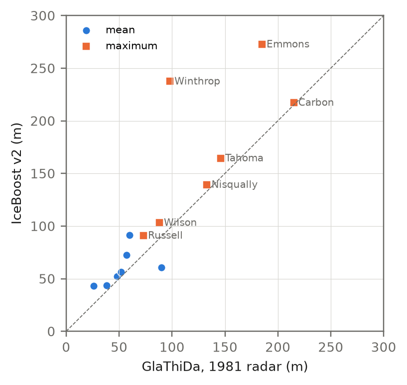
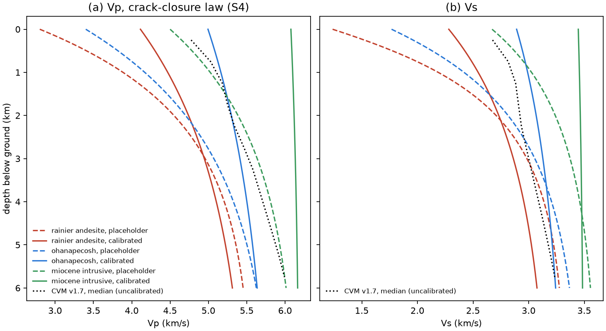
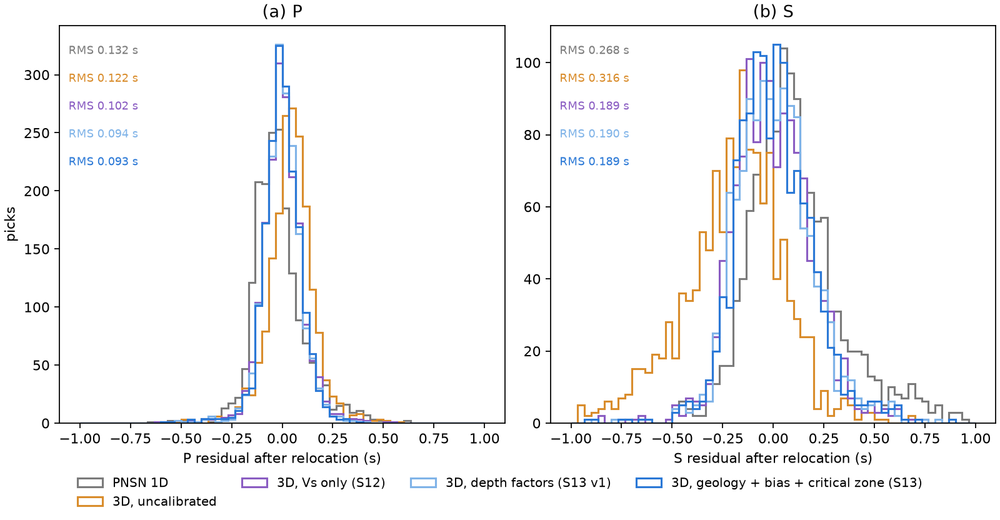
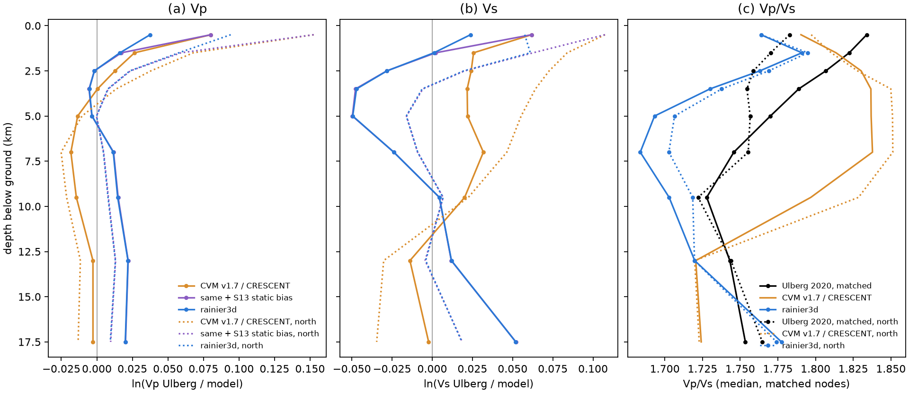
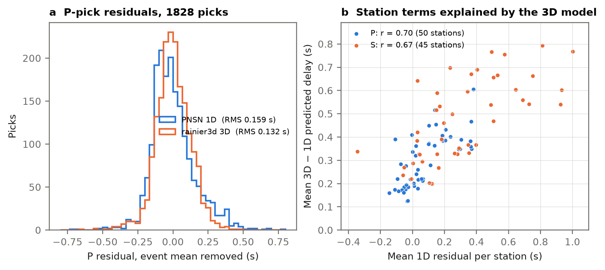
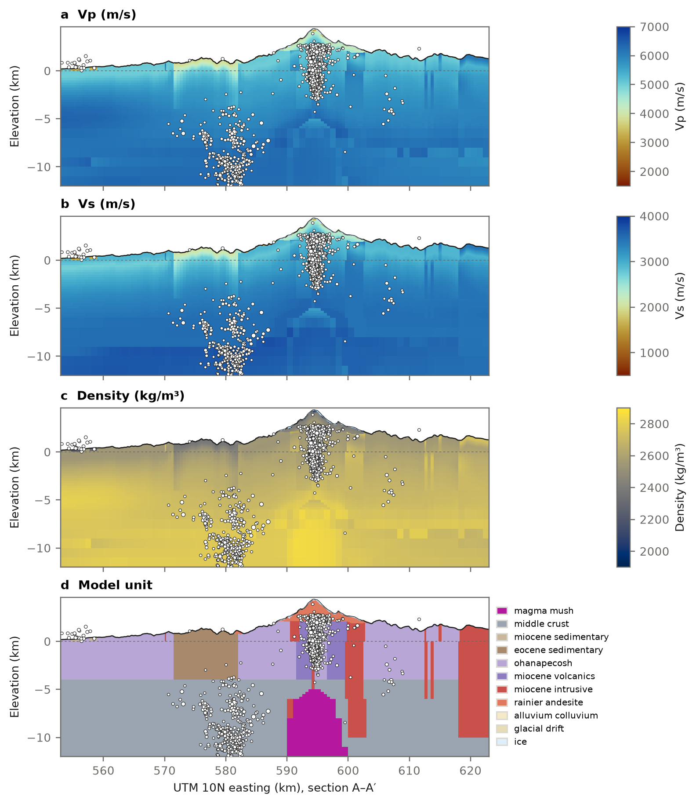
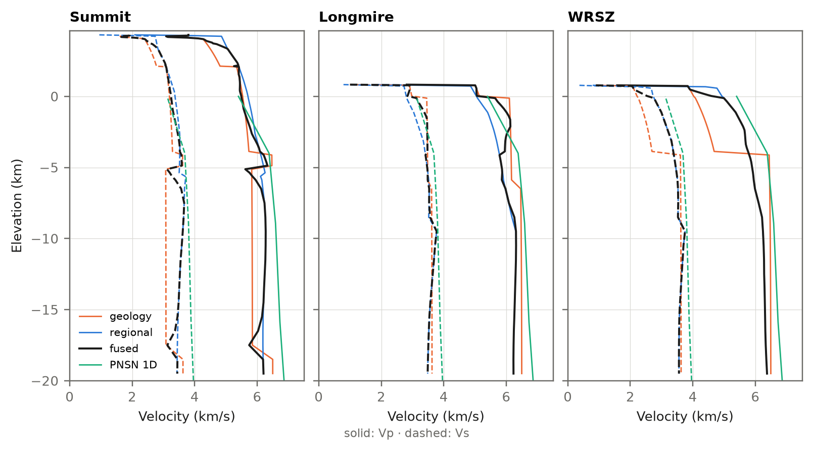
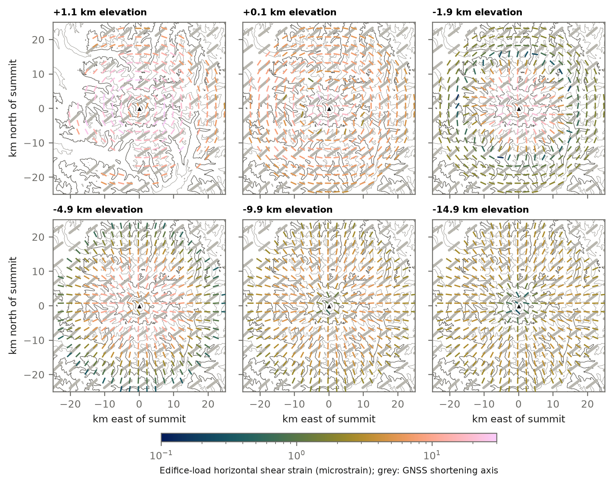
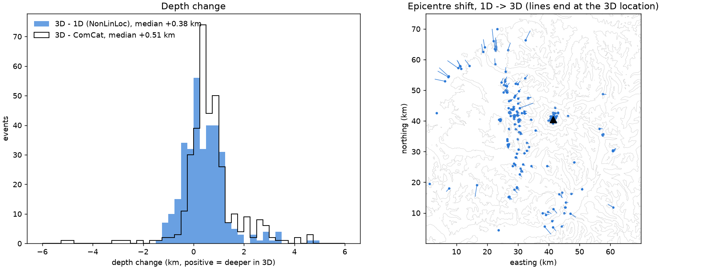

# Introduction {#sec:intro}

Mount Rainier is the most hazardous volcano in the Cascade Range, for two reasons. Its hydrothermally weakened edifice is covered by glaciers, and its lahars reach populated valleys [@hoblitt_1998; @scott_1995]. Seismic monitoring at Rainier relies on one-dimensional velocity models, with station corrections absorbing the effects of topography and near-surface structure. The regional three-dimensional models of Cascadia resolve the crust at wavelengths of several kilometres or more [@cvm17_article; @crescent_gen0]. They do not resolve the volcanic edifice, its altered core, its glaciers or the shallow units exposed around it.

rainier3d connects these scales in one model with three properties:
- it is tied to the mapped geology at the surface: the 149 map symbols of the Washington 1:100,000 geologic map in the box [@dnr_gems_100k] are assigned to 14 surface model units by the rules of `configs/units.yaml` (S1) and extended to depth by explicit geometry rules (S3, [@sec:subsurface]), and an invariant test requires the top rock cell of the finest level (L1) to carry the mapped unit in at least 95% of bedrock columns;
- it is consistent with regional tomography at depth: S5 merges the geology model in the wavenumber domain with the USGS Cascadia velocity model v1.7 down to 9.9 km below the ground [@cvm17_article] and CRESCENT Gen0 below it [@crescent_gen0], keeping the regional model at wavelengths longer than a cutoff of 6 km at the surface, 10 km at 2 km depth and 20 km at 10 km depth (placeholder values in `configs/domain.yaml`), the geology model alone above 300 m depth, and a linear taper between 300 and 1000 m; the root-mean-square (RMS) difference of ln V between the low-passed fused and regional models is at most 0.012, against a tolerance of 0.03;
- it reproduces the travel times of the Pacific Northwest Seismic Network (PNSN): calibrated in S13 on 1823 P and 1280 S analyst picks from 88 PNSN earthquakes (M 2.0–3.4, 1 January 2015 to 1 September 2026) [@comcat_uw], each relocated in 3D in every trial model, it lowers the RMS residual of held-out events after relocation from 0.121 to 0.093 s for P and from 0.317 to 0.188 s for S ([@sec:subsurface]).

The same grids carry the surface layers that describe soil, water, vegetation and ice, the geodetic strain field, and the stress of the edifice load. The model is a digital model rather than a digital twin: it assimilates no time-dependent data. Only the GNSS product is refreshed on a schedule.

This paper describes, in order:

| Section | Content |
|-----|--------------------|
| [@sec:domain] | Domain and workflow |
| [@sec:data] | How the data are compiled deterministically, and how to rebuild them |
| [@sec:surface] | Surface layers |
| [@sec:subsurface] | Subsurface model, with its calibration and validation |
| [@sec:strain] | Strain and stress |
| [@sec:hydro] | Geohydrology |
| [@sec:mass] | Catalogue of mass movements |
| [@sec:events] | Toward a time-dependent model: one storm, its precipitation and river response |
| [@sec:access] | Access to the products |
| [@sec:limits] | Limitations |

: Outline of the paper. {#tbl:outline}

# Domain, grids and workflow {#sec:domain}

The model uses Universal Transverse Mercator zone 10N (EPSG:32610) coordinates, with elevation in metres above NAVD88 (EPSG:5703), positive up.
- **Model box.** Easting 553–623 km and northing 5149–5224 km, 70 × 75 km (`bounds_utm` in `configs/domain.yaml`): the geographic box 122.30–121.40° W, 46.50–47.15° N (the box of the companion mt-rainier-smart-sensing project), whose projected corners span 553.07–622.77 km E and 5149.84–5223.08 km N, rounded outward to whole kilometres. It covers Mount Rainier National Park and the West Rainier Seismic Zone (WRSZ).
- **Summit.** Columbia Crest (4392 m; 121.7603° W, 46.8523° N, `summit_lonlat` in `configs/domain.yaml`) lies at easting 594.5 km, northing 5189.5 km. The 4392 m is the maximum of the 3DEP mosaic (about 8.3 m) of the mt-rainier-smart-sensing project; the highest cell of the 100 m surface grid is 4380 m, centred at 594.45 km E, 5189.45 km N.
- **Single source of the geometry.** All grids are derived from one configuration file (`configs/domain.yaml`, read by `rainier3d.config.domain.load_domain()`), which sets the horizontal coordinate system (EPSG:32610), the vertical datum (EPSG:5703), the bounds and two resolution profiles: `m1`, used for every product in this paper (100 m surface grid and the levels of [@tbl:grids]), and `full` (10 m surface grid; horizontal × vertical spacing 50 × 20 m on L1, 200 × 100 m on L2, 500 × 500 m on L3), which is defined but not built. The code never hard-codes bounds, spacing or coordinate system.

Properties are stored on three stacked regular grids whose spacing coarsens with depth ([@tbl:grids]). Cells above the ground carry no properties. The depth of each cell below the local ground surface is stored with it.

| Level | Elevation range (m) | Horizontal spacing (m) | Vertical spacing (m) | Cells (z × y × x) |
|---|---|---|---|---|
| Surface grid | – | 100 | – | 750 × 700 |
| L1 | 4400 to 0 | 250 | 50 | 88 × 300 × 280 |
| L2 | 0 to −6000 | 500 | 250 | 24 × 150 × 140 |
| L3 | −6000 to −20000 | 1000 | 1000 | 14 × 75 × 70 |

: Model grids. The master product is one xarray DataTree in Zarr v3 format (`model.zarr`) with one node per level and a surface node. {#tbl:grids}

The workflow is a sequence of numbered scripts, S0 to S30, each run as a task of one locked software environment (pixi). [@fig:workflow] shows how they connect:
- the model chain (S1–S5): S1 builds the 100 m surface stack of elevation, surface unit and ice thickness (`surface.zarr`), S2 the environmental surface layers (`surface_layers.zarr`), S3 the rule-based 3D geology on L1–L3 (`geomodel.zarr`), S4 converts the units to Vp, Vs, density, Qp and Qs (`properties_geology.zarr`), and S5 fuses them with the regional models into the master product `model.zarr` (`pixi run all` runs S1–S8);
- the calibration loop, in which travel-time residuals update the rock-physics parameters and the regional correction (S13, S14): S13 relocates the 88 PNSN calibration events in 3D in each trial model and fits, by Gauss–Newton iterations on P, S and S−P residuals, three multipliers on all rock units (zero-pressure Vp V0, crack-closure pressure P* and Vs) and a static depth-dependent bias of the regional models below 1 km depth, written to `configs/velocity_calibration.yaml`; S14 relocates the same events in any model and scores it by the residuals left;
- the checks and products that read the finished model: the travel-time check against the PNSN one-dimensional model (S6), VTK and HTML views (S7), the sensor atlas (S8), uniform grids for ray tracing and location (S9), the paper figures (S10), the 3D viewer layers (S11), the download packages (S20) the comparison with the iMUSH local-earthquake tomography (S21) and the terrain-geometry layers (S30, [@sec:surface-terrain]).

The domain and its sensors are mapped in [@fig:map].

{#fig:workflow width=100%}

{#fig:map width=100%}

# A deterministic data compilation {#sec:data}

## Principles

The database is compiled by code, not by hand, following five rules.

1. **One registry.** `configs/sources.yaml` lists every data set and publication the model uses (99 entries). Each entry gives its DOI or service address, licence, the date and method of verification, and its role in the model. Every number in the configuration files names a registry key. A value chosen by the authors carries the key `m1_placeholder`, so the unsourced values can be listed and replaced. The bibliography of this paper is generated from the same registry (`pixi run bib`), with BibTeX keys equal to the registry keys.
2. **Original archives, cached.** Each stage downloads what it needs from the original archive, clipped to the model box where the service allows it. Examples are a window of a cloud-optimised GeoTIFF, an OPeNDAP subset, a feature-service query or a staged file. Each download is cached under `data/raw/<source>/`, and reruns read the cache. The GNSS stage also writes a manifest with the URL, retrieval time, size and SHA-256 of each file.
3. **A checksum for every cached file.** `scripts/00_data_manifest.py` records the size and SHA-256 of all cached files in the committed table `docs/data_manifest.csv` (2,072 files, 4.44 GB; [@tbl:raw]). `pixi run manifest -- --check` compares a rebuilt cache with it. Some services can return different bytes on a later request: ComCat can revise picks, and the USGS can re-stage NHDPlus. The check lists those files, so any difference between a rebuilt model and the published one can be traced to its input.
4. **One environment.** The software is pinned in `pixi.lock` for Linux and macOS (arm64). Two slim environments serve automation: `gnss` for the weekly strain refresh and `paper` for this report.
5. **Invariants.** The test suite checks the built model against rules that must hold whatever the data:
    - no properties above the ground: on L1, L2 and L3, Vp, Vs and density are NaN in every air cell (unit 0) and finite in every other cell;
    - Vp/Vs and density within physical bounds: Vp/Vs between 1.5 and 3.0 in rock cells (air, ice and magma mush excluded), fused Vp/Vs between the geology and regional ratios of the same cell (relative tolerance 10⁻⁴), and density between 900 and 3100 kg m⁻³ in every non-air cell;
    - the long wavelengths of the fused model equal those of the regional model within a tolerance: per level and for Vp and Vs, the RMS of ln V between the low-passed fused and low-passed regional models is at most `lowpass_rms_tol` = 0.03 (`configs/domain.yaml`), checked on the report that S5 writes to `outputs/fusion_report.csv` (current maximum 0.012, L1 Vs);
    - the surface unit matches the unit of the top model cell: where bedrock (plutonic, supracrustal or cap units) crops out, the top non-air L1 cell carries the mapped surface unit in at least 95% of columns.

   Tolerances are fixed in the configuration and are not relaxed to make a run pass.

| Source folder | Stage | Content | Files | Size (MB) |
|------------|----|--------------------|----|-----|
| `dem` | S1 | USGS 3DEP 1 arc-second (about 30 m) DEM [@usgs_3dep], fetched with py3dep over the box plus 0.02° (`3dep_30m_rainier-v0.tif`) | 1 | 59 |
| `geology` | S1, S24 | Washington 1:100,000 geology (GeMS) map units (feature-service layer 11) and faults (layer 7) [@dnr_gems_100k]; Quaternary faults (Earthquakes and Faults map service, layer 12) [@dnr_quaternary_faults]; one GeoPackage each | 3 | 5 |
| `glaciers` | S1 | IceBoost v2 per-glacier thickness and error GeoTIFFs for 219 glaciers [@iceboost_v2], RGI 6.0 glacier list and statistics (two CSV files) [@rgi60], GlaThiDa survey table [@glathida] | 222 | 44 |
| `ecology` | S2 | ETH canopy height 2020, 10 m tile N45W123 clipped to the box plus 2 km [@eth_canopy_2020_article]; NLCD 2021 from the MRLC web coverage service on its native 30 m EPSG:5070 grid, box plus 1 km [@nlcd_2021] | 2 | 27 |
| `hydrology` | S2 | NHDPlus HR geodatabases (HU4 1703, 1708, 1711) and the flowlines extracted from them [@nhdplus_hr], NHDPlus v2.1 flowlines [@nhdplus_v21], clips of the two water-table grids [@ma2026_wtd_article; @fan2017_wtd] | 7 | 924 |
| `imagery` | S2 | Sentinel-2 L2A median composite, 1 August – 30 September 2025, bands B02, B03, B04, B08 and B11 at 20 m [@sentinel2_l2a] | 1 | 96 |
| `regional` | S5 | Cascadia velocity model v1.7, levels L01 and L2 (0–9.9 km below the ground), clipped to the box plus 2 km (`cvm17_domain.nc`) [@cvm17] | 1 | 60 |
| `pnsn` | S6, S13 | ComCat phase-data QuakeML for 91 events, the P and S picks extracted from them and a station table [@comcat_uw] | 93 | 21 |
| `sensors` | S8 | FDSN station and channel metadata of all networks in the box [@earthscope_fdsn]; GNSS site metadata [@earthscope_gnss] | 2 | 1 |
| `gnss` | S17 | 76 UNR daily position series (`.tenv3`) [@unr_ngl_gnss], the PANGA raw archive and its horizontal and vertical NAM20 velocity fields [@panga_gnss], download manifest | 80 | 218 |
| `emc` | S21 | iMUSH local-earthquake tomography of @ulberg_2020_article, in the netCDF format of the EarthScope Earth Model Collaboration (EMC) | 1 | 5 |
| `rainier_aerogeophysics` | S22 | 1996 USGS helicopter survey [@rystrom_2000]: apparent-resistivity grids at 33 kHz, 4737 Hz, 4341 Hz and 837 Hz (50 m), reduced-to-pole magnetic grid (62 m), electromagnetic (EM) and magnetic flight lines | 8 | 19 |
| `wgs_landslides` | S24 | Washington landslide inventory [@wgs_landslide_inventory]: lidar-protocol deposits, recent landslides, compilation (one GeoPackage each) | 3 | 3 |
| `allstadt2017` | S24 | Seismically recorded mass movements, western United States (`Events.csv`) [@allstadt_2017_esec] | 1 | 0.03 |
| `usgs_rainier_hazards` | S24 | Lahar hazard zones of 1998 (`rainier_98shapefiles.zip`) [@hoblitt_1998] | 1 | 0.2 |
| `dem_3dep_1m` | S24 | 1,638 3DEP 1 m windows around landslide polygons [@usgs_3dep]; one GeoPackage of 3DEP source footprints | 1,639 | 1,818 |
| `canopy_storage` | S28 | GEDI L3 global 1 km grids of mean and standard deviation of relative height 100 and of shot counts, 18 April 2019 – 9 July 2025 [@gedi_l3], and four crops to the box (adding the standard error), written by the vendored canopy-storage code | 7 | 1,135 |

: The raw input cache, from `docs/data_manifest.csv`. SOLUS100 soil thickness is read directly from its cloud-optimised GeoTIFFs and is not cached. {#tbl:raw}

Four inputs are not fetched by script:
- **Cascadia velocity model v1.7** [@cvm17]. ScienceBase blocks scripted downloads with a captcha, so the files are downloaded by hand once: levels L01 (0–1200 m below the ground, 200 m spacing) and L2 (1500–9900 m, 300 m spacing) are read from a local path, clipped to the box plus 2 km and cached as `data/raw/regional/cvm17_domain.nc` (S5); level L3 (10.8–59.4 km) is not downloaded.
- **CRESCENT Gen0.** The model file is read from a local copy of its figshare record [@crescent_gen0_data]. It supplies Vs and its uncertainty below the 9.9 km base of CVM v1.7, with Vp from the Vs relation of @brocher_2005, and its depth axis (−4 to 100 km) is read as kilometres below sea level.
- **PNSN one-dimensional model.** The table is read from a local file (`vel_pnsn_wa.csv` of the cascadia_obs_ensemble repository, registry key `pnsn_1d_wa`): seven layers with linear gradients, from Vp 5.40 km s⁻¹ at the surface to 7.80 km s⁻¹ at 41 km depth, with Vp/Vs 1.73. It is the reference of the S6 check. Which PNSN model it is (P3 Puget Sound or C3 Cascades) is not documented [TODO: confirm the model name with PNSN].
- **Canopy-storage products.** The lidar canopy and soil-map products are delivered files ([@sec:surface-veg]), read from the paths listed in `configs/canopy_products.yaml` (delivered 24 September 2026); in the current cache only the GEDI L3 canopy height is regenerated by the vendored pipeline (S28).

The code names each of these paths, and their registry entries say how to obtain them.

## Rebuilding the database and the model

From a clean clone, the following commands download every input, rebuild the model and check the result. Stages that need credentials or delivered files skip those layers and say so.

```bash
git clone https://github.com/Denolle-Lab/mt-rainier-digital-model && cd mt-rainier-digital-model
pixi install                       # the locked environment
pixi run all                       # S1-S8: surface, layers, geology, rock physics, fusion, checks, figures
pixi run s2 -- --ma                # optional: the Ma et al. (2026) water table (~1 GB download)
pixi run s22 && pixi run s3 && pixi run s4 && pixi run s5   # alteration from the EM survey, then rebuild
pixi run s17 && pixi run s18       # GNSS positions, velocities, strain, edifice load
pixi run s24                       # mass movements and faults: catalogue, figure, viewer layers (~1.8 GB of 1 m windows)
pixi run -e canopy canopy          # canopy-storage pipeline: GEDI (Earthdata login), Sentinel-2 LAI (CDSE client)
pixi run s9                        # uniform grids for ray tracing and location
pixi run manifest -- --check       # compare the rebuilt cache with docs/data_manifest.csv
pixi run test                      # unit tests and the invariants of the built model
```

The calibration (S13, about 26 min on a 10-core laptop) and the relocation comparisons (S14) are rerun as described in `docs/joint_calibration.md`.

## Redistribution

The pipeline is published in full. Derived products are published unless a source forbids it.
- **Excluded products.** A variable whose provenance (its `gaia:source_keys` attribute) includes a source flagged `redistribute_derived: false` in `configs/sources.yaml` is left out of the downloadable archives by S20 (`scripts/20_publish_products.py`), and is listed in the catalogue's `excluded` field and in the archive's `excluded_variables` attribute.
- **Flagged sources.** Three sources carry the flag (registry keys `ma2026_wtd`, `canopy_lidar_chm` and `soil_map_image`):
    - the Ma et al. (2026) water table [@ma2026_wtd_article], whose licence (CC-BY-NC-ND 4.0) forbids derivatives; the 3D viewer shows it as a visualisation only, and `pixi run s2 -- --ma` rebuilds it from the open Zenodo record;
    - the lidar canopy height and vegetation cover [@canopy_lidar_chm], made from the 2022–2023 "Wali" tiles of the Washington Department of Natural Resources Lidar Portal, whose terms of reuse are not yet confirmed;
    - the soil-map image (an RGB rendering in EPSG:3857 at 7.8 m, masked to the park), whose source, legend and licence are not documented.
- **Rebuilding the excluded layers.** Users rebuild them with their own access. Two open archives need a free login to download, NASA Earthdata for the GEDI L2B, L3 and L4B products and the Copernicus Data Space for the Sentinel-2 leaf area index. Their derived layers are published, since neither NASA nor Copernicus data carry a redistribution restriction.

`docs/data_policy.md` gives the tier of every source.

# Surface layers {#sec:surface}

## Elevation, geology and glaciers {#sec:surface-core}

Three surface layers set the top of every model column.

- **Elevation.** USGS 3D Elevation Program [@usgs_3dep] at 1 arc-second (about 30 m), fetched by S1 with py3dep over the box plus 0.02° and block-averaged onto the 100 m surface grid in EPSG:32610; S1 stops if any cell is left empty. It ranges from 24 to 4380 m in the box. The highest cell lies below the 4392 m of Columbia Crest because each cell is a 100 m average.
- **Geology.** The Washington Geological Survey 1:100,000 surface geology in the GeMS format [@dnr_gems_100k], queried by S1 from the Washington Department of Natural Resources feature service (layer 11, map-unit polygons intersecting the geographic box; layer 13, Description of Map Units) and cached as `data/raw/geology/dnr_gems_100k_map_units.gpkg`.
    - All 149 map symbols present in the box are assigned to 14 surface model units by 14 ordered regular-expression rules on the symbol (the first match wins), checked against each unit's full name in the map's Description of Map Units. Every cell receives a unit: S1 stops if a symbol matches no rule, and the polygons are rasterised at cell centres as uint8 without interpolation. The Ohanapecosh unit covers the largest share of the box (187,565 of 525,000 cells, 35.7%).
    - The rules are in `configs/units.yaml` (`crosswalk_rules`), and the generated crosswalk (`configs/crosswalk_geology.json`, one entry per map symbol with its model unit and the age and full name from the Description of Map Units) is committed for review.
    - The park map of @fiske_1963 (USGS I-432, sheet 1, a single 10,000 × 10,000 pixel KMZ ground overlay listed in `configs/overlays.yaml`) is carried as a georeferenced image for display in the viewers. It is read from a local copy, not fetched by script, and its units are not digitised.
- **Faults.** The same map gives 134 fault traces in the box (220 km), 106 of them high-angle dip-slip faults and 46 concealed. The Washington Quaternary fault layer adds four features [@dnr_quaternary_faults]: the Western Rainier and Goat Rocks seismic zones, drawn as geophysical lineaments, the Devils Dream reverse fault and an unnamed oblique reverse fault. Neither source gives a dip, and no fault section of the 2023 National Seismic Hazard Model lies in the box [@nshm23_fsd]; the nearest, the Olympia and Tacoma faults, are 17 and 28 km outside it. Faults are therefore mapped traces ([@fig:mass]a) and are not surfaces in the 3D model.
- **Glacier ice thickness.** IceBoost v2 per-glacier grids [@iceboost_v2] for the 219 glaciers of the Randolph Glacier Inventory 6.0 [@rgi60] whose centroids fall in the box, 97.3 km² in all. The grids are area-averaged onto the 100 m grid, and each glacier is rescaled so that its volume matches the IceBoost total for it. This removes an 18% overestimate from counting partly glacier-covered cells as full. The total is 5.50 km³, of which 5.32 km³ is on the cone.

The glacier bed is the ground elevation minus the ice thickness. Against the 1981 radar surveys of @driedger1986 as archived in GlaThiDa [@glathida], maximum thickness agrees for Carbon, Nisqually and Tahoma glaciers ([@fig:glaciers]). IceBoost is thicker on Emmons (273 vs 185 m) and Winthrop (237 vs 98 m) glaciers. Part of any difference reflects thinning since 1981 [@sisson2011].

{#fig:glaciers width=55%}

## Soil, water, land cover and imagery {#sec:surface-env}

Script S2 reads each source over the model box only, resamples it onto the 100 m grid and records its source ([@tbl:env], [@fig:surface]). Continuous layers are averaged over each cell; categorical layers take the most common class.

| Layer | Source | Native resolution | Median (5th–95th percentile) |
|---------|--------------------|-------|-----------|
| Soil thickness | SOLUS100 depth to a lithic contact [@solus100_article], read from its cloud-optimised GeoTIFF over the box and block-averaged; 98.8% of cells valid | 100 m | 1.41 m (0.54–1.97 m) |
| Water-table depth | Random-forest estimate for the conterminous US, mean [@ma2026_wtd_article], block-averaged; not redistributed | about 24 m | 10.1 m (4.8–20.4 m) |
| Water-table depth | Global groundwater model, annual mean [@fan2017_wtd], read through OPeNDAP, stored positive down and block-averaged | 30″ (about 1 km) | 23 m (0–306 m) |
| Streams | NHDPlus High Resolution, 60,174 flowlines, Strahler orders 1–8, with mean annual flow [@nhdplus_hr]; each 100 m cell takes the highest order of any flowline touching it (0 = none) | 1:24,000 | – |
| Canopy height | ETH global canopy height 2020 [@eth_canopy_2020_article], block-averaged, values outside 0–120 m masked; 98.4% of cells valid | 10 m | 30 m (9–45 m) |
| Land cover | NLCD 2021 [@nlcd_2021], most common class in each cell | 30 m | evergreen forest in 72.5% of cells |
| NDVI | Sentinel-2 L2A median composite, 1 August – 30 September 2025 [@sentinel2_l2a]; (B08 − B04)/(B08 + B04) from band reflectances averaged onto the grid; 99.8% of cells valid | 20 m | 0.85 (0.26–0.92) |
| NDSI | same composite; (B03 − B11)/(B03 + B11) | 20 m | −0.48 (−0.60 to −0.24) |

: Environmental surface layers (S2); percentiles are over the cells of the box. {#tbl:env}

Notes on individual layers:

- **SOLUS100.** It predicts soil depth only to 2.01 m (201 cm is the largest value of its centimetre grid over the box), so that value is read as "at least 2 m"; 3.5% of the valid cells reach 2.0 m. SOLUS100 does not document this cap.
- **Sentinel-2 composite.** Scenes are searched in the Microsoft Planetary Computer catalogue, with Element84 Earth Search as fallback. It uses the least-cloudy scenes (at most 25% cloud), up to six per Sentinel-2 tile, so that every part of the box is covered; the cached composite holds 10 acquisition dates. The scene classification keeps vegetation, bare soil, water, snow and unclassified pixels (classes 4, 5, 6, 11 and 7), and the median is taken per pixel on a 20 m grid in EPSG:32610 (S2).
- **Reflectance offset.** Since processing baseline 04.00 (all scenes since January 2022), Level-2A reflectance is stored as reflectance × 10,000 + 1000, and neither distribution service removes the offset. S2 removes it before computing indices and stops if a window mixes baselines. Without the correction, median NDVI over this forest is 0.46 instead of 0.85 [TODO: record the command or log that gives 0.46].
- **Snow and ice.** NDSI above 0.4 covers about 65 km² at the end of the 2025 melt season, against 97.3 km² of glacier in the Randolph inventory outlines (about 2000) of the 219 glaciers in the box. The difference is consistent with debris-covered glacier tongues (Carbon, Emmons, Winthrop), which read as rock in NDSI, and with glacier retreat.

{#fig:surface width=100%}

## Vegetation structure {#sec:surface-veg}

Script S19 adds the vegetation products of the canopy-storage project (M. Köpfli, University of Washington) on the same grid ([@tbl:canopy], [@fig:canopy]). They describe the canopy that intercepts precipitation and loads the ground: height, cover, leaf and plant area, and aboveground biomass.

| Layer | Source | Native resolution | Median (5th–95th percentile) |
|---------|--------------------|-------|-----------|
| Canopy height | airborne lidar, digital surface minus terrain model [@canopy_lidar_chm]; 10 m grid block-averaged per cell, values outside 0–110 m masked | 10 m | 14.6 m (0.3–32.4 m), on 49% of the box |
| Vegetation cover | same lidar, vegetation cover fraction block-averaged per cell | 10 m | 0.88 (0.01–1.00), on 49% of the box |
| Leaf area index | Sentinel-2 L2A, SNAP biophysical processor, 1 July – 15 August 2023 [@sentinel2_lai_2023]; 10 m mosaic block-averaged; 99.8% of cells valid | 10 m | 2.36 (0.40–3.68) |
| Plant area index | GEDI L2B version 2, quality-filtered footprints gridded to 1 km (mean per cell) [@gedi_l2b]; bilinear resampling; 95.9% of cells valid | 1 km | 2.72 (0.86–3.79) |
| Canopy height | GEDI L3 version 2, mean relative height 100, 18 April 2019 – 9 July 2025 [@gedi_l3]; bilinear resampling | 1 km | 25.5 m (13.3–39.9 m) |
| Aboveground biomass | GEDI L4B version 2.1, with standard error (median 21.4 Mg ha⁻¹) [@gedi_l4b]; bilinear resampling | 1 km | 198 Mg ha⁻¹ (58–436) |

: Vegetation layers (S19). The lidar is the 2022–2023 "Wali" acquisition of the Washington Department of Natural Resources Lidar Portal, whose terms of reuse are not yet confirmed; the provenance of a soil-map image delivered with these products is undocumented. Both are displayed in the 3D viewer and excluded from the downloadable products. {#tbl:canopy}

{#fig:canopy width=100%}

The two canopy heights differ by design. The lidar value is the mean of 10 m cells in each 100 m cell, including gaps, while the GEDI value is a 1 km mean of the tallest return per footprint. That is why the lidar median (14.6 m) is lower than the GEDI median (25.5 m) and the ETH median (30 m).

The project's download and gridding code is part of this repository, unmodified and under its MIT licence (`third_party/canopy-storage_seismic`). Script S28 runs it inside the raw-data cache: it fetches the GEDI L3 grids and L2B footprints through NASA Earthdata and the Sentinel-2 leaf area index through the Copernicus Data Space, and S19 reads its products in place of the delivered files. The GEDI L3 canopy height it produces is identical to the delivered grid (33,701 cells). The L2B plant area index, the L4B biomass, the lidar layers and the soil map are still read from the delivered files: the vendored gridder writes the maximum plant area index rather than the mean, and the others were made outside that code. The project's lidar scripts compute canopy height only at its stations; the 10 m lidar grids were made from the same tiles in QGIS. `docs/canopy_pipeline.md` lists each service call.

## Terrain geometry {#sec:surface-terrain}

Script S30 derives four layers of terrain geometry that control surface instability, as specified by co-author S. Han (`configs/terrain.yaml`, [@fig:terrain]). They have their own 30 m grid in UTM zone 10N, 2,333 × 2,500 cells from the southwest corner of the box. The box is 70 km wide, so a 10 m strip at its east edge is not a whole cell and is left out.

- **Inputs.** Surface elevation z is USGS 3DEP fetched at 30 m [@usgs_3dep] and block-averaged onto the grid. Over glaciers it is the elevation of the ice surface. Ice thickness H is the IceBoost v2 layer of the model surface [@iceboost_v2], interpolated bilinearly from 100 m to 30 m; the ice volume is unchanged (5.50 km³). Bedrock elevation is b = z − H.
- **Surface slope.** arctan |∇z|, with the gradient from central differences between the two neighbours of each cell, a 60 m baseline. Over glaciers it is the slope of the ice surface.
- **Bedrock slope.** The same operator applied to b. Where neither the cell nor its eight neighbours carry ice, it equals the surface slope exactly.
- **Local relief.** The maximum minus the minimum of z within a disk of radius 510 m (17 cells) centred on each cell.
- **Valley depth.** The black top-hat of z: the grey-scale closing of z (a dilation, then an erosion, with a flat disk of radius 990 m, 33 cells) minus z. It measures incisions narrower than the disk, about 2 km; wider valleys are not filled and read as shallow.
- **Edges.** Every filter mirror-reflects the grid at its edges.

The layers, the ice thickness and the bedrock elevation are written to `data/processed/terrain_geometry.zarr`, and the four layers appear in the 3D viewer under "Terrain geometry". Three limitations follow from the inputs. The effective resolution of the 3DEP product at 30 m is 35–49 m, which smooths cliffs and headwalls and lowers their slope; its reprojection also leaves a faint diagonal striping in the slope maps. The bedrock slope inherits the errors of the IceBoost thickness and the blur of its 100 m grid, and the ice surface of 3DEP and the IceBoost thickness do not refer to the same year. The radii are parameters and can be changed in `configs/terrain.yaml`.

![Terrain geometry over 40 × 40 km centred on the summit (triangle), on the 30 m grid (S30): (a) surface slope, arctan |∇z| from central differences between adjacent cells (60 m baseline), the slope of the ice surface on glaciers; (b) bedrock slope, the same operator on the 3DEP elevation minus the IceBoost v2 thickness (bilinear from 100 m), identical to (a) off the ice; (c) local relief, maximum minus minimum elevation within a disk of radius 510 m; (d) valley depth, the grey-scale closing of the elevation with a disk of radius 990 m minus the elevation. Filters mirror-reflect at the grid edges. The blue line outlines ice thicker than 10 m. The 35–49 m effective resolution of the source smooths cliffs, the bedrock slope inherits the errors of the ice thickness, and the radii are adjustable.](figures/fig22_terrain_geometry.png){#fig:terrain width=100%}

[@tbl:terrain-mass] samples the layers at the 1,650 event points of the mass-movement catalogue ([@sec:mass]), which are the crowns of mapped landslides and the locations of the other events, and in the cells covered by its flow polygons. The reference is every cell of the grid. Events sit on steeper ground than the box as a whole: their median slope is 27.9° against 18.5°, and 42% of them lie on slopes above 30° against 22% of the cells. Rock falls and rock and ice avalanches are the steepest class, with a median of 39.8° and 77% above 30°, and the highest local relief, 380 m. Local relief separates the events from the box less clearly than slope does (median 334 m against 297 m), and valley depth does not separate them at all (50 m against 54 m): crowns lie on ridges and valley walls as often as in incised channels. The flow polygons record runout rather than source. The mapped debris flows have a median slope of 12.6°, the lahar deposits 0.7–5.3°, and the deposits other than the Osceola and Electron mudflows fill valleys, with a median valley depth of 182 m. Only 0.8% of the events lie on ice thicker than 10 m, so the bedrock and surface slopes agree at almost every event. They differ at the two snow and ice avalanches (median 37.8° on the ice surface, 34.8° on the bed). The 19 seismically located events fall on 7 distinct points, 9 of them on one, so their percentiles repeat.

| Sites | Count | Surface slope (°) | > 30° | Local relief (m) | Valley depth (m) |
|------------------|------|----------|----|----------|----------|
| All cells of the grid | 5,832,500 cells | 18.5 (2.2–36.0) | 22% | 297 (78–505) | 54 (1–237) |
| All events | 1,650 | 27.9 (15.0–40.0) | 42% | 334 (176–467) | 50 (0–204) |
| Rock fall, rock and ice avalanche | 56 | 39.8 (23.2–51.0) | 77% | 380 (98–787) | 89 (4–276) |
| Slide, debris slide | 324 | 29.3 (16.0–40.3) | 48% | 340 (144–464) | 40 (0–164) |
| Complex or unknown type | 1,267 | 27.2 (14.7–39.0) | 39% | 331 (186–459) | 52 (0–208) |
| Seismically recorded | 19 | 48.2 (36.5–48.2) | 100% | 787 (646–787) | 64 (0–98) |
| Debris flows (mapped) | 463 polygons, 12,292 cells | 12.6 (3.6–26.2) | 6% | 190 (124–329) | 52 (7–140) |
| Osceola Mudflow | 88,559 cells | 2.1 (0.3–21.7) | 4% | 98 (8–288) | 44 (1–216) |
| Electron Mudflow | 20,833 cells | 0.7 (0.3–4.6) | 0% | 45 (7–114) | 9 (0–78) |
| Other lahar deposits | 17,777 cells | 5.3 (2.0–16.0) | 1% | 196 (88–307) | 182 (54–337) |

: Terrain geometry at the mass movements (S30, `outputs/terrain/mass_movement_terrain.csv`): median (10th–90th percentile) and the fraction of sites above 30°. The fractions above 300 m of local relief and 50 m of valley depth are in the file; these thresholds are author judgement. The two snow or ice avalanches and the single seismically recorded debris flow are in the file. {#tbl:terrain-mass}

# Subsurface model {#sec:subsurface}

## Three-dimensional geology {#sec:geology}

Units are extended to depth by explicit column rules, in the manner of the San Francisco Bay region model [@aagaard2021]: the geology comes first and the velocity rules second. For a cell at elevation $z$ and depth $d$ below the ground, the rules of [@tbl:rules] are applied from the top down.

| Condition | Assigned unit |
|--------------------|--------------------|
| $d < 0$ | air |
| $d <$ ice thickness (IceBoost v2 [@iceboost_v2]) | ice |
| $d <$ ice + deposit thickness (water 5 m, glacial drift 15 m, alluvium and colluvium 10 m, lahar deposits 15 m) | mapped surface deposit, beneath any ice |
| inside the edifice footprint, above the edifice base | Rainier andesite |
| young volcanic rocks, or andesite outside the footprint, within 300 m below the base of the ice and deposits | that cap unit |
| above the base of the bedrock unit (−4 km NAVD88 for supracrustal units, −10 km NAVD88 for the Miocene plutons) | bedrock unit (mapped, or nearest mapped basement unit) |
| otherwise (below −4 or −10 km NAVD88) | middle crust |

: Column rules for the 3D units (S3; `configs/units.yaml`). {#tbl:rules}

- **Edifice.** The edifice footprint is the Rainier andesite and ice mapped within 12 km of the summit (Columbia Crest, `configs/domain.yaml`) on the 100 m surface grid, closed morphologically over 500 m (a 5 × 5 cell element) with holes filled, keeping the connected region that contains the summit (S3, `rainier3d.geomodel.rules.edifice_footprint`; `geometry.edifice` in `configs/units.yaml`, `m1_placeholder` values). Its base is the pre-volcanic surface: the DEM elevations of the plutonic and supracrustal outcrops in a two-cell (200 m) ring around the footprint, interpolated linearly across it (nearest value where the linear interpolant is undefined) and kept at or below the glacier bed. The base lies at 804–2234 m NAVD88 over a 252 km² footprint (`/surface` node of `data/processed/geomodel.zarr`).
- **Basement.** Beneath the deposits and the edifice, the basement unit is taken from the nearest outcrop: every map cell takes the plutonic or supracrustal unit mapped there, or else that of the nearest such outcrop on the 100 m surface grid (nearest-neighbour fill, `rainier3d.geomodel.rules.bedrock_units`, S3). Map symbols of the 1:100,000 state geologic map [@dnr_gems_100k] reach the model units only through the ordered regular-expression rules of `configs/units.yaml` (`crosswalk_rules`).
    - The supracrustal units (the Ohanapecosh, Fifes Peak and Stevens Ridge formations, the Eocene volcanic rocks and the Puget Group, and also the pre-Tertiary Russell Ranch Formation) extend to 4 km below sea level (`supracrustal_base_z` = −4000 m NAVD88 in `configs/units.yaml`, an `m1_placeholder`); the middle crust fills the column below.
    - The Miocene plutons (Tatoosh, White River, Carbon River and Nisqually; map symbols starting `Mi`, `MOi`, `PLOi`, `PLMi`) extend to 10 km below sea level (`pluton_base_z` = −10000 m NAVD88 in `configs/units.yaml`, an `m1_placeholder`). They therefore continue through L2 into the top four 1 km layers of L3, where they cover about 700 km² in plan view (2800 L3 cells).
    - The Mashel Formation (Miocene sedimentary rocks, map symbols starting `Mc`) is capped at 300 m thickness below the ice and deposits (`max_thickness_m: 300` in `configs/units.yaml`, an `m1_placeholder`); below that, the column takes the nearest mapped basement unit other than the Mashel (`rainier3d.geomodel.rules.build_level`).
- **Unconsolidated deposits.** They have fixed thicknesses beneath any ice, set per mapped surface unit (`geometry.unconsolidated_thickness_m` in `configs/units.yaml`, all `m1_placeholder`): glacial drift 15 m, alluvium and colluvium 10 m, lahar deposits 15 m, and 5 m for mapped open water, which is given the properties of saturated alluvium. All are thinner than the 50 m cells of L1, so they appear only where a cell centre falls inside them: 6189 of the 7.39 million L1 cells.
- **Magma body.** A slow body below the summit is an ellipsoid centred beneath Columbia Crest at 11.5 km below sea level (`center_z` = −11500 m NAVD88), with semi-axes of 5 km horizontally and 6.5 km vertically, so it spans 5–18 km below sea level (`geometry.magma_body` in `configs/units.yaml`, source key `moran_1999`). As unit `magma_mush` it replaces every non-air unit it contains: 176 L2 cells and 646 L3 cells. It follows the low-Vp body imaged 5–18 km beneath the summit by @moran_1999. [TODO: confirm whether the 5–18 km of @moran_1999 is below sea level or below the summit; `configs/units.yaml` line 59 marks the depth reference as still to verify]

## Hydrothermal alteration from the helicopter electromagnetic survey {#sec:alteration}

Clay-bearing altered rock is electrically conductive, while fresh lava and ice are resistive. The 1996 helicopter electromagnetic (EM) and magnetic survey of Rainier [@rystrom_2000] measured apparent resistivity at four frequencies (33 kHz, 4737 Hz, 4341 Hz and 837 Hz) on a 50 m grid. @finn_2001 used it to map collapse-prone altered zones. Script S22 turns these grids into an alteration field in three steps.

1. **Registration.** The grids are converted from NAD27 to the model datum. Their orientation is checked against the data, not assumed: the magnetic anomaly correlates with high-passed topography at 0.60 as read, and at 0.08 if flipped north–south.
2. **Intensity.** The survey saturates at a different resistivity at each frequency, so each frequency $f$ is referred to its own fresh level $L_f$. $L_f$ is the median log resistivity over the surveyed edifice lavas: 4.35, 3.89, 3.74 and 3.00 (log₁₀ Ω m). The intensity is
   $$a_f = \mathrm{clip}\!\left(\frac{L_f - 0.3 - \log_{10}\rho_a}{0.7},\,0,\,1\right),$$ {#eq:alteration}
   which starts at half the fresh resistivity and reaches 1 at a tenth of it.
3. **Depth.** Each frequency senses to a depth of investigation of half its skin depth, $503\sqrt{\rho_a/f}$ m, capped at 150 m. The three-dimensional field is the maximum over frequencies of $a_f$ tapered below that depth. Depth is measured below the glacier bed, and the field is restricted to the edifice lavas and young volcanic rocks.

Over the 126 km² of surveyed edifice lava, 10.6 km² reaches an intensity of 0.5 or more ([@fig:alteration]). That corresponds to 1.9 km³ of equivalent fully altered rock in the model grid. [@tbl:alteration] gives the distribution around the summit.

| Area (edifice lavas within 6 km of the summit) | Mean intensity at the surface | Share with intensity ≥ 0.5 |
|--------------|--------|--------|
| West flank | 0.08 | 8% |
| Summit (within 1.5 km) | 0.21 | 19% |
| East flank | 0.27 | 25% |

: Alteration of the surface rock from the EM survey (S22, `docs/alteration.md`). {#tbl:alteration}

The concentration east of and around the summit agrees with the exposed east–west belt of altered rock described by @finn_2001 and @john_2008. The EM field sees only the top ~150 m. It cannot see the altered rock buried beneath fresh cover on the upper west flank, which @finn_2001 inferred from magnetic modelling. The survey's terrain-correlated apparent magnetisation is published as a separate map.

{#fig:alteration width=100%}

## Rock physics {#sec:rockphysics}

Each rock unit receives a P-wave speed that increases with effective pressure as cracks close:
$$V_P(P) = V_\infty - (V_\infty - V_0)\, e^{-P/P^{*}}, \qquad P = (\rho_{b} - \rho_{w})\, g\, d,$$ {#eq:crack}
with bulk density $\rho_b$ = 2500 kg m⁻³, water density $\rho_w$ = 1000 kg m⁻³ (hydrostatic pore pressure) and $d$ the depth below the local ground.
- **Vp/Vs and density.** Ice, open water and the three unconsolidated deposits carry their own Vp/Vs and density in `configs/petrophysics.csv`, partly because the Brocher relations are not valid below Vp = 1.5 km s⁻¹. Where a unit has no ratio or density of its own, both follow @brocher_2005: Vs from his regression fit (his Eq. 6), $V_S = 0.7858 - 1.2344V_P + 0.7949V_P^2 - 0.1238V_P^3 + 0.0064V_P^4$, and density from the Nafe–Drake fit (his Eq. 1), $\rho = 1.6612V_P - 0.4721V_P^2 + 0.0671V_P^3 - 0.0043V_P^4 + 0.000106V_P^5$, with V in km s⁻¹ and ρ in g cm⁻³ (valid for 1.5 < Vp < 8.5 km s⁻¹; S4, `rainier3d.petro.relations`, `rainier3d.properties.assign`).
- **Attenuation.** $Q_S = 0.05\,V_S$ (Vs in m s⁻¹) and $Q_P = 2\,Q_S$ (`q` block of `configs/perturbations.yaml`, `m1_placeholder`); S5 recomputes both from the fused Vs. Because $Q_P = 2\,Q_S$ implies a negative bulk quality factor where Vp/Vs < √(8/3) ≈ 1.63, the 11,738 of 2.24 million non-ice fused cells below that ratio carry an inconsistent Q. [TODO: literature source for the Q rule]
- **Parameters.** [@tbl:units] lists the unit parameters, chosen within published ranges. Every row of `configs/petrophysics.csv` has the source key `m1_placeholder` and a one-line basis (for example, granodiorite and quartz diorite for the plutons). The calibration of [@sec:calibration] scales them with three global multipliers that act on the eleven rock units, the magma body included, and leave ice and the unconsolidated deposits unchanged (block `geology` of `configs/velocity_calibration.yaml`). The contrasts between units therefore come from the table, and their overall level comes from the travel times. [TODO: the published range each table value was taken from, per unit]
- **Magma body.** Inside it, the middle-crust parameters apply (V₀ = 6.0 km s⁻¹, V∞ = 6.5 km s⁻¹, P* = 50 MPa; row `magma_mush` of `configs/petrophysics.csv`), and Vp, Vs and density are then reduced by 10%, 15% and 3% (`magma_mush` block of `configs/perturbations.yaml`, `m1_placeholder`), which raises Vp/Vs by about 6%. In the geology model the body is 16% slower in Vs than the middle-crust cells at the same elevations (mean ln ratio −0.16 in L2 and L3).
- **Alteration.** The alteration intensity $a$ (0 to 1, from S22 in [@sec:alteration]; zero in air and ice) scales Vp by $(1 - 0.30a)$, Vs by $(1 - 0.35a)$ and density by $(1 - 0.12a)$, within the ranges reported for altered volcanic rock [@heap2021]. Fully altered rock is thus 30% slower in Vp, 35% slower in Vs and 12% less dense, with Vp/Vs about 8% higher. S4 applies the factors after the crack-closure law and the magma factors (`alteration` block of `configs/perturbations.yaml`, `m1_placeholder`; the file notes the values are still to be sourced).

| Unit | V₀ (km s⁻¹) | V∞ (km s⁻¹) | P* (MPa) | Vp/Vs | Density (g cm⁻³) |
|---|---|---|---|---|---|
| Ice | 3.80 | 3.80 | – | 1.98 | 0.917 |
| Glacial drift | 1.60 | 2.40 | 5 | 2.50 | 1.95 |
| Alluvium, colluvium | 1.50 | 2.20 | 5 | 2.80 | 1.90 |
| Lahar deposits | 1.80 | 2.80 | 8 | 2.30 | 2.00 |
| Rainier andesite | 2.80 | 5.60 | 30 | Brocher | Nafe–Drake |
| Young volcanic rocks | 3.00 | 5.60 | 30 | Brocher | Nafe–Drake |
| Miocene intrusive rocks | 4.50 | 6.20 | 40 | Brocher | Nafe–Drake |
| Miocene volcanic rocks | 3.20 | 5.80 | 40 | Brocher | Nafe–Drake |
| Ohanapecosh Formation | 3.40 | 5.90 | 40 | Brocher | Nafe–Drake |
| Eocene volcanic rocks | 3.50 | 6.00 | 40 | Brocher | Nafe–Drake |
| Puget Group, Eocene sedimentary rocks | 2.60 | 5.20 | 40 | Brocher | Nafe–Drake |
| Mashel Formation | 2.20 | 4.50 | 30 | Brocher | Nafe–Drake |
| Russell Ranch Formation | 4.00 | 6.00 | 40 | Brocher | Nafe–Drake |
| Middle crust | 6.00 | 6.50 | 50 | Brocher | Nafe–Drake |

: Unit parameters of the crack-closure law (`configs/petrophysics.csv`). For the rock units (Rainier andesite to middle crust, and the magma body), the calibration multiplies V₀ by 1.31 (capped at 0.98 V∞), P* by 0.91 and Vs by 0.976. Ice and the unconsolidated deposits keep their table values. {#tbl:units}

## Fusion with the regional models {#sec:fusion}

**Regional models.** The regional model has two parts:
- **Down to 9.9 km below the ground:** the USGS Cascadia velocity model v1.7 [@cvm17_article], for Vp and Vs, from its levels L01 (0–100 m every 10 m, then every 100 m to 1.2 km) and L2 (1.5–9.9 km every 300 m) on a 200 m horizontal grid, with L2 interpolated onto the L01 grid; its level L3 (10.8–59.4 km) is not used (`rainier3d.fusion.regional.load_cvm`). Its depth axis is below the ground surface. For the shallow level this is confirmed by a median top-sample Vs of 194 m s⁻¹ over the model domain (`data/raw/regional/cvm17_domain.nc`; 206 m s⁻¹ over the larger area of `configs/sources.yaml`), and for the deeper level it is inferred from continuity: at the summit, Vs is 2841 m s⁻¹ at 1.2 km in L01 and 2870 m s⁻¹ at 1.5 km in L2 (`configs/sources.yaml`, key `cvm17`).
- **Below 9.9 km:** CRESCENT Gen0 Vs [@crescent_gen0], with Vp from @brocher_2005 through his regression $V_P = 0.9409 + 2.0947V_S - 0.8206V_S^2 + 0.2683V_S^3 - 0.0251V_S^4$ (km s⁻¹). The CRESCENT depth axis (−4 to 100 km) is taken as kilometres below sea level; the model is resampled onto a 2 km UTM grid padded by 5 km around the box and interpolated linearly to the cells, and its Vs uncertainty is carried as `vs_unc_regional`. The switch from the Cascadia model is at 9.9 km below the ground, so it follows the topography (`rainier3d.fusion.regional`).

Below 1 km, both are multiplied by a static, depth-dependent correction fitted to the PNSN arrivals ([@sec:calibration]). The corrected Vs is floored at Vp/1.6 [@christensen_1996].

**Strategy.** Neither model is right at every wavelength. The regional models resolve the crust at wavelengths of several kilometres and are constrained by teleseismic, ambient-noise and local-earthquake data; they carry no information on the mapped units. The geology model carries the mapped units and their contrasts, but its absolute level rests on laboratory-style rules. The fusion keeps each where it is informative: the regional model supplies the long wavelengths and the geology model the short ones. The combination is done in the logarithm of velocity, so contrasts are relative:
$$\ln V = \mathrm{LP}_{\lambda_c}\!\left(\ln V_{\mathrm{reg}}\right) + \left[\ln V_{\mathrm{geo}} - \mathrm{LP}_{\lambda_c}\!\left(\ln V_{\mathrm{geo}}\right)\right],$$ {#eq:fusion}
where LP is a horizontal Gaussian low-pass filter with half power at the cutoff wavelength $\lambda_c$, that is $\sigma = \sqrt{2\ln 2}\,\lambda_c / 2\pi$.

**Implementation details.**

1. **Fused quantities.** Vs and Vp/Vs are fused rather than Vp and Vs separately, so the fused Vp/Vs always lies between the two input ratios.
2. **Cutoff wavelength.** $\lambda_c$ grows with depth below the ground: 6 km at the surface, 10 km at 2 km, and 20 km from 10 km down. The values approximate the lateral resolution of the regional models.
3. **Air cells.** Cells above the ground are excluded from the filters by normalised convolution.
4. **Overshoot.** A Gaussian high-pass overshoots at sharp contrasts and puts fast rims around slow bodies. Six alternating projections remove them: each cell is clamped between its geology and regional values, then the regional low-pass is restored.
5. **Top kilometre.** The top 300 m keep the geology model unchanged, and a linear taper reaches the fused model at 1 km. The regional models do not resolve this depth range; their shallowest layer is a generic near-surface model.
6. **Density.** Density follows Vp through the ratio of Nafe–Drake densities, which preserves the density contrasts between units.

[@fig:fusion] shows the three models along a section through the summit. The fusion is checked by an invariant ([@tbl:invariant]): below 1 km depth, the low-passed fused model must equal the low-passed regional model within an RMS of 0.03 in ln V.

{#fig:fusion width=100%}

| Level | RMS of LP(ln V) − LP(ln V_reg), Vp | Same, Vs | Mean ln(V / V_reg), Vp | Same, Vs |
|---|---|---|---|---|
| L1 | 0.011 | 0.012 | +0.046 | +0.077 |
| L2 | 0.002 | 0.002 | +0.000 | +0.001 |
| L3 | 0.0006 | 0.0006 | 0.0002 | 0.0001 |

: Departure of the calibrated fused model from the corrected regional model at the regional wavelengths below 1 km depth, and mean offset over all cells (`outputs/fusion_report.csv`). The tolerance is 0.03. {#tbl:invariant}

## Calibration on P and S−P travel times {#sec:calibration}

**Data.** The data are the analyst picks of the 88 PNSN earthquakes with M ≥ 2 in the box between 2015 and 2026 that have at least six picks, four of them P. They comprise 1823 P and 1280 S picks at 50 stations, with origins and picks from the USGS ComCat catalogue [@comcat_uw]. The event list is committed (`configs/validation_events.csv`), so every run uses the same set. Picks are weighted by the RMS of PNSN's own location residuals: 0.14 s for P and 0.23 s for S.

**Travel times.** They are computed on a 500 m grid with pykonal's point-source solver [@white_2020], one solve per station and phase by reciprocity.
- **Solver accuracy.** Against analytic travel times on a grid of the same size (70 × 75 × 24 km) and spacing (0.5 km), for an off-grid source and 360 receivers, its RMS error is 8 ms in a uniform 6 km s⁻¹ model and 11 ms with the gradient 4 + 0.1z km s⁻¹; fteikpy (second-order fast sweeping) gives 22 and 46 ms. At 0.25 km spacing the pykonal errors fall to 4.7 and 5.7 ms at about nine times the cost (`scripts/bench_eikonal.py`, `docs/eikonal_benchmark.md`, pykonal 0.4.1, run on 24 September 2026).
- **Topography.** The travel-time grid is the S6 grid (`validation` block of `configs/domain.yaml`): 141 × 151 × 70 nodes at 500 m, from 4.5 km above to 30 km below sea level. Cells more than one cell (500 m) above the ground carry the speed of sound in air, 343 m s⁻¹, so rays follow the rock and cannot cut across valleys (`rainier3d.validate.locate.with_topography`). The one-cell skin keeps every station in rock; station elevations match the DEM within ±70 m (median +5 m). Against rock-filled air, the air handling changes the station-mean residuals by a median of 0.2 ms.
- **Cross-check.** For station OBSR, NonLinLoc's Grid2Time P times on the exported NonLinLoc grids (S9, `rainier3d_nll_500m.tar.gz`) agree with the pykonal times to 12 ms on average (RMS 31 ms, 85 events). This number comes from a separate session's record and has not been rerun.

**What is estimated.** Fifteen parameters $\boldsymbol\theta$ scale the two models that are fused, and the hypocentres and origin times of the 88 events are re-estimated in every model tried. The travel-time data therefore constrain the velocity parameters only through the part of the misfit that relocation cannot absorb. This avoids the circularity of scoring a model with catalogue hypocentres that were located in a 1D model with station corrections.

**Parameters.**
- **Rock physics (3).** Log-multipliers on three quantities shared by all rock units: the zero-pressure velocity V₀ and the crack-closure pressure P* of [@eq:crack], and Vs. The Vs multiplier acts at fixed Vp, so it is a change of Vp/Vs. Ice and unconsolidated deposits are not scaled.
- **Regional correction (12).** A static depth profile $m(d)$ of the log-factor that multiplies the regional velocity, $V_{\mathrm{reg}} \to V_{\mathrm{reg}}\,e^{m(d)}$, one profile for Vp and one for Vs. Here $d$ is depth below the ground. Each profile is piecewise linear between knots at 0, 1, 2, 4, 7, 11, 16 and 25 km and constant below 25 km. The values at 0 and 1 km are fixed at zero, because the fused model takes the top kilometre from the geology model ([@sec:fusion]); the six deeper values are free.

**Forward problem.** For a trial $\boldsymbol\theta$, the model is rebuilt from its inputs by the same code that builds the published model. At $\boldsymbol\theta = 0$ it returns the uncalibrated model cell for cell, which checks that the calibration fits the model that is delivered and not an approximation of it. The steps are:
1. Vp of every rock-unit cell from [@eq:crack] with the scaled V₀ and P*, and Vs from that Vp through the unit's Vp/Vs ratio, or the regression of @brocher_2005 where the unit has none, times the Vs multiplier;
2. the regional Vp and Vs multiplied by $e^{m(d)}$;
3. the fusion of [@eq:fusion], including the geology-only top 300 m and the taper to 1 km;
4. P and S travel times from every station on the 500 m grid, with air above the ground, as described under Travel times;
5. every event relocated in that model (see Relocation below).

**Objective.** With $t_{ij}$ the pick of phase at station $j$ for event $i$, $T_j$ the travel-time field, and $(\mathbf{x}_i, \tau_i)$ the hypocentre and origin time, the normalised residual is
$$r_{ij} = \frac{t_{ij} - \tau_i - T_j(\mathbf{x}_i;\boldsymbol\theta)}{\sigma_{\mathrm{ph}}},$$ {#eq:residual}
where $\sigma_{\mathrm{ph}}$ is the pick uncertainty of the pick's phase: $\sigma_P = 0.14$ s for P picks and $\sigma_S = 0.23$ s for S picks. The calibration minimises
$$\Phi(\boldsymbol\theta) = \sum_{ij} w_{ij}\, r_{ij}^2 + \boldsymbol\theta_g^{\mathsf T} \mathbf C_g^{-1} \boldsymbol\theta_g + \lambda_s \lVert \mathbf D \mathbf m \rVert^2 + \lambda_d \lVert \mathbf m \rVert^2,$$ {#eq:objective}
where the hypocentres minimise the first term for each $\boldsymbol\theta$. The weights $w_{ij}$ are the Huber weights of the relocation (threshold 1.5σ), so outlying picks count less. $\boldsymbol\theta_g$ holds the three rock-physics log-multipliers, with prior standard deviations of 0.3, 0.7 and 0.1 on the diagonal of $\mathbf C_g$ (factors of 1.35, 2 and 1.1). $\mathbf m$ holds the regional log-factors at all eight knots, with the two fixed at zero, and $\mathbf D$ takes second differences along depth. The smoothing weight $\lambda_s$ and the damping weight $\lambda_d = 0.01$ are relative: both are multiplied by the mean diagonal of the data term for the regional parameters.

**Update.** Each iteration linearises the residuals about the current model and hypocentres, $\mathbf r(\boldsymbol\theta + \delta\boldsymbol\theta) \approx \mathbf r - \mathbf G\,\delta\boldsymbol\theta$, with $\mathbf G = \partial \mathbf T / \partial \boldsymbol\theta$ scaled like the residuals.
- **Separating hypocentres from velocity.** For each event, the columns $\mathbf H_i$ of partials with respect to $(\mathbf x_i, \tau_i)$ are formed at its current location. The event's rows of $\mathbf G$ and $\mathbf r$ are projected onto the orthogonal complement of $\mathbf H_i$, through a QR factorisation of $\mathbf H_i$ [@pavlis_booker_1980]. What remains is the part of the misfit that no shift of that hypocentre can remove. Events with five or fewer usable picks keep at most one degree of freedom after the projection and are left out of the update.
- **Step.** With the projected $\tilde{\mathbf G}$, $\tilde{\mathbf r}$ and the regularisation matrix $\mathbf L$ of [@eq:objective],
$$\boldsymbol\theta \leftarrow \boldsymbol\theta + \left(\tilde{\mathbf G}^{\mathsf T}\tilde{\mathbf G} + \mathbf L\right)^{-1}\left(\tilde{\mathbf G}^{\mathsf T}\tilde{\mathbf r} - \mathbf L\,\boldsymbol\theta\right).$$ {#eq:gn}
- **Relocation.** Every event is then relocated in the updated model before the next linearisation, so velocity and hypocentres are updated in alternation, as in the minimum one-dimensional model of @kissling_1994. Relocation is a grid search over nodes at or below the ground, within 15 km of the catalogue epicentre, on the sum of |r| with the median origin time, followed by Huber Gauss–Newton [@huber_1964] on interpolated travel times with a penalty on hypocentres more than 50 m above the ground. It follows the grid-search-then-refine design of NonLinLoc [@lomax_2000].

**Derivatives.**
- **Rock physics.** A rock-physics multiplier changes every rock-unit cell, and its effect passes through the fusion filters, so its column of $\mathbf G$ is a one-sided finite difference ($h = 0.05$ in log) through the whole forward problem, with the hypocentres held fixed. That costs one full rebuild and eikonal solution per parameter, and it is recomputed at every iteration on the fitting half.
- **Regional correction.** For knot $k$ the derivative is the ray integral
$$\frac{\partial T}{\partial m_k} = -\int_{\mathrm{ray}} \beta(d)\, \phi_k(d)\, s\, \mathrm d\ell,$$ {#eq:raykernel}
where $s$ is slowness, $\phi_k$ the linear interpolation weight of knot $k$ at depth $d$, and $\beta(d)$ the share of the regional model in the fused model: 0 above 300 m, rising linearly to 1 at 1 km. Rays are traced down the gradient of each station's travel-time field [@thurber_1983]. The integral assumes that a depth-only factor on the regional model passes through the fusion unchanged. The low-pass filter of [@eq:fusion] passes a factor that varies slowly across the box, but the clamping of fused values between the two input models is not linear, and is the likely cause of the difference below. Against a finite difference through the full forward problem, for the Vs knot at 4 km over all 1280 S picks, the ray derivatives correlate at 0.96 with a slope of 0.80: they underestimate the sensitivity by about 20%. The residuals are always evaluated with the full forward problem, so this error does not bias the data fit. At convergence it acts, to first order, like regularising the regional correction about 20% more weakly than $\lambda_s$ and $\lambda_d$ state.

**Validation and choice of smoothing.** Events alternate between a fitting half and a held-out half in origin-time order, and held-out events are relocated in every iterate, so their misfit is an independent score. At the first iteration, $\lambda_s$ is chosen from 0.01, 0.1, 1 and 10 by the normalised RMS of the held-out separated residuals predicted by the linearised step: 0.720, 0.719, 0.733 and 0.778. The adopted value is 0.1.

**Iterations and uncertainties.** Four iterations on the fitting half are followed by two on all events, which reuse the last rock-physics derivatives ([@tbl:iterations]); the run takes about 26 min on a 10-core laptop. Posterior standard deviations are the square roots of the diagonal of $(\tilde{\mathbf G}^{\mathsf T}\tilde{\mathbf G} + \mathbf L)^{-1}$ at the last iteration, with the covariance multiplied by the mean reduced χ² of the two phases, 0.568, the mean of 0.456 for P and 0.680 for S (`scripts/13_joint_calibration.py`). They are linearised. They do not include the error of the ray derivatives, or the trade-off with hypocentres beyond what the projection removes.

| Iteration | P, fitting (s) | P, held out (s) | S, fitting (s) | S, held out (s) | ln V₀ | ln P* | ln Vs |
|---|---|---|---|---|---|---|---|
| 0 (uncalibrated) | 0.124 | 0.121 | 0.314 | 0.317 | 0 | 0 | 0 |
| 1 | 0.099 | 0.094 | 0.195 | 0.189 | 0.131 | 0.268 | 0.017 |
| 2 | 0.097 | 0.093 | 0.192 | 0.188 | 0.162 | 0.297 | 0.033 |
| 3 | 0.097 | 0.092 | 0.193 | 0.188 | 0.267 | 0.403 | 0.016 |
| 4 | 0.097 | 0.093 | 0.192 | 0.188 | 0.256 | 0.176 | −0.003 |
| final (all events) | 0.095 | 0.092 | 0.190 | 0.188 | 0.270 | −0.099 | −0.024 |

: Gauss–Newton iterations of the calibration (S13, `outputs/joint_calibration/history.json`): RMS after relocation and the geology parameters. Most of the misfit reduction happens in the first iteration. {#tbl:iterations}

The fit is resolved as follows ([@tbl:multipliers], [@tbl:bias], [@fig:calibration], [@fig:law]).

- **V₀.** It is the parameter the data require: ×1.31 ± 0.02. The table rock is too slow near the surface. With the multiplier, surface Vp is 3.7 km s⁻¹ for Rainier andesite and 4.5 km s⁻¹ for the Ohanapecosh Formation. Because the multiplier is global, the Miocene plutons reach 5.90 km s⁻¹ at the surface (4.5 × 1.31), just below the cap of 0.98 V∞ = 6.08 km s⁻¹, and 6.07 km s⁻¹ at 2 km, so they are nearly uniform from the surface down (L1 medians of `data/processed/properties_geology.zarr`).
- **P\*.** It is not resolved: its log-multiplier ranged from +0.40 to −0.10 across the iterations while the misfit changed by less than 1 ms, and it trades off against the regional correction at 2 km.
- **Rock Vs.** It falls by 2.4 ± 1.2% (ln multiplier −0.024 with posterior s.d. 0.012, against a prior s.d. of 0.1), a change of about two standard deviations. Because it acts at fixed Vp, it raises the Vp/Vs of every rock unit by about 2.4%.
- **Regional correction.** It changes Vp by less than 3.5% at every depth. It makes Vs 5–9% faster at 2–7 km and 5–8% slower at 16–25 km, which lowers Vp/Vs at 2–4 km depth from 1.83 to 1.74.
- **Agreement between the two models.** After calibration, the geology model and the corrected regional model agree to within 3.5% between 0.3 and 4 km depth. Uncalibrated, they differ by up to 24%, and the fusion invariant exceeds its tolerance in L1 (0.032). These are mean ln(V_geology / V_regional) by depth below ground over L1–L3 without ice, from `model_nocal.zarr` and `model_v2.zarr`; the largest uncalibrated difference is −0.238 in Vp at 0.3–1 km, and the invariant values are 0.0316 for Vp and 0.0326 for Vs (`outputs/relocation/s5_nocal.log`). In the top 300 m, which the fused model takes from the geology alone, the calibrated rock remains 21% faster in Vp and 30% faster in Vs than the regional model.

| Parameter | Multiplier | Posterior s.d. (ln) | Resolved |
|-----------|------|------|------|
| V₀, zero-pressure Vp | 1.31 | 0.018 | yes |
| P*, crack-closure pressure | 0.91 | 0.098 | no |
| Vs of rock units | 0.976 | 0.012 | marginally |

: Geology multipliers (`configs/velocity_calibration.yaml`, block `geology`). Posterior standard deviations are linearised and scaled by the reduced χ². {#tbl:multipliers}

| Depth below ground (km) | 2 | 4 | 7 | 11 | 16 | 25 |
|---|---|---|---|---|---|---|
| Factor on regional Vp | 1.022 | 1.005 | 0.968 | 0.975 | 0.979 | 0.973 |
| Factor on regional Vs | 1.049 | 1.086 | 1.060 | 0.990 | 0.952 | 0.925 |

: Static correction of the regional models (block `regional_bias`). Formal standard deviations of the log-factors are 0.003–0.016. The deepest knots rest on few rays: 30 events are deeper than 11 km and 8 deeper than 16 km below sea level (36 and 11 below the ground, the depth axis of the table). {#tbl:bias}

![(a) Static correction of the regional Vp and Vs (solid, ±1 standard deviation). The dashed and dotted lines are the two alternative parameterisations of [@tbl:models]. The grey band is the geology-only zone. (b) Median and 5–95% range of Vp/Vs of the fused model against depth below ground.](figures/fig10_calibration.png){#fig:calibration width=100%}

{#fig:law width=100%}

**Why this parameterisation.** Two simpler parameterisations were tested against the same data ([@tbl:models]).
- **Vs-only depth factor, catalogue hypocentres fixed.** It fits S as well as the adopted model, but pushes Vp/Vs to 1.60–1.67 at 2–4 km. That is low for crustal rock and lower still than expected beneath a volcano with a hydrothermal system: the S−P misfit of fixed hypocentres is partly a location error. This is the earlier S12 calibration (`scripts/12_calibrate_vs.py`, `configs/vs_calibration.yaml`), which raised Vs by up to 10% at 2–7 km; it leaves 30,086 fused cells below Vp/Vs = √(8/3), against 11,738 for the adopted model.
- **Depth factors on the regional Vp and Vs at all depths, with relocation.** It fits as well as the adopted model, but places the correction in the regional model where the fusion does not use it. It requires Vp 7–19% faster in the top 2 km, where the fused model follows the geology, and it breaks the fusion invariant (0.050). This is the first S13 run (`configs/velocity_calibration_v1.yaml`): Vp factors of 1.19, 1.14 and 1.07 at 0, 1 and 2 km, and an L1 invariant of 0.050 for Vp and 0.044 for Vs (`outputs/relocation/s5_joint.log`).
- **Adopted parameterisation.** Fitting the geology's rock physics and correcting the regional model only below 1 km fits equally well, satisfies the invariant (0.011 for Vp, 0.012 for Vs, L1 in `outputs/fusion_report.csv`) and keeps the unit contrasts in physical parameters.

**Alteration and the calibration.** The calibration was run with a conduit-centred alteration field. Replacing it with the EM-based field of [@sec:alteration] changes the relocated RMS from 0.095 to 0.093 s for P and leaves S at 0.190 s, so the calibrated parameters are kept.

## Validation {#sec:validation}

**Held-out events.** On the 44 events not used in the fit, relocated in each model, the RMS falls from 0.121 to 0.093 s for P and from 0.317 to 0.188 s for S during the calibration (S13, [@tbl:iterations]). The fitting half ends at 0.097 and 0.192 s, so the fit does not overfit. Relocating the same held-out events in the published model (EM-based alteration, `data/processed/model.zarr`) with S14 gives 0.093 s for P (949 picks) and 0.188 s for S (655 picks), against 0.131 and 0.263 s in the PNSN 1D model on the same events (`outputs/relocation/heldout_published.json`; split as in S13, event identifiers in origin-time order, every second one held out).

**All models scored the same way.** [@tbl:models] relocates all 88 events in each model with the same locator and topography. Relocation alone does not rescue the uncalibrated three-dimensional model: its S residuals stay larger than those of the 1D model. The S−P misfit therefore lies in the velocity model, not in the catalogue hypocentres. With the ground bound, no event is placed at the top of the grid, and one of the 88 events ends more than 50 m above the ground in the published model, at the limit of the ground penalty (`outputs/relocation/published/stats.json`, `above_ground_gt_50m` = 1; three in the conduit-alteration run).

| Model | P RMS (s) | S RMS (s) | Epicentre shift from ComCat, median (m) | Depth shift, median (m) |
|------------------|----|----|------|------|
| PNSN 1D | 0.132 | 0.268 | 1157 | +511 |
| 3D, uncalibrated | 0.122 | 0.316 | 1285 | +257 |
| 3D, Vs-only depth factor¹ | 0.102 | 0.190 | 847 | +306 |
| 3D, depth factors on regional Vp and Vs¹ | 0.094 | 0.190 | 835 | +727 |
| 3D, geology multipliers and regional correction, conduit-centred alteration¹ | 0.095 | 0.190 | 856 | +852 |
| 3D, published model: the same calibration with the EM-based alteration¹ | 0.093 | 0.190 | 850 | +855 |

: Residuals after relocating all 88 events in each model (S14, `outputs/relocation/<model>/stats.json`). Depth shifts are relocated minus ComCat, positive deeper. ¹ Fitted on these events; the held-out scores are the fair measure. {#tbl:models}

{#fig:residuals width=100%}

**Independent tomography.** The iMUSH project imaged Vp and Vs around Mount St. Helens from local earthquakes and explosions recorded by a 70-station array [@ulberg_2020_article; @ulberg_2020].
- **Coverage.** Its grid spans the whole model box. Its Vp is resolved over 82–90% of the box. Its Vs is resolved over 83–93% of the southern strip (south of 46.65° N) but only 11–19% of the northern half. Script S21 samples our models at its 51,300 resolved nodes below ground. The model is the EarthScope EMC file `iMUSH-localEQ-Ulberg-2020.r0.0-n4c.nc`, with 1.2 km nodes masked where checkerboard tests do not recover 20 km features; its depth axis is read as kilometres below sea level, as the EMC page states, although the netCDF long_name says below the surface. Coverage is counted over 0–14 km below sea level, and north of 46.75° N between 188 and 1354 Vs nodes fall in each depth bin.
- **Beneath Rainier, north of 46.75° N ([@tbl:imush]).** The iMUSH model finds the Cascadia model's Vs 5–8% too slow at 1–8 km and 3–4% too fast at 11–20 km, the shape of [@tbl:bias]. With the correction, the difference in Vs is 2% or less below 2 km. Vp/Vs moves from 1.83–1.85 towards the iMUSH value of 1.75–1.77; at 4–8 km our Vp/Vs (1.705) is about 0.05 below it.
- **South of 46.65° N, inside the iMUSH array.** The iMUSH Vs is within 1–2% of the Cascadia model at 1–6 km, and the correction makes our Vs 5–7% too fast. The correction is therefore local to Rainier.
- **Independence.** Both studies use PNSN arrivals from 2015–2016. The iMUSH-only stations and explosions make the comparison largely independent in the south, less so in the north.

| Depth below ground (km) | 1–2 | 2–3 | 3–4 | 4–6 | 6–8 | 11–15 | 15–20 |
|---|---|---|---|---|---|---|---|
| Vs, regional as distributed | +0.084 | +0.073 | +0.064 | +0.055 | +0.046 | −0.030 | −0.035 |
| Vs, regional with the correction | +0.061 | +0.016 | −0.010 | −0.019 | −0.009 | −0.005 | +0.017 |
| Vp/Vs, iMUSH | 1.770 | 1.759 | 1.754 | 1.757 | 1.755 | 1.744 | 1.765 |
| Vp/Vs, regional | 1.810 | 1.828 | 1.850 | 1.851 | 1.851 | 1.720 | 1.723 |
| Vp/Vs, rainier3d | 1.794 | 1.767 | 1.736 | 1.705 | 1.705 | 1.720 | 1.772 |

: North of 46.75° N: mean ln(V~iMUSH~/V~model~) for Vs and median Vp/Vs (S21, `outputs/model_comparison/ulberg2020_by_depth.csv`). {#tbl:imush}

{#fig:imush width=100%}

**Catalogue hypocentres.** At the ComCat hypocentres, which were located in a 1D model, the three-dimensional model predicts later arrivals than the 1D model at every station: by 0.30 s for P (mean over 50 stations of the station-mean difference) and 0.48 s for S (45 stations with at least five picks); per pick, the means are 0.26 and 0.44 s (`outputs/pnsn_residuals.csv`). With each event's mean residual removed, the RMS is 0.132 s (P) and 0.227 s (S) for the 3D model, against 0.159 and 0.287 s for the 1D model. The per-station 3D − 1D delay correlates with the mean 1D residual at 0.67 for both phases ([@fig:pnsn]). The 3D structure therefore explains part of what station corrections absorb.

{#fig:pnsn width=100%}

## The fused model {#sec:fused}

[@fig:sectionA; @fig:sectionB] show the fused model along two sections through the summit, and [@fig:profiles] compares vertical profiles.

- **Level L1 (the ground to sea level).** L1 is on average 5% faster in Vp and 8% faster in Vs than the regional model. The calibrated rock is stiffer than the shallowest layer of the Cascadia model, a generic near-surface model with a median top-sample Vs of 194 m s⁻¹ over the model domain. The travel times constrain this difference only beneath the stations. The averages are the mean ln(V_fused / V_regional) over all non-air L1 cells, from 0 to 4.4 km NAVD88: +0.046 for Vp and +0.077 for Vs (`outputs/fusion_report.csv`). The difference is largest in the top 300 m, where the calibrated geology is 21% faster in Vp and 30% faster in Vs than the regional model.
- **Plutons.** The Miocene plutons stand out as fast columns to 10 km below sea level, the base set by `pluton_base_z`. With the calibrated V₀ their geology Vp is already 5.90 km s⁻¹ at the surface and 6.07 km s⁻¹ at 2 km depth (L1 medians in `data/processed/properties_geology.zarr`).
- **Puget Group.** The Puget Group block west of the summit is slow down to 4 km below sea level. It is unit `eocene_sedimentary` (V₀ = 2.6 km s⁻¹, V∞ = 5.2 km s⁻¹ in [@tbl:units]), whose base is the supracrustal base at −4 km NAVD88, and on the summit row it extends from 571.7 to 582.0 km easting (UTM 10N).
- **Seismicity.** Summit earthquakes form a column from the edifice to about 3 km below sea level. WRSZ earthquakes concentrate 4–12 km below sea level, 12–18 km west of the summit. The sections show 4369 PNSN events of M 0.5–3.4 from 2015 to 2026 (`web/atlas/data/events.geojson`, depths taken as below sea level). Of the 1559 events within 2 km of A–A′ and 3 km of the summit, 90% lie between 2.3 km above and 1.9 km below sea level and 99% above 2.6 km below. Of the 329 West Rainier Seismic Zone (WRSZ) events within 2 km of A–A′ and 8–25 km west of the summit, 90% lie at 4.5–11.8 km below sea level and 10.8–18.2 km west.
- **Magma body.** The slow body of the geology model (5–18 km below sea level, [@sec:geology]) is largely removed by the fusion, because neither regional model holds a slow body there at the wavelengths they resolve. Whether a body of the size imaged by @moran_1999 and @pang_2025 belongs in the model is a question for data that resolve it. Its Vs contrast with the middle crust at the same elevations, 16% in the geology model, falls to 6.6% in L2 and 3.2% in L3 after fusion (mean ln ratios −0.161, −0.066 and −0.032).

{#fig:sectionA width=92%}

{#fig:sectionB width=100%}

{#fig:profiles width=100%}

# Geodetic strain and stress at depth {#sec:strain}

## GNSS data and velocities

Daily GNSS positions come from two archives:
- **PANGA.** The Pacific Northwest Geodetic Array (PANGA, Central Washington University) is the regional analysis centre [@panga_gnss]: S17 (`scripts/17_gnss_fetch.py`) reads its daily GIPSY positions (`panga_raw.zip`, outlier-screened, not detrended) and its NA20 horizontal and vertical velocity fields for all 188 sites in the network box of 124.0–119.8° W, 45.6–48.2° N (`configs/gnss.yaml`, `network_bbox`), in its North-America-fixed frame; the PANGA series run from 1 January 2008 (`start`) to 18 July 2026, and 281 step epochs come from the headers of its DQRFIT trajectory fits.
- **UNR.** The Nevada Geodetic Laboratory (NGL, University of Nevada, Reno) supplies IGS20 North-America-fixed daily series (`.NA.tenv3`) for the 54 sites in the box that PANGA lacks [@unr_ngl_gnss], plus 20 sites that both archives process (the 20 longest PANGA series that UNR also holds), used only for frame alignment; the UNR series run to 1 September 2026 and the PANGA series to 18 July 2026, which is also the end of the regional daily strain series, and the NGL steps database adds 162 equipment and processing steps (code 1) for these sites. Every downloaded file is cached under `data/raw/gnss/` and listed with its URL, retrieval time and SHA-256 in `data/raw/gnss/manifest.csv`.

Together they give 1,050,643 site-days in 256 series.
- **Frame alignment.** The 20 sites that both archives process align UNR to PANGA (S18, `align_frames` in `scripts/18_gnss_strain.py`): the UNR minus PANGA differences of horizontal MIDAS velocity are fitted by least squares with a translation and a rotation about the centroid of the shared sites in the local UTM plane, with a residual RMS of 0.10 mm yr⁻¹, and the fitted correction is removed from the velocities and trends of the UNR-only sites; where both archives have a site, only the PANGA series is used.
- **Velocities.** Station velocities come from MIDAS [@blewitt_2016_midas], implemented in `rainier3d.geodesy.velocity`: the median of slopes between positions one year apart (±0.001 yr), skipping pairs that span a known step, trimmed at two scaled median absolute deviations (MAD) and taken again, with an uncertainty of 1.2533 × 1.4826 MAD / √(N/4) floored at 0.2 mm yr⁻¹. Series shorter than 365 days or 2.5 years (`min_years`) are not used, which leaves 203 sites (169 PANGA, 34 UNR). Equipment steps are taken from the PANGA fit headers and the UNR steps database. Each component is also fitted with a trajectory model (trend about 2015.0, annual and semiannual terms and steps; Huber-weighted least squares, k = 1.345, five iterations), whose annual terms and residuals feed the seasonal and daily strain.
- **Quality control.** Sites are flagged (S18) when their MIDAS horizontal velocity differs by more than 1 mm yr⁻¹ from PANGA's published NA20 velocity (PANGA sites only), or by more than 2.5 mm yr⁻¹ from the median velocity of at least three neighbours within 40 km (`configs/gnss.yaml`, `qc`; thresholds are author choices, `m1_placeholder`). This flags 22 of 203 sites (`outputs/gnss/summary.json`, `qc_flagged`): 11 on the PANGA test alone, 9 on the neighbour test alone and 2 (MUIR, V096) on both. They include the high edifice sites MUIR, CSHR, SNRS, PNHG and PNHR; PNHG moves 44 mm yr⁻¹ east, which is not tectonic, and PNHR departs from its neighbours by 266 mm yr⁻¹. Flagged sites are kept in `outputs/gnss/velocities.csv` with their flag and left out of the strain fits.

The data are fetched again every week, and the products are recomputed ([@sec:access]). The numbers below are for the series ending on 1 September 2026, which are frozen in `configs/gnss.yaml`.

## Strain rate

The horizontal strain-rate tensor $\dot\varepsilon_{ij}$ is estimated from the velocities.
- **Grid.** On a 5 km grid over the network box (64 × 59 nodes in EPSG:32610, 3502 with a solution), a uniform velocity-gradient field is fitted at each node by weighted least squares to the quality-controlled MIDAS velocities, with Gaussian distance weights exp(−(d/s)²) times inverse-variance weights [@shen_2015_strain]. The smoothing scale s is tried in the order 5, 7.5, 10, 15, 20, 30, 40 and 60 km until the summed weight reaches 6 and at least four stations have a weight above 0.05 (`configs/gnss.yaml`, `strain`; author choices); inside the model box the scale is 30 km at 134 of the 210 nodes and 40–60 km elsewhere. The result is `data/processed/gnss/strain_grid.nc` (S18).
- **Regions.** For the two regions of interest it is a uniform-strain fit (the same gradient fit with equal distance weights) to the MIDAS velocities of the quality-controlled stations around them: for the West Rainier Seismic Zone (WRSZ), the stations within 25 km of the polygon 122.10–121.88° W, 46.60–47.00° N, drawn around the band of Pacific Northwest Seismic Network seismicity 12–18 km west of the summit [@comcat_uw]; for the edifice, the stations within 25 km of the summit (121.7603° W, 46.8523° N). The regions are defined in `configs/gnss.yaml` (`regions`); the radii are author choices (`m1_placeholder`).

The reported components are the dilatation $\dot\varepsilon_{xx} + \dot\varepsilon_{yy}$, the maximum shear $\sqrt{(\dot\varepsilon_{xx}-\dot\varepsilon_{yy})^2/4 + \dot\varepsilon_{xy}^2}$, the principal rates and their azimuth, the rotation and the second invariant. The grid also carries the amplitude and peak day of the annual areal strain, the seasonal signal of hydrological loading.

| Region | Sites | Dilatation (nanostrain yr⁻¹) | Maximum shear (nanostrain yr⁻¹) | Azimuth of $\dot\varepsilon_1$ |
|--------------|---|------|-----|-----|
| WRSZ (polygon + 25 km) | 17 | −16.6 ± 3.5 | 11.1 | 136° |
| Edifice (within 25 km of the summit, quality-controlled) | 6 | −27.9 ± 12.4 | 4.3 | 171° |
| Edifice, all sites | 11 | +120.5 ± 11.8 | 61.2 | 103° |

: Secular strain rates from uniform-strain fits to MIDAS velocities (S18, `outputs/gnss/summary.json`). {#tbl:strain}

Both regions contract at a few tens of nanostrain per year ([@tbl:strain], [@fig:strain]a), as the rest of the model box does (median −19 nanostrain yr⁻¹). The edifice result depends on quality control: with the flagged summit sites included, it changes sign. On the grid, the summit cell has a dilatation rate of −14.6 nanostrain yr⁻¹ at a smoothing scale of 30 km, because the flagged summit sites are excluded. The annual areal-strain amplitude has a median of 15 nanostrain over the box (5–95%: 4–39), peaking in late August.

## Daily strain and the summit swarms

The daily uniform strain of each region's stations is fitted to trajectory residuals, with trend, annual and semiannual terms and steps removed per site. Stations joining or leaving the network therefore do not shift the series ([@fig:strainseries]). Across the two summit swarms, the 60-day changes are small ([@tbl:swarms]).

| Region | Daily scatter (MAD) | 13 February 2009 swarm | 8 July 2025 swarm |
|---|---|---|---|
| WRSZ | 20 [TODO: not reproduced; 23 from `outputs/gnss/strain_wrsz.csv`, no script computes it] | +6 | +7 |
| Edifice | 106 [TODO: not reproduced; 133 from `outputs/gnss/strain_edifice.csv`, no script computes it] | no quality-controlled coverage (fewer than four quality-controlled sites before 9 September 2012) | −166, inside the 411-nanostrain scatter of the 30-day medians |

: Median absolute deviation (MAD) of the daily strain and 60-day change in areal strain across the summit swarms, in nanostrain (S18). {#tbl:swarms}

Neither swarm shows a transient above about 10 nanostrain in the WRSZ. On the edifice, winter excursions of up to 1500 nanostrain [TODO: the 30-day median of `outputs/gnss/strain_edifice.csv` reaches 2335 nanostrain; state the period and statistic] come from the close-spaced high sites. With stations a few kilometres apart, a few millimetres of snow-related antenna error become about 1000 nanostrain of apparent strain. Resolving strain of the edifice or of a magma body needs other instruments: tiltmeters, borehole strainmeters or interferometric synthetic-aperture radar.

{#fig:strainseries width=100%}

## Stress from the edifice load

The weight of the edifice is a static load on the crust beneath it.
- **Load.** The edifice is taken as everything above the pre-volcanic surface of the geology model (surface node `edifice_base`, inside the edifice footprint; [@sec:geology]). Its 100 m columns of height $h$ are summed onto 500 m cells as vertical Boussinesq point loads $P_k = \rho g h_k A_k$ on an elastic half-space [@johnson_1985]: 1131 cells with a total weight of 2.34 × 10¹⁵ N (95 km³ of rock at 2500 kg m⁻³, g = 9.81 m s⁻²), on a flat reference plane at 1789 m, the mean elevation of the edifice base under the load (S18, `rainier3d.geodesy.load`; `configs/gnss.yaml`, `load`; ρ and Poisson's ratio ν = 0.25 are `m1_placeholder` values).
- **Output.** The six stress components (Pa, tension positive), the mean stress, the maximum shear (half the difference of the extreme principal stresses) and the most and least compressive principal stresses are computed at every node of the model levels L1 (250 m horizontal, 50 m vertical, 25 to 4375 m elevation), L2 (500 m, 250 m, −125 to −5875 m) and L3 (1000 m, 1000 m, −6500 to −19,500 m) and written to `data/processed/edifice_load.zarr`; nodes less than 250 m below the reference plane (above 1539 m) are left empty, where the point-load field is singular.
- **Checks.** Two unit tests on a single 10¹² N point load check the implementation (`tests/test_geodesy.py`): the vertical stress integrated over a plane 2 km below the load (200 m sampling over ±60 km) balances the load within 1%, and the divergence of the stress, by 1 m central differences at a point off the axis, is below 10⁻⁷ of the local vertical stress per metre; the on-axis branch matches the r → 0 limit to 10⁻⁴.

| Elevation (m) | Vertical stress (MPa) | Mean stress (MPa) | Maximum shear (MPa) |
|---|---|---|---|
| 0 | −38.5 | −18.7 | 15.2 |
| −2000 | −24.0 | −9.4 | 11.2 |
| −5000 | −13.0 | −4.4 | 6.6 |
| −11,500 (magma-body centre) | −4.9 | −1.5 | 2.6 |

: Stress from the edifice load beneath the summit (compression negative; S18, `edifice_load.zarr`). {#tbl:load}

The load stress decays from tens of megapascals beneath the summit to a few megapascals at the depth of the magma body ([@tbl:load], [@fig:strain]b). At the tectonic stress rate implied by the geodetic strain rates (about 1 kPa yr⁻¹ for a shear modulus of 30 GPa and 3 × 10⁻⁸ yr⁻¹), the load stress beneath the summit (1.5–38.5 MPa, [@tbl:load]) corresponds to 10³–10⁴ years of tectonic loading. The load stress therefore sets the orientation of stresses in the upper crust beneath the edifice. The model is a homogeneous half-space with a flat reference plane, and its Poisson's ratio (0.25) and density (2500 kg m⁻³) are author choices.

{#fig:strain width=100%}

## Strain in the model volume {#sec:strain3d}

Script S25 puts two strain fields on the 500 m × 250 m grid of the three-dimensional viewer, from the surface
to 20 km below sea level. Both are written with the axes of maximum shortening, so that they can be compared
with the fast directions of shear-wave splitting.

**Tectonic strain rate at depth.** GNSS constrains the horizontal strain rate at the surface only. The
horizontal tensor of [@tbl:strain] is carried down unchanged through the elastic upper crust. The vertical
component follows from plane stress, $\dot\varepsilon_{zz} = -\nu/(1-\nu)\,(\dot\varepsilon_{xx}+\dot\varepsilon_{yy})$,
with $\nu = 0.25$. Both steps are assumptions, not observations. The tensor is then resolved on vertical
planes parallel to the WRSZ. The zone's strike, N174°E, is the long axis of its 1294 epicentres (elongation
3.1).

At 5 km below sea level inside the WRSZ polygon:

| Quantity | Value |
|---|---|
| Axis of maximum shortening | N48°E |
| Maximum shear strain rate | 10.4 nanostrain yr⁻¹ |
| Right-lateral shear strain rate on WRSZ-parallel planes | 10.0 nanostrain yr⁻¹ |
| Normal strain rate across the zone | −12.9 nanostrain yr⁻¹ (contraction) |

: Tectonic strain rate in the WRSZ (S25). {#tbl:wrsz}

The planes of maximum shear strike N3.5°E and N93.5°E. The WRSZ lies 9° from the first, so the geodetic
field loads it almost optimally for right-lateral slip ([@tbl:wrsz], [@fig:strainwrsz]).

{#fig:strainwrsz width=100%}

**Static strain of the edifice load.**
- **Method.** The Boussinesq stress of [@sec:strain] is converted to strain with the local stiffness of the
  velocity model, $\mu = \rho V_S^2$ and $\lambda = \rho V_P^2 - 2\mu$, with $V_P$, $V_S$ and $\rho$ of the fused model resampled to the 500 m × 250 m viewer grid (rock cells only, down to −20 km); the full strain tensor, the volumetric and areal strain, the horizontal maximum shear strain, the SHmax azimuth and the mean stress are written to `data/processed/strain_3d.zarr` (S25).
- **Cone interior.** Inside the cone above the half-space, that is higher than 1539 m, the stress is taken as
  the laterally confined overburden, $\sigma_{zz} = -\rho g d$ and $\sigma_h = \nu/(1-\nu)\,\sigma_{zz}$, with $\rho$ = 2500 kg m⁻³, $g$ = 9.81 m s⁻², $\nu$ = 0.25 and $d$ the depth below the local ground.
  This approximation defines the volumetric strain but no horizontal stress direction. The level 1539 m is the reference plane (1789 m) minus the 250 m exclusion depth, and these cells are marked `load_method` = 2 in the product (1 for half-space cells, 0 for air).

Beneath the summit ([@tbl:edificestrain]), the volumetric strain is compressive throughout. It is largest at the
base of the cone and decays below. Neither the load nor the geodetic field produces dilatation in the edifice
above sea level, where the shallow swarms of the summit occur ([@fig:strainedifice]). The GNSS areal strain rate
there is −15 nanostrain yr⁻¹. Dilatation in that volume would need a source these models do not contain, such
as the pressurisation of the hydrothermal system.

| Elevation (m) | 2500 | 1500 | 1000 | 500 | 0 | −2000 | −5000 | −11,500 |
|---|---|---|---|---|---|---|---|---|
| Volumetric strain (microstrain) | −563 | −831 | −668 | −518 | −413 | −208 | −73 | −24 |

: Volumetric strain of the edifice load beneath the summit (S25). Above 1539 m the stress is the confined overburden. {#tbl:edificestrain}

{#fig:strainedifice width=82%}

SHmax of the load is tangential around the summit at and above sea level and radial from 5 km below sea level
down ([@fig:strainorient]). The horizontal shear strain of the load reaches 1–30 microstrain within 20 km of the
summit, which is 10²–10³ years of accumulation at the geodetic rates (per-cell ratio of the load shear to the geodetic shear rate within 20 km of the summit: 97, 377 and 1445 years at the 5th, 50th and 95th percentiles; `data/processed/strain_3d.zarr`, variables `load_max_shear_h` and `tect_max_shear_rate`).

The two fields are published on regular grids at fixed elevations (`strain_orientation.csv`):
- the geodetic shortening axes (azimuth of maximum horizontal shortening, with the maximum horizontal shear strain rate and the right-lateral shear strain rate on WRSZ-parallel planes), every 5 km over the model box, at the grid levels nearest to 1500, 1000, 0, −2000, −5000, −10,000 and −15,000 m (1625, 1125, 125, −1875, −4875, −9875 and −14,875 m);
- the SHmax azimuth of the load, with its horizontal maximum shear strain and volumetric strain, every 2 km within 20 km of the summit at the same levels except inside the cone, where SHmax is undefined (2942 rows for both fields, `configs/gnss.yaml`, `volume.bars`).

These grids are for comparison with the fast directions of shear-wave splitting, which aligned cracks orient
parallel to the most compressive horizontal stress.

{#fig:strainorient width=100%}

### How the strain fields are computed {#sec:strainmethod}

Both fields are first-order estimates. Neither is computed with Green's functions of the heterogeneous model or
with a rheology other than linear elasticity. This subsection gives the calculation as implemented
(`rainier3d.geodesy.load`, `rainier3d.geodesy.volume`, script S25) and then lists what it leaves out.

**Tectonic strain rate.** The horizontal strain-rate tensor $\dot\varepsilon_{\alpha\beta}(x, y)$, with
$\alpha, \beta \in \{x, y\}$, is the velocity-gradient fit of [@sec:strain] at the surface. At depth it is not
calculated but assigned:
$$\dot\varepsilon_{\alpha\beta}(x, y, z) = \dot\varepsilon_{\alpha\beta}(x, y, 0), \qquad \dot\varepsilon_{zz} = -\frac{\nu}{1-\nu}\left(\dot\varepsilon_{xx}+\dot\varepsilon_{yy}\right), \qquad \dot\varepsilon_{xz}=\dot\varepsilon_{yz}=0.$$ {#eq:tectdepth}
The vertical component follows from a vanishing vertical stress rate (plane stress). This is the thin-plate
view of the upper crust: it holds when the sources of deformation are far or deep compared with the depth of
interest and the crust is laterally uniform. No source (megathrust locking, fault slip, block rotation) is
inverted from the GNSS velocities.

The shear on the WRSZ is resolved as
$$\dot\gamma = -\,\mathbf{s}\cdot\dot{\boldsymbol\varepsilon}\cdot\mathbf{n},$$ {#eq:resolved}
with $\mathbf{s}$ the horizontal unit vector along the strike and $\mathbf{n}$ the horizontal normal. The sign is
positive for right-lateral motion. The strike is the long axis of the covariance of the WRSZ epicentres.

**Edifice-load stress.** The load is the rock above the pre-volcanic surface of the geology model. Its columns
of height $h$ are summed on 500 m cells into vertical point forces $P_k = \rho g h_k A_k$ ($\rho$ = 2500 kg m⁻³).
The forces act on a flat reference plane at the mean elevation of the edifice base (1789 m). The stress at a
point is the sum over $k$ of the Boussinesq solution for a point force on the surface of a homogeneous,
isotropic, linear-elastic half-space [@johnson_1985]. At horizontal distance $r$ and depth $z$ below the plane,
with $R = \sqrt{r^2+z^2}$ and tension positive:
$$\sigma_{zz} = -\frac{3Pz^3}{2\pi R^5}, \quad \sigma_{rz} = -\frac{3Prz^2}{2\pi R^5}, \quad
\sigma_{rr} = \frac{P}{2\pi}\left[\frac{1-2\nu}{r^2}\left(1-\frac{z}{R}\right) - \frac{3r^2z}{R^5}\right], \quad
\sigma_{\theta\theta} = -\frac{P(1-2\nu)}{2\pi}\left[\frac{1}{r^2}\left(1-\frac{z}{R}\right)-\frac{z}{R^3}\right].$$ {#eq:boussinesq}
These stresses depend on Poisson's ratio ($\nu = 0.25$) but not on the elastic moduli. Points within 250 m below
the plane are left out, where the point-force field is singular.

**Edifice-load strain.** The stress is converted to strain with the isotropic compliance of each cell:
$$\varepsilon_{ij} = \frac{\sigma_{ij}}{2\mu} - \frac{\lambda\,\sigma_{kk}}{2\mu(3\lambda+2\mu)}\,\delta_{ij}, \qquad \mu = \rho V_S^2, \quad \lambda = \rho V_P^2 - 2\mu,$$ {#eq:compliance}
with $V_P$, $V_S$ and $\rho$ taken from the fused model.
- **Cone interior.** Above the half-space (higher than 1539 m), the stress is the laterally confined
  overburden, $\sigma_{zz} = -\rho g d$ and $\sigma_{xx} = \sigma_{yy} = \nu\,\sigma_{zz}/(1-\nu)$, with $d$ the
  depth below the local ground.
- **SHmax.** It is the eigenvector of the horizontal stress tensor $(\sigma_{xx}, \sigma_{yy}, \sigma_{xy})$
  with the most compressive eigenvalue. It is undefined in the cone interior, where the horizontal stress is
  isotropic. Azimuths are in degrees east of north, from 0 to 180°.

**What the calculation does not include.**
- **Green's functions of the 3D model.** The stress is that of a uniform half-space, so the stiffness contrasts
  of the model neither concentrate nor divert it. Applying the local compliance ([@eq:compliance]) makes soft
  rock strain more under the same stress. The stress field, however, is not in equilibrium in the
  heterogeneous medium, and its axes do not rotate around stiff plutons or the soft edifice.
- **Topography as part of the elastic body.** The load sits on a flat plane. The cone above it is not part of the
  elastic domain, and its interior is approximated in one dimension.
- **Rheology beyond linear elasticity.** There is no viscoelastic relaxation of the warm lower crust or of the
  magma body, no plasticity, no pore-pressure coupling and no thermal stress.
- **A tectonic source model.** The GNSS rates are not explained by locking, fault slip or block motion, so their
  variation with depth ([@eq:tectdepth]) is assumed rather than computed.
- **Absolute stress.** The load gives a static stress and GNSS a strain rate. Without the magnitude of the
  tectonic background stress the two cannot be summed, so their orientations are reported separately.

**A consistent model** would compute the same quantities in three steps:
1. a static finite-element solution on the model mesh, with gravity acting on the real topography and
   heterogeneous $\lambda$ and $\mu$ from the fused velocities;
2. Green's functions computed in the same 3D elastic model, used to invert the GNSS velocities for their sources
   before computing strain rates at depth;
3. a viscoelastic lower crust for time-dependent loading.

The load pattern of [@fig:strainorient], tangential beneath the summit and radial at depth, is the qualitative
signature of any load on a cone. Heterogeneity would change its magnitudes and rotate its axes near stiffness
contrasts. The depth extension of the GNSS axes is the least certain part of the product.

# Geohydrology {#sec:hydro}

Water controls much of what rainier3d describes:
- the seismic velocities of the shallow crust;
- the conductivity that maps alteration;
- the seasonal loading seen by GNSS (annual areal-strain amplitude of median 15 nanostrain over the model box, [@sec:strain]);
- the lahars and debris flows of [@sec:mass].

The model compiles the hydrological information needed for a hydrological description of the mountain. It holds no hydrological state: it neither models groundwater flow nor assimilates hydrological observations. [@tbl:hydro] lists what it holds.

| Component | Layer in rainier3d | Source | Section |
|--------|------------------|-----------|----|
| Ice | glacier thickness and bed on the 100 m grid: 5.50 km³ of ice in 219 glaciers covering 97.3 km², at most 363 m thick | IceBoost v2 [@iceboost_v2], RGI 6.0 [@rgi60] | [@sec:surface-core] |
| Snow | NDSI of the Sentinel-2 L2A median composite of 1 August – 30 September 2025, the end of the melt season: median −0.48 (5–95%: −0.60 to −0.24) | Sentinel-2 [@sentinel2_l2a] | [@sec:surface-env] |
| Surface water | 60,174 flowlines (1:24,000) with Strahler order 1–8 and mean annual flow (EROM QAMA), rasterised to stream order on the 100 m grid | NHDPlus HR [@nhdplus_hr] | [@sec:surface-env] |
| Soil storage | soil thickness (depth to a lithic contact): median 1.41 m (5–95%: 0.54–1.97 m), with the 2.01 m maximum read as ≥ 2 m | SOLUS100 [@solus100_article] | [@sec:surface-env] |
| Groundwater | water-table depth, two estimates block-averaged to 100 m: random forest, median 10.1 m (5–95%: 4.8–20.4 m); global model, median 23 m (0–306 m) | Ma et al. (2026) [@ma2026_wtd_article]; Fan et al. (2017) [@fan2017_wtd] | [@sec:surface-env] |
| Interception and transpiration | canopy height (airborne lidar and ETH 2020 at 10 m, GEDI L3 at 1 km), lidar vegetation cover, Sentinel-2 leaf area index, GEDI L2B plant area index and GEDI L4B aboveground biomass | lidar, Sentinel-2, GEDI | [@sec:surface-veg] |
| Hydrothermal fluids | alteration intensity (0–1) from apparent resistivity at four frequencies, sensed to at most 150 m below the ground or glacier bed; 10.6 km² of the 126 km² of surveyed edifice lava reach 0.5 or more | 1996 helicopter EM survey [@rystrom_2000] | [@sec:alteration] |
| Hydrological loading | annual areal-strain amplitude and peak day on the 5 km GNSS strain grid: median 15 nanostrain over the model box (5–95%: 4–39), peaking in late August | GNSS (S18) | [@sec:strain] |

: Hydrological information in rainier3d. {#tbl:hydro}

**The water table.** The two estimates differ in level and in pattern.
- **Ma et al. (2026).** The random-forest estimate of @ma2026_wtd_article (ensemble mean on the ~24 m CONUS2 grid, block-averaged to 100 m by S2) keeps the water table within 20 m of the ground in 95% of the cells of the box (median 10.1 m, 95th percentile 20.4 m, maximum 117 m).
- **Fan et al. (2017).** The global groundwater model of @fan2017_wtd (annual mean at 30″, about 1 km, block-averaged to 100 m) places it hundreds of metres down under ridges: median 23 m, 95th percentile 306 m, maximum 847 m, and deeper than 100 m in 27% of the box.

For the shallow seismic model the choice matters more than either value. A water table separates dry from saturated rock, and saturation raises Vp and Vp/Vs below it. The Ma et al. grid is used under its CC-BY-NC-ND licence for non-commercial research and is not redistributed. Its ensemble uncertainty is served through the HydroGEN platform and needs an account.

**Groundwater observations.** No aquifer maps exist for the park. The groundwater study of the upper White River [@fuhrig2024] is the only park-scale assessment we found. The surficial hydrothermal system described by @frank1995 is represented only through the alteration it left.

**How the layers can enter the seismic model.**
- **Fluid substitution.** A water table would separate dry from saturated cells in Gassmann-type fluid substitution; at present the crack-closure law assumes hydrostatic pore pressure everywhere (water density 1000 kg m⁻³, [@sec:rockphysics]).
- **Valley fill.** Valley fill along the mapped streams would appear as slow, high-Vp/Vs bodies; at present the unconsolidated deposits have fixed thicknesses (glacial drift and lahar deposits 15 m, alluvium and colluvium 10 m, [@sec:geology]).
- **Hydrothermal core.** A fluid-saturated core would join the alteration field, which at present reaches only the top ~150 m sensed by the EM survey ([@sec:alteration]).
- **Loading.** The annual strain signal (peak in late August) and the snow and water storage could be compared as a loading model; the model holds only end-of-season NDSI, not snow water equivalent.

None of these couplings is applied in the model.

# Mass movements: landslides, lahars, debris flows and avalanches {#sec:mass}

Mass movements are Rainier's most frequent hazard. Debris flows and outburst floods from its glaciers recur on a scale of years [@walder_driedger_1995; @legg_2014], rock and ice avalanches fall from its steep upper slopes [@crandell_fahnestock_1965], and its lahars have reached the Puget Lowland [@crandell_1971; @vallance_scott_1997]. This section defines a catalogue of these events on the model grid: its scope, its record structure and its sources ([@tbl:mass]). The catalogue adds a time-dependent layer to the model and provides labelled sources for the seismic detection of surface events.

**Scope.** Four classes of event:
- landslides, including rock avalanches and edifice collapses (catalogue classes `rock_avalanche` for rock falls, topples and rock or ice avalanches, `slide` for slides and debris slides, and `complex` for complex or unrecorded movement types);
- lahars, kept as the mapped outlines of the Qvl units of the 1:100,000 geologic map (Osceola Mudflow, Electron Mudflow, other lahar deposits) [@dnr_gems_100k];
- debris flows, including glacial outburst floods that bulk into debris flows (inventory polygons of type Flow, Debris flow or Hyperconcentrated flows, and seismic events whose type names a flow or an outburst; class `debris_flow`);
- snow and ice avalanches (class `snow_ice_avalanche`: types naming snow, or an ice avalanche without rock; the two such events in the box are seismic events of @allstadt_2017_esec).

For each event, the catalogue records the following:
- class (field `cls`, one of the five classes above) and date (`date`, ISO day, 377 of the 1,650 events), or the relative age of undated deposits (`age`, for example "Pre-historic (>150 years)", 273 events);
- source area and runout on the model grid: flows as polygons clipped to the model box (466 in `flows.gpkg`), events as points in EPSG:32610 (`located`: crown 1,624, seismic location 19, mapped point 7), with `crown_dem` giving the 3DEP resolution under each crown;
- volume where published (`volume_m3`, converted from ft³ for the inventory: 260 events, 247 inventory deposits and 13 seismic events) and failure depth (`depth_m`, converted from ft, 247 events);
- the triggering conditions where known [TODO: `events.csv` has no trigger field; the 351 landslides of the January 2009 storm are identifiable only by date; add a field or drop this item];
- the source (`source`, a key of `configs/sources.yaml`, whose entry carries the licence; the Washington inventory states none) and a confidence (`confidence`: the inventory's confidence class, or the location uncertainty in km for seismic events).

**The catalogue.** Script S24 fetches four machine-readable sources, clips them to the box and writes the catalogue to `outputs/mass_movements/` ([@tbl:mass-counts], [@fig:mass]). `docs/mass_movements.md` lists each service call with its endpoint, parameters, paging and cache path. The catalogue has two parts.
- **Flows.** Lahar deposits and debris flows keep their mapped outlines, because their runout is the information. The lahar deposits are the Qvl units of the 1:100,000 map [@dnr_gems_100k]: the Osceola Mudflow [@vallance_scott_1997] covers 79.7 km² of the box, the Electron Mudflow 18.8 km² and other lahar deposits 16.0 km². The debris flows are the flow-type polygons of the Washington State Landslide Inventory Database [@wgs_landslide_inventory]: 198 from its lidar-protocol mapping and 265 from its compilation of older mapping.
- **Events.** Every other mass movement is a point. The Allstadt et al. compilation of seismogenic mass movements [@allstadt_2017_esec] gives 19 events in the box with a time and a seismic location: the ten 2011 rock and ice avalanches of the Nisqually headwall, five rock falls from Russell Cliff in 1989 and 1992, a 2010 snow avalanche, a 2014 ice avalanche, and the August 2015 rock fall and debris flow. The inventory gives 1,624 landslide polygons of other types and seven recent-landslide points. A polygon becomes a point at its crown, the highest point of its outline, where failure began. The crown is sampled every 2 m on a 1 m window of the USGS 3DEP elevation service around each polygon [@usgs_3dep], which returns the best 3DEP source at each point: 994 crowns lie on 1 m lidar, 441 on 3 m and 186 on 10 m data. Three windows were refused by the service on every attempt; those crowns are placed on the 30 m DEM and flagged. The compilation repeats three protocol deposits; those copies are dropped.

The inventory records a failure depth for every lidar-protocol deposit (453 deposits in the box, median 14.6 m), so these deposits could later be given a volume in the model. The 1998 lahar inundation zones [@hoblitt_1998; @schilling_2008] are kept as a separate hazard layer, not as events: the case 1 zone covers 964 km² of the box. The Exotic Seismic Events Catalog version 3 [@esec_v3] extends the seismic compilation to 2025 but has no scripted download yet. The slope, local relief and valley depth at each event and in each flow deposit are compared with the whole box in [@sec:surface-terrain] ([@tbl:terrain-mass]).

| Part | Class | Source | Count | Area (km²) |
|--------|------------------|-----------|----|----|
| Flows | Osceola Mudflow | @dnr_gems_100k | 1 | 79.7 |
| | Electron Mudflow | @dnr_gems_100k | 1 | 18.8 |
| | Other lahar deposits | @dnr_gems_100k | 1 | 16.0 |
| | Debris flows | @wgs_landslide_inventory | 463 | 11.2 |
| Events | Rock fall, rock and ice avalanche | seismic 16; mapped 40 | 56 | |
| | Snow or ice avalanche | seismic | 2 | |
| | Debris flow, outburst flood | seismic | 1 | |
| | Slide, debris slide | mapped 317; recent 7 | 324 | |
| | Complex or unknown type | mapped | 1,267 | |

: The mass-movement catalogue in the model box (S24, `outputs/mass_movements/summary.csv`, run of 2026-09-25). Seismic events are from @allstadt_2017_esec; mapped and recent events from @wgs_landslide_inventory. Of the 1,650 events, 377 are dated; 351 of these are landslides of the January 2009 storm in the compilation. {#tbl:mass-counts}

{#fig:mass width=100%}

**Other machine-readable sources.** The U.S. Landslide Inventory [@usgs_landslide_inventory_v3; @mirus_2020] compiles the same state data nationally, and the compilation layer includes the park-wide mapping of 448 mass movements over 37 km² by @riedel_dorsch_2016. PNSN classifies surface events in its own catalogue, but these classes are not in ComCat: within 25 km of the summit, ComCat lists 14,288 events and none of them is a surface event. The curated PNSN dataset of @ni2023 and the classifiers of @kharita_2026 give labelled waveforms for training detectors.

**Sources in the literature.** Other sources are reports and papers, from which events are digitised.
- **Lahars.** Holocene lahars and their deposits: @crandell_1971, @scott_1995, and the Osceola Mudflow [@vallance_scott_1997].
- **Rock avalanches.** The 1963 rock avalanches from Little Tahoma Peak [@crandell_fahnestock_1965].
- **Debris flows and outburst floods.** Along Tahoma Creek [@walder_driedger_1994; @walder_driedger_1995], and debris-flow initiation in proglacial gullies [@legg_2014].
- **River response.** River aggradation measured by repeat lidar [@anderson_pitlick_2014].
- **Seismic signatures.** Seismic and acoustic signatures of mass movements at volcanoes [@allstadt_2018], and the lahar-detection network of the Cascades Volcano Observatory [@kramer_2024].
- **Snow avalanches.** Observations are held by the Northwest Avalanche Center [@nwac_observations], with programmatic access on request.

| Class | Main sources | Machine-readable |
|--------|--------------------|---------|
| Landslides, rock avalanches | WGS inventory (with NPS mapping); U.S. Landslide Inventory; ESEC | yes (polygons; seismic events) |
| Lahars | Crandell (1971); Scott et al. (1995); Vallance and Scott (1997); USGS hazard zones | zones only; events from the literature |
| Debris flows, outburst floods | Walder and Driedger (1994, 1995); Legg et al. (2014); ESEC; PNSN surface events | partly |
| Snow and ice avalanches | Northwest Avalanche Center; PNSN surface events | on request |

: Sources for the mass-movement catalogue. {#tbl:mass}

Each record carries its source, like every other layer. Records from the literature are to be entered from their tables with a citation to the page.

# Toward a time-dependent model: the December 2025 floods {#sec:events}

Every other layer of the model is static. This section adds one storm, the atmospheric rivers of 5–13 December 2025, as observed forcing and river response stored on the model domain. The aim is to fix the data structures, the viewer and the questions that a time-dependent model of the volcano will need. No process of the model responds to the rain: the water table, the glaciers and the rock properties stay as they are.

## The event and its data

The storm is the one analysed by the seis-hydro-2-sed project [@seis_hydro_2_sed], which divides it into a pre-AR storm and three atmospheric-river pulses (AR1–AR3); those windows are used here unchanged. Script S29 assembles three data sets for 216 hourly frames, from 00:00 UTC on 5 December to 00:00 UTC on 14 December ([@tbl:eventdata]).

| Data | Source | Sampling | Stored as |
|------|--------|----------|-----------|
| Precipitation | MRMS MultiSensor QPE 1 h Pass 2 (`MultiSensor_QPE_01H_Pass2_00.00`, GRIB2, NOAA Open Data bucket `noaa-mrms-pds`), radar with gauge correction [@mrms_qpe] | 0.01° (about 0.76 km east–west by 1.11 km north–south here), hourly; 216 of 216 hours present | area average (rasterio `average`) onto the 1 km domain grid, 70 × 75 cells, UTM 10N; negative MRMS codes (−3, no coverage) as no data; mm per hour |
| Discharge | USGS NWIS instantaneous values, parameter 00060, one query on the domain longitude–latitude box [@usgs_nwis_iv] | 15 min (865 samples for a complete record) | 15 gauges in the model box, converted from ft³/s (1 ft³/s = 0.0283168 m³/s), m³/s; 12 complete records, 2 stopped during the storm, Puyallup River near Orting with gaps (662 samples) |
| Virtual sensors: discharge from seismometers | power–discharge ratings of river-proximal stations, seismic power at 5–15 Hz, seis-hydro-2-sed commit 6a5065a [@seis_hydro_2_sed] | 5 min | 3 of the 9 rated stations, those whose rating reproduces the gauge (Nash–Sutcliffe efficiency, NSE, of log Q ≥ 0.7): PR03 0.95, PR02 0.92, STYX 0.75; m³/s |
| Storm windows | seis-hydro-2-sed `ar_windows.json` [@seis_hydro_2_sed] | – | pre-AR 5 Dec 08:00 to 7 Dec 18:00, AR1 7 Dec 21:00 to 10 Dec 03:00, AR2 10 Dec 03:00 to 11 Dec 10:00, AR3 11 Dec 10:00 to 13 Dec 04:00 (UTC) |

: Data of the December 2025 event (S29, `configs/events.yaml`). {#tbl:eventdata}

The event is one DataTree in `data/processed/events/dec2025_ar.zarr`, with a node per data set: `/rain` (time, y, x), `/gauges` and `/virtual` (site, time). The rain grid is the domain box at 1 km, 70 × 75 cells with centres from x = 553.5 to 622.5 km and y = 5149.5 to 5223.5 km (UTM 10N); gauges and virtual sensors keep their native 15 min and 5 min sampling. Each MRMS file holds the accumulation of the hour that ends at its time stamp, and frames keep that convention: frame t holds the precipitation of (t − 1 h, t]. `outputs/events/dec2025_ar/summary.json` and `peaks.csv` hold the numbers quoted below, and [@fig:flood] shows the event. In the viewer, the Storms panel replays the event hour by hour. Its frames are resampled bilinearly onto a 0.01° texture of the viewer's overview box and stored as 8-bit integers in 0.25 mm steps. A drop appears with a probability equal to the local rate divided by 8 mm h⁻¹ (all drops above that rate, none below 0.05 mm h⁻¹), and drops thicken up to 12 mm h⁻¹; drop size is not observed. Bars at the 7 gauges and 3 virtual sensors inside the overview box show the hourly-mean discharge, scaled to 3 km at each site's event peak.

![The December 2025 event. (a) Precipitation, 5–13 December (MRMS, liquid equivalent) over a hillshade, with the USGS gauges (circles) and the virtual sensors, seismometers read as river gauges (diamonds). (b) Domain-mean hourly precipitation; shading marks the storm windows of seis-hydro-2-sed. (c) Discharge as a fraction of the event peak at four gauges and at the virtual gauge PR03, which sits next to the Electron gauge. (d) Mean event precipitation by ground elevation, 1 km cells, with the mean over cells at least half covered by glaciers.](figures/fig21_flood_event.png){#fig:flood}

## For atmospheric scientists

Over the 216 hours the domain received 217 mm on average. AR1 brought 90 mm in 54 hours, AR2 55 mm in 31 hours, AR3 21 mm in 42 hours and the pre-AR storm 41 mm in 58 hours. The domain-mean rate peaked at 4.8 mm h⁻¹ at 07:00 UTC on 9 December, within AR1; the wettest hour of a single cell was 17.2 mm. The event total grows with elevation, from 169 mm below 500 m to 547 mm above 3000 m ([@fig:flood]d), and the wettest cell, 752 mm, lies 4 km south-east of the summit. The four windows cover 185 of the 216 hours and 206 mm of the 217 mm; the remaining hours fall before the pre-AR window (00:00 to 08:00 on 5 December), between it and AR1 (18:00 to 21:00 on 7 December) and after AR3 (04:00 on 13 December to 00:00 on 14 December). Each 1 km cell is assigned the mean elevation of the 100 m model surface inside it; the six elevation bands (0–500, 500–1000, 1000–1500, 1500–2000, 2000–3000 and 3000–5000 m) hold 1,038, 1,697, 1,678, 693, 119 and 25 of the 5,250 cells, so the value above 3000 m rests on 25 km².

These high-elevation totals are the least certain numbers of the event. The edifice blocks the radar beams, and in such terrain MRMS falls back on gauge and climatology-based estimates [@mrms_qpe]; the compact maximum around the summit may reflect that fallback more than the storm. MRMS also gives the liquid equivalent of all precipitation and does not separate rain from snow.

AI weather models already cover the event. GraphCast [@lam_2023_graphcast] runs are archived with 6-hourly precipitation at 0.25° by the NOAA machine-learning weather prediction archive [@radford_2025_mlwp], and ECMWF publishes the precipitation of AIFS [@lang_2024_aifs] as open data. FuXi [@chen_2023_fuxi] is set up in a separate GAIA pipeline but has not been run for this storm. At 0.25° the domain holds 4 × 6 forecast cells, and panel (d) shows a threefold precipitation gradient inside one of them, so any comparison with MRMS at the scale of the volcano needs downscaling. The event file reserves a `forecasts` list for these runs, to be stored with the same (time, y, x) layout as the observations so that forecasts can be scored against MRMS by lead time. In the archive, GraphCast is initialised from GFS or IFS analyses, runs to 240 h and stores 6 h accumulated precipitation (`apcp`, in m); AIFS single provides total, convective and snowfall precipitation (`tp`, `cp`, `sf`) as GRIB2 at 0.25°. Pangu, FourCastNet v2 and Aurora are in the same archive but carry no precipitation.

## For hydrologists and geomorphologists

[@tbl:eventgauges] lists the gauge peaks. Small basins on the flanks respond to AR1: Mineral Creek, the Carbon River near Fairfax, the Clearwater River, Huckleberry Creek and the Mashel River peak between 0.5 and 5 h after the domain-mean maximum of 07:00 UTC on 9 December. The Nisqually River near National, the Puyallup River near Orting, the Greenwater River and the Cowlitz River at Packwood peak 31–34 h later, during AR2. The lowland South Prairie and Ohop creeks peak during AR3. These delays mix pulses and are not travel times. The Puyallup River near Electron reached 323 m³/s twice, at 03:30 and 11:30 UTC on 9 December. Two records stop during the storm: the White River below the Clearwater River (last value 20:30 UTC on 8 December) and the Nisqually River at La Grande Dam (07:00 UTC on 9 December). Each delay is the time from the domain-mean maximum to the first time the gauge reaches its peak (`summary.json`, `gauge_peak_lags`): the Mashel River peaks 5.0 h after it, the Cowlitz River at Randle 46.3 h after, South Prairie and Ohop creeks 58.3 and 59.8 h after, and the Puyallup River near Electron 3.5 h before. The Nisqually River at La Grande Dam records at most 2.4 m³/s before it stops [TODO: state whether this site measures a regulated release].

| Gauge | Peak (m³/s) | Peak time (UTC) |
|-------|-------------|-----------------|
| Cowlitz River at Randle | 1039 | 11 Dec 05:15 |
| Cowlitz River at Packwood | 886 | 10 Dec 14:45 |
| Puyallup River near Orting | 589 | 10 Dec 15:15 |
| Nisqually River near National | 425 | 10 Dec 14:15 |
| Carbon River near Fairfax | 371 | 9 Dec 09:45 |
| Puyallup River near Electron | 323 | 9 Dec 03:30 |
| South Prairie Creek at South Prairie | 213 | 11 Dec 17:15 |
| Mineral Creek near Mineral | 176 | 9 Dec 07:30 |
| Mashel River near La Grande | 154 | 9 Dec 12:00 |
| Clearwater River near Buckley | 148 | 9 Dec 09:30 |
| Greenwater River at Greenwater | 123 | 10 Dec 16:30 |
| Virtual sensor PR03, seismometer (Puyallup) | 545 | 10 Dec 13:45 |
| Virtual sensor PR02, seismometer (Puyallup) | 501 | 10 Dec 12:10 |
| Virtual sensor STYX, seismometer (Puyallup) | 445 | 10 Dec 13:00 |

: Peak discharge of the December 2025 event (S29, `peaks.csv`); gauges with peaks below 100 m³/s and the two interrupted records are in the file. {#tbl:eventgauges}

We call an instrument used to estimate a quantity it was not designed to measure a virtual sensor. Each one is listed in `configs/virtual_sensors.yaml` with what it was designed for, what it estimates, the method, its skill against a direct measurement and the products that use it, and the viewer labels it on the map and on its station card; S29 stops if a station read as a gauge has no entry. The three seismometers here, CC.PR02, CC.PR03 and CC.STYX on the Puyallup River, invert the seismic power of river noise at 5–15 Hz [@burtin_2008; @tsai_2012] through a power–discharge rating fitted on the co-located gauge [@seis_hydro_2_sed]. The rating is log₁₀ P = a + b log₁₀ Q, fitted by least squares on the 5–15 Hz power P and the gauge discharge Q over the flood window and inverted as Q = 10^((log₁₀ P − a)/b) (seis-hydro-2-sed `workflows/12_virtual_q.py`, commit 6a5065a). [TODO: the gauge each of PR02 and STYX was rated on; the pairing is in the seis-hydro-2-sed results tables, not its configuration]. Of the nine stations with a rating, S29 keeps those with a Nash–Sutcliffe efficiency of log discharge of at least 0.7 (PR03 0.95, PR02 0.92, STYX 0.75; the next best, UW.LON, reaches 0.62). The ratings were fitted on December 2025 records that contain the event (8,916 five-minute samples from 1 to 31 December; 5,752 to 21 December for PR02), so these efficiencies are in-sample skill. PR03 sits 200 m from the Electron gauge; its peak, 545 m³/s against 323 m³/s at the gauge, shows the rating extrapolated beyond the discharges it was fitted on, where bedload adds seismic power that the water alone does not. The same project reports that the 5–15 Hz transport band rises 5–7 h before the discharge peak at PR01, PR02 and PR03 (seis-hydro-2-sed, `paper/paper.qmd`, figure F8 caption, commit 6a5065a). The ratings were fitted on the December 2025 record, which contains the storm, so their efficiencies are fit skill, not skill on independent data. With the mass-movement catalogue of [@sec:mass], the hourly 1 km precipitation can be read at any mapped debris-flow source or lahar path, for intensity–duration analyses of the kind introduced by @caine_1980.

## For cryospheric scientists

The 134 cells of 1 km² in which at least half of the 100 m model cells carry ice (ice thickness > 0 in the IceBoost v2 layer on RGI 6.0 outlines [@iceboost_v2; @rgi60], [@sec:surface-core]) received 439 mm on average, twice the domain mean. These 134 km² are the area of the cells; the glaciers themselves cover 97.3 km² of the domain. How much of it fell as rain, and how much snow and glacier ice melted under a warm atmospheric river, cannot be told from MRMS alone, which reports the liquid equivalent of all phases. A freezing-level analysis and the 11 SNOTEL sites of the sensor inventory (8 operating, [@synoptic_catalog]) would give the phase; neither is in the event file. The glacier outlines and thicknesses already in the model give the area and ice volume (5.50 km³) that a melt and runoff model would start from. The event file is where such a model's output would be stored against the gauges.

## For geophysicists

The event pairs each river-proximal seismic station with discharge, so river noise can be treated as a hydrological signal on the same time axis as precipitation. The model supplies the elastic structure around those stations (Vp, Vs and density, [@sec:subsurface]), and [@sec:hydro] supplies the static water table. Changes in seismic velocity from ambient noise, pore-pressure diffusion after the storm and seismicity during and after it (the relocated catalogue of [@sec:relocation]) can therefore be examined against the forcing on the same grid, although none of these is computed here. The event file holds discharge only, not the seismic power or the waveforms, which stay at the pinned seis-hydro-2-sed commit; PR03 and STYX record at 500 samples per second and PR02 at 50. The relocated 2023–2025 catalogue (magnitude ≥ 1) contains no earthquake between 5 and 14 December 2025 and three between 14 and 31 December, so seismicity linked to this storm, if any, lies below that magnitude.

## For hazards researchers

The event reproduces the chain that an operational tool would follow: forcing, observed or forecast; river response at gauges and at seismic stations; and the hazard layers of the model, which include lahar zones and the 463 mapped debris-flow sources. Two gauges stopped reporting during the storm, the White River below the Clearwater River and the Nisqually River at La Grande Dam, while the seismic stations kept recording; the three virtual sensors are on the Puyallup River, so they do not replace those two records, but they show how a seismometer near a gauge can carry a record through such a gap. The hourly 1 km field allows rainfall thresholds to be evaluated at each debris-flow source. Nothing here is run in real time, and none of the numbers carries an uncertainty yet.

## What a time-dependent model still needs

| Process | In the model now | Forcing available | Missing |
|---------|------------------|-------------------|---------|
| Precipitation phase | – | MRMS (liquid equivalent); AI forecasts (AIFS snowfall `sf`) | freezing level; snow water equivalent at the 11 SNOTEL sites of the sensor inventory |
| Snow and glacier melt | glacier outlines, ice thickness | precipitation | melt model (degree-day or energy balance) |
| Runoff and routing | streams, 15 gauges (15 min), 3 virtual sensors (5 min) | hourly precipitation, 1 km | routing model calibrated on the gauges |
| Groundwater | static water-table depth | infiltration | recharge and water-table change |
| Sediment and debris flows | mass-movement catalogue, lahar zones | hourly precipitation | thresholds; bedload from seismic noise |
| Seismic velocity | Vp, Vs, density | groundwater, surface loading | ambient-noise monitoring on the model grid |

: Components of a time-dependent model and their state. {#tbl:twin}

The first four rows describe hydrology, which the model does not yet contain; the event supplies the forcing and the observations against which such components would be tested. The March 2026 flood, which seis-hydro-2-sed names as its first out-of-sample test (`paper/paper.qmd`, commit 6a5065a), would be a second event of the same form and the first independent test of the virtual sensors.

# Accessing the model {#sec:access}

## Products and the client

The derived products are published as assets of the release `products-v1.0.0` of the code repository, under CC-BY 4.0 ([@tbl:products]). The archive names and their SHA-256 checksums are listed in the release file `SHA256SUMS` and in the package catalogue `src/rainier3d/products.json`.

| Product | Size | Content |
|-----------|-----|-----------------------|
| `model` | 110 MB | the subsurface model, `model.zarr` (xarray DataTree, zarr v3, UTM 10N and NAVD88): levels L1–L3 ([@tbl:grids]) with Vp, Vs, density, Qp, Qs, unit, alteration, and the geology and regional inputs, plus the surface node; the water-table depth of @ma2026_wtd (`surface/water_table_depth`, CC-BY-NC-ND) is removed |
| `grids` | 55 MB | the subsurface model on one uniform 500 m grid (S9): CF netCDF (vp, vs, rho, qp, qs, alteration, air, surface_elevation; UTM 10N, elevation up), EMC-style netCDF (longitude, latitude, depth), NonLinLoc P and S slowness grids |
| `strain_3d` | 72 MB | strain in the volume (S25, [@sec:strain3d]) on a 500 m horizontal by 250 m vertical grid: GNSS strain rate carried down (areal, volumetric, maximum shear, shortening azimuth, right-lateral shear on planes parallel to the WRSZ) and the static strain of the edifice load (full tensor, volumetric, SHmax azimuth) |
| `edifice_load` | 115 MB | stress from the weight of the edifice, Boussinesq half-space solution, on L1–L3 (S18) |
| `alteration` | 1 MB | alteration from the 1996 helicopter electromagnetic survey (S22, [@sec:alteration]; @rystrom_2000; @finn_2001): 3D intensity in the top 200 m, bedrock elevation, resistivity and depth of investigation per frequency, apparent magnetisation; CF netCDF, UTM 10N |
| `mass_movements` | 2 MB | the mass-movement catalogue (S24, [@sec:mass]): events, flow deposits, faults, the 1998 lahar hazard zones and a summary, GeoPackage and CSV; the Washington landslide inventory states no licence |
| `gnss` | 4 MB | station velocities (MIDAS [@blewitt_2016_midas]) with quality flags, strain-rate grid, daily regional strain series and the download manifest (S17, S18); refreshed every Monday at 09:00 UTC in the rolling release `gnss-latest`, with dated copies; `products-v1.0.0` holds the copy of 2026-09-01 |

: Downloadable products. {#tbl:products}

The archives need no software from this project. The subsurface model is downloaded, checked and opened with standard tools:

```bash
B=https://github.com/Denolle-Lab/mt-rainier-digital-model/releases/download/products-v1.0.0
curl -LO $B/SHA256SUMS -LO $B/rainier3d_model.zarr.zip -LO $B/rainier3d_grids.zip
sha256sum -c SHA256SUMS --ignore-missing     # or: shasum -a 256 -c (macOS)
unzip rainier3d_model.zarr.zip && unzip rainier3d_grids.zip
```

```python
import xarray as xr
tree = xr.open_datatree("model.zarr", engine="zarr", consolidated=False)
vs = tree["L2"].to_dataset().vs.interp(x=594500, y=5189500, z=-2000)   # m/s, 2 km below sea level
g = xr.open_dataset("grids/rainier3d_fused_500m.nc")                    # whole model, 500 m spacing
```

In `model.zarr`, cells above the ground are empty (NaN), and the unit codes are those of `configs/units.yaml`.

A client is installed with the package. It is available as the `rainier3d` command and as the Python module `rainier3d.api`. It downloads a product once, checks its checksum, caches it, and writes grids for other codes:

```bash
pip install "git+https://github.com/Denolle-Lab/mt-rainier-digital-model"
rainier3d list                                        # products, versions and licences
rainier3d fetch model                                 # prints the folder that holds model.zarr
rainier3d export model --format specfem --bbox -122.0 46.7 -121.6 47.0 \
    --dx 250 --dz 250 --zmin -10000 --out out/tomography_model.xyz
rainier3d export model --format nll --dx 500 --dz 500 --out out/nll/rainier3d
rainier3d export surface --layers elevation soil_thickness --out out/surface/   # GeoTIFFs
rainier3d sample --lon -121.76 --lat 46.85 --depth 5000   # values at one point
rainier3d fetch gnss                                  # latest weekly strain product
```

```python
import rainier3d.api as r3
tree = r3.open_model()                                    # downloads once, then reads the cache
g = r3.grid(tree, bbox=(-122.0, 46.7, -121.6, 47.0), dx=250, dz=250, zmin=-10000)
r3.export(g, "netcdf", "out/rainier3d_250m.nc")           # also nll, emc, specfem, pylith, csv
```

The repository file `docs/products.md` gives examples for every product.

Resampled grids are interpolated linearly within each level. Cells above the ground take the value of the first rock cell beneath them, so receivers at the surface sit in rock, and a variable `air` flags them. [@tbl:formats] lists the formats.

| Format | Coordinates | Use |
|----------|-------------------|------------|
| CF netCDF4 | UTM 10N x, y (m); z = elevation (m, up) | eikonal solvers (pykonal, fteikpy), custom codes |
| NonLinLoc 3D grids (P, S), slowness × cell size | UTM 10N km, depth down below sea level, `TRANSFORM NONE` | Grid2Time, NLLoc |
| EMC netCDF3 | longitude, latitude, depth below sea level (km) | EarthScope Earth Model Collaboration tools |
| SPECFEM3D `tomography_model.xyz` | UTM 10N m, elevation up, x fastest | SPECFEM3D Cartesian |
| PyLith spatial database (SimpleGridDB): density, Vs, Vp, with a parameter snippet | UTM 10N m, elevation up | PyLith static and quasi-static elasticity |
| CSV | x, y, z and variables, one row per node | spreadsheets, GIS |
| GeoTIFF (surface layers) | UTM 10N, 100 m | GIS |

: Export formats of `rainier3d export`. {#tbl:formats}

## Locating earthquakes in the three-dimensional model {#sec:relocation}

Of the 15,660 PNSN earthquakes since 1980 in the box, 500 have ComCat hypocentres at or above the ground surface, mostly shallow edifice events. Those events were located in one-dimensional models that know neither the topography nor the slow edifice. Script S26 relocates the catalogue with NonLinLoc [@lomax_2000] twice: once in the PNSN 1D model and once in rainier3d. Both runs use the same picks, stations, grid geometry and settings, so the difference between the two catalogues isolates the velocity model. ComCat is kept as a third reference. The settings are:

- **Grids.** Equal spacing in all directions (500 m here; 250 m is practical near the edifice). The time grids run from the summit rounded up to a whole cell (4.5 km above sea level) to 20 km below sea level. The 1D model is written on the same grid as the 3D model. The search volume is inset 1 km from each side of the box and starts one cell below the top of the time grids.
- **Keep hypocentres in rock.** The search volume is masked below the ground with `LOCTOPO_SURFACE`, reading an ASCII GMT grid of the DEM in kilometres on the UTM frame. With `TRANS NONE`, NonLinLoc compares −z with that grid. The exported velocities are left unchanged, and air cells carry the rock velocity below them, so travel times are unbiased. Slow air above a rock skin is an alternative, but the skin must be at least two cells thick: with a one-cell 500 m skin, Grid2Time's finite-difference start box reaches the slow air around summit stations and delays P times at station OBSR by 0.41 s on average.
- **Stations.** The 45 stations inside the box that carry picks, in the UTM kilometre frame, with depth = −elevation/1000 (`GTSRCE <sta> XYZ <x_km> <y_km> <−elev_km> 0.0`).
- **Travel times and location.** Grid2Time with the Podvin–Lecomte finite-difference eikonal solver (`GT_PLFD 1.0e-3`, `GTMODE GRID3D ANGLES_NO`) [TODO: cite Podvin and Lecomte 1991; no key in sources.yaml or references.bib]; NLLoc with the equal-differential-time likelihood (`LOCMETH EDT_OT_WT`) and oct-tree search (`LOCSEARCH OCT 10 10 6 0.01 30000 10000`). Events need at least six picks, four of them P. Gaussian pick errors are 0.14 s for P and 0.23 s for S, as in the calibration; model errors are 0.1 s (`LOCGAU 0.1 0.0`) and grow with travel time as 2% of it, between 0.05 and 0.5 s (`LOCGAU2 0.02 0.05 0.5`).
- **Quality.** Graded from the rainier3d location. Grade A: gap < 180°, at least eight phases and depth standard deviation < 2 km. Grade B: gap < 250° and at least six phases. Grade C: the rest.

**The 2023–2025 catalogue.** We applied S26 to the 371 PNSN earthquakes of magnitude 1 or larger in the box from 2023 to 2025. They carry 20,425 analyst picks (12,546 P and 7,879 S) at 45 stations inside the box, and 370 have at least six picks. NonLinLoc locates 347 events in the 1D model and 353 in rainier3d. The others are rejected because their most likely location lies on the edge of the search volume ([@tbl:relocation]):

- in rainier3d, 12 rejected events lie at its base, at 18.2 km below sea level, the deepest node of the search grid (z₀ = 3.8 km below sea level plus 44 steps of 0.5 km in `scripts/26_relocate_catalog.py`);
- the remaining rejections, in either model, are epicentres at the edge of the box, beyond which there are few stations.

| | ComCat | NonLinLoc, PNSN 1D | NonLinLoc, rainier3d |
|---|---|---|---|
| Located (of 370) | – | 347 | 353 |
| Rejected: base of the volume / side | – | 3 / 20 | 12 / 5 |
| Median RMS, grade A and B (s) | – | 0.119 | 0.109 |
| Median depth sd; largest horizontal uncertainty (km) | – | 0.61; 0.61 | 0.68; 0.57 |
| Above the ground | 1 | 4, pinned at the mask | 0 |
| Summit (165 events): median elevation; 5–95% range (km) | −0.31; −1.29 to 2.18 | −0.28; −0.90 to 0.77 | −0.91; −1.82 to 0.65 |
| WRSZ (129 events): median elevation; 5–95% range (km) | −8.8; −14.7 to −3.7 | −9.6; −16.0 to −3.4 | −9.5; −15.2 to −4.5 |

: Relocation of the 2023–2025 PNSN catalogue, magnitude ≥ 1 (S26, `outputs/catalog/summary.json` and `catalog_relocated.csv`). Rows below "Located" are for the 340 grade A and B events located in both models. Summit events lie within 3 km of the summit and WRSZ events 8–25 km west of it, both by ComCat epicentre. {#tbl:relocation}

**What changes.** The residuals fall by 8% in rainier3d (median RMS 0.109 against 0.119 s). The events move a median 0.6 km horizontally and 0.44 km deeper than in the 1D model (10th–90th percentile −0.55 to +1.46 km).

- **Summit.** The largest change is under the summit. The 1D model gathers the events near sea level, over 1.7 km (5–95%). rainier3d places them 0.76 km deeper (median) and spreads them over 2.5 km. In the 1D model, four events rise until they meet the topography mask: ComCat places them 2.8–7.1 km below sea level, and rainier3d 1.2–9.9 km below it.
- **WRSZ.** The median depth changes little (−0.16 km), and the depth range narrows from 12.6 to 10.7 km.
- **Edges.** Epicentres near the northwestern and southeastern edges of the box shift outward in both models, where the station coverage ends.

In this period ComCat places one event above the ground. The problem of the 500 above-ground events therefore lies in the older part of the catalogue, which S26 can relocate once its picks are cached ([@sec:limits]).

{#fig:relocated width=100%}

{#fig:relshift width=100%}

## The three-dimensional viewer

The viewer runs in a web browser, including on phones. It is a React and three.js application (MIT licence) published at <https://denolle-lab.github.io/mt-rainier-digital-model/>, and it draws the following on the terrain:
- the 22 draped surface layers of [@sec:surface] (`model/layers.json` of the data release), from Sentinel-2 imagery, geology, ice and soil thickness to canopy, vegetation indices, land cover and water-table depth;
- the alteration field at the surface and the apparent magnetisation from the 1996 helicopter survey ([@sec:alteration]);
- the 1,161 sensor sites of the S8 inventory (EarthScope FDSN, UW 2025 nodes, EarthScope GNSS, Synoptic), 123 permanent and 1,038 temporary: seismometers, accelerometers, geophone nodes (1,004), infrasound, GNSS, strain and tilt meters, weather, snow and streamflow stations, and the Paradise–Nisqually Entrance distributed acoustic sensing (DAS) fibre with 3,191 channels, with permanent and temporary networks separated;
- the PNSN seismicity from ComCat [@comcat_uw]: 15,660 events from 1980 to 23 September 2026, magnitude −1.6 to 4.9, in the overview box (46.58–47.12° N, 122.16–121.36° W), drawn at their hypocentres; the 439 that ComCat places above the viewer terrain are counted but not drawn;
- the mass movements of [@sec:mass]: the 466 flow deposits as a draped layer and the 1,650 events as points on the ground (crown or seismic location), filtered by class and date from the legend;
- the storm of [@sec:events], replayed over its 216 hourly frames: precipitation as falling drops and discharge as bars at the 7 USGS gauges and 3 virtual sensors inside the overview box.

Below the ground it shows Vs, Vp, Vp/Vs, density, units, alteration and the strain fields of [@sec:strain3d], on a vertical section along the terrain cut and on a horizontal depth slice. For the strain fields, the depth slice also carries their orientation bars. A panel under the subsurface controls shows the relocated catalogue of [@sec:relocation], as located by ComCat, in the 1D model and in rainier3d, with optional lines from each 1D location to its 3D location. Its map data are built by scripts S8, S11, S24, S25 and S26 and published as a release asset named in `web/viewer/DATA_RELEASE`.

# Limitations {#sec:limits}

- **Rock-physics parameters.** The unit parameters of [@tbl:units] are chosen within published ranges and scaled by three global multipliers, of which only V₀ is resolved by the travel times. The alteration factors and the Q rule are likewise author choices. The planned replacement is a table of laboratory and field measurements on Cascade and analogue volcanic rocks [@watters2000; @heap2021], against which the calibrated V₀ can be tested. Per-lithology multipliers need more stations on plutonic and sedimentary units.
- **Unsourced parameters.** Values chosen by the authors carry the registry key `m1_placeholder`: all 16 unit rows of `configs/petrophysics.csv`, the alteration, magma-body and Q factors of `configs/perturbations.yaml`, three alteration thresholds in `configs/units.yaml`, and the quality-control, strain, region, load and volume choices of `configs/gnss.yaml`. Replacing them from the literature is tracked work.
- **Geometry by rules.** Contacts are vertical and unit bases are flat. Structural modelling from the map contacts and orientation measurements would replace the column rules.
- **Hidden alteration and deep bodies.**
    - The alteration field covers only the top ~150 m. The buried alteration of the upper west flank [@finn_2001] is not represented.
    - The magma body is a prescribed ellipsoid that the fusion largely removes.
    - The Southern Washington Cascades Conductor [@stanley1996] is not represented.
- **Regional correction.** It is one depth profile for the whole box. The iMUSH comparison shows that it holds beneath Rainier but makes Vs 5–7% too fast in the south, so it should vary laterally.
- **Top 300 m.** The calibrated rock is 21% faster in Vp and 30% faster in Vs than the shallowest layer of the Cascadia model, and the travel times constrain it only beneath the stations. Near-surface Vs from dense nodal and fibre arrays, or station terms estimated with a prior on their size, can settle which is right. Station terms are not estimated in the calibration.
- **Depth coverage of the calibration.** Only 30 of the 88 events are deeper than 11 km. Larger pick sets, such as the curated PNSN dataset [@ni2023], and Rainier-specific models [@obrebski2015; @flinders2017] would constrain the deep correction.
- **Reference 1D model.** The PNSN one-dimensional model used for comparison is read from a local table whose identity (P3 Puget Sound or C3 Cascades) is not documented [TODO: confirm with PNSN and cite].
- **Regional model below 9.9 km.** The regional model there is CRESCENT Vs with Brocher's Vp; the deep level of the Cascadia model (10.8–59.4 km) is not used.
- **Resolution.** L1 is 250 m × 50 m, so thin deposits fall below the cell size.
- **Glaciers.** IceBoost exceeds the 1981 radar thicknesses on Emmons and Winthrop glaciers; its total should be compared with the lidar-based ice volume of @sisson2011.
- **Relocated catalogue.** Only the 2023–2025 events of magnitude 1 or larger are relocated. The 500 older ComCat events at or above the ground wait for their picks to be cached, and 12 events stop at the base of the search volume in rainier3d.
- **Geodesy and strain.** The GNSS network does not resolve strain on the edifice. The strain in the volume uses no Green's functions of the heterogeneous model and no rheology beyond linear elasticity ([@sec:strainmethod]):
    - the geodetic strain rate at depth is assigned (depth-invariant horizontal rate, plane stress), not inverted from sources;
    - the edifice-load stress is that of a uniform half-space with a flat surface, converted to strain with the local stiffness, with a confined-overburden approximation inside the cone.
- **Hydrology.** The model has no hydrological state ([@sec:hydro]). The December 2025 layer stores forcing and river response, but no process of the model responds to them ([@sec:events]).
- **Storm layer.** It holds one event. Precipitation at high elevation is the least certain part, because the edifice blocks the radar and MRMS falls back on gauge and climatological estimates. MRMS does not separate rain from snow, two of the 15 gauge records stop during the storm, no value carries an uncertainty, and the forecast runs reserved in `configs/events.yaml` are not fetched.
- **Virtual sensors.** The three seismic gauges are all on the Puyallup River, and their ratings are fitted on co-located USGS gauges (Nash–Sutcliffe efficiency of log discharge 0.75–0.95). Beyond the fitted range the rating overshoots: PR03 peaks at 545 m³/s against 323 m³/s at the Electron gauge 200 m away. The ratings were fitted on the 1–31 December 2025 records, which contain the storm (`virtual_q_fit.json`, 8916 five-minute samples), so this skill is in-sample.
- **Mass-movement catalogue.** Events from reports and papers are not yet digitised, the Exotic Seismic Events Catalog v3 has no scripted download, three landslide crowns sit on the 30 m DEM, and the Washington landslide inventory states no licence.
- **Vegetation layers.** Only the GEDI L3 canopy height is rebuilt by script (S28). The 10 m lidar grids were made in QGIS, and the GEDI L2B plant area index, L4B biomass and the soil map are read from delivered files.
- **Licences.** The lidar canopy layers (Washington DNR Lidar Portal terms not confirmed) and the soil-map image (source undocumented) are shown in the viewer but not published. The licences of CRESCENT Gen0, IceBoost v2, RGI 6.0, GlaThiDa, the Synoptic station catalogue and the Fan et al. (2017) water table are not yet recorded in the registry.

# Conclusions {#sec:conclusions}

rainier3d assembles, in one reproducible structure, what is openly known about the subsurface and surface of Mount Rainier.

- **Subsurface.** A geology-driven velocity model, fused with the regional tomography, calibrated on PNSN P and S−P travel times with events relocated in 3D, and validated on held-out events and an independent tomography. The calibration shows that the table rock is too slow near the surface: V₀ is raised by 31%. It also shows that the regional Vs beneath Rainier is 5–9% too slow at 2–7 km, a correction the iMUSH tomography confirms locally.
- **Surface.** Layers for geology, ice, soil, water, vegetation and imagery on a common grid, and a catalogue of mass movements.
- **Geodesy and load.** GNSS strain rates, refreshed weekly, and the stress of the edifice load at depth, both carried into the model volume as strain.
- **Earthquake locations.** The 2023–2025 PNSN catalogue relocated with NonLinLoc in the 1D and 3D models with the same picks: in rainier3d no event lies above the ground, and the median RMS falls from 0.119 to 0.109 s.

Every cached input is checksummed, and all but four are fetched by script from their original archives. Every parameter names its source, and every product of the release can be downloaded with one command in the formats that seismological codes read. Two layers carry time: the mass-movement catalogue and the December 2025 storm, whose hourly precipitation and river discharge, at gauges and at virtual sensors, are stored on the model domain. The next steps are the events digitised from the literature and the couplings listed in [@tbl:twin], between precipitation, the hydrological layers and the seismic properties.

# Code and data availability {.codedataavailability .unnumbered}

The code, configuration, source registry and this paper are at <https://github.com/Denolle-Lab/mt-rainier-digital-model> (BSD-3-Clause). The 3D viewer in `web/viewer/` and the vendored canopy-storage code in `third_party/canopy-storage_seismic` are under the MIT licence. The derived products are the seven assets of the release `products-v1.0.0` of the same repository (CC-BY 4.0): the model, the uniform grids, the strain in the volume, the edifice-load stress, the alteration field, the mass-movement catalogue and a GNSS snapshot of 1 September 2026. They are listed with SHA-256 checksums in `SHA256SUMS` and `src/rainier3d/products.json`, downloaded with `rainier3d fetch`, and described product by product, with command-line and Python examples, in `docs/products.md`. The GNSS product is refreshed weekly in the release `gnss-latest`, with dated copies. The relocated 2023–2025 catalogue and the summaries of the December 2025 event are the assets of the releases `relocated-catalog-2023-2025-v1` and `storms-dec2025-v1` [TODO: licence of these two releases]. The viewer reads its map data from the release named in `web/viewer/DATA_RELEASE`. The software and the derived products are to be deposited on Zenodo as two versioned records (`docs/doi.md`) [TODO: concept and version DOIs; no `v1.0.0` software tag exists yet].

Appendix A lists the input data sets with their DOIs or service addresses. `docs/data_policy.md` gives the licence tier of each. `docs/data_manifest.csv` gives the checksum of each cached input.

Two inputs require attribution notices:
- GPS time series are provided by the Pacific Northwest Geodetic Array, Central Washington University.
- The imagery layers contain modified Copernicus Sentinel data (2023, 2025).
- MRMS precipitation is NOAA open data, whose terms request attribution.

The code and this paper were written with an AI coding assistant (Claude, Anthropic) under the direction of the authors. All numbers are produced by the scripts named in the text. DOIs were resolved at doi.org or against the Crossref and DataCite registries (`docs/citations.csv`) [TODO: check the DOIs of brocher_2005, glathida and rgi60, which the registry records as taken from memory].

# Data sets {.appendix .unnumbered}

| Data set | Role in the model | Reference |
|------------------|-------------|------------|
| Cascadia velocity model v1.7 | regional Vp and Vs to 9.9 km | @cvm17_article; @cvm17 |
| CRESCENT Gen0 community velocity model | regional Vs below 9.9 km | @crescent_gen0; @crescent_gen0_data |
| Washington 1:100,000 surface geology (GeMS) | surface units | @dnr_gems_100k |
| Geology of Mount Rainier National Park | stratigraphy; map overlay | @fiske_1963 |
| USGS 3D Elevation Program | elevation | @usgs_3dep |
| IceBoost v2 per-glacier thickness; RGI 6.0 | ice thickness; glacier identifiers | @iceboost_v2; @rgi60 |
| GlaThiDa; 1981 radar surveys | glacier thickness check | @glathida; @driedger1986 |
| 1996 helicopter EM and magnetic survey | alteration | @rystrom_2000 |
| iMUSH local-earthquake tomography | independent check | @ulberg_2020; @ulberg_2020_article |
| PNSN origins and phase picks (ComCat) | calibration and validation | @comcat_uw |
| PNSN one-dimensional velocity model, western Washington | reference model for validation and relocation | [TODO: citable reference; registry key pnsn_1d_wa has no BibTeX entry] |
| FDSN station metadata | station coordinates, sensor inventory | @earthscope_fdsn |
| EarthScope GNSS site metadata | GNSS site positions | @earthscope_gnss |
| 2025 nodal deployment; Paradise–Nisqually Entrance DAS channel table | sensor positions, fibre route | [TODO: citable references; registry keys nodes_2025 and das_paradise_nisqually are local files with no BibTeX entry] |
| Synoptic weather, SNOTEL and streamflow stations (gaia-hazlab catalogue) | sensor inventory in the viewer | @synoptic_catalog [TODO: licence] |
| PANGA and UNR GNSS daily positions | velocities, strain | @panga_gnss; @unr_ngl_gnss |
| SOLUS100 | soil thickness | @solus100 |
| US water-table depth | water table | @ma2026_wtd |
| Global water-table depth | water table, comparison | @fan2017_wtd |
| NHDPlus High Resolution | streams | @nhdplus_hr |
| MRMS multi-sensor QPE, 1 h, Pass 2 | event precipitation | @mrms_qpe |
| USGS instantaneous discharge | event river gauges | @usgs_nwis_iv |
| seis-hydro-2-sed virtual discharge and storm windows | event virtual sensors | @seis_hydro_2_sed |
| ETH global canopy height 2020 | canopy height | @eth_canopy_2020 |
| NLCD 2021 | land cover | @nlcd_2021 |
| Copernicus Sentinel-2 L2A | imagery, NDVI, NDSI, leaf area index | @sentinel2_l2a; @sentinel2_lai_2023 |
| GEDI L2B, L3, L4B | plant area index, canopy height, biomass | @gedi_l2b; @gedi_l3; @gedi_l4b |
| Washington DNR Lidar Portal, 2022–2023 "Wali" acquisition | canopy height and vegetation cover (viewer only) | @canopy_lidar_chm |
| Soil-map image of the park | display only | [TODO: source and legend; registry key soil_map_image] |
| Washington State Landslide Inventory Database | landslide and debris-flow catalogue | @wgs_landslide_inventory |
| Seismogenic mass movements, western United States | dated, seismically located events | @allstadt_2017_esec |
| Mount Rainier volcano hazards, digital data | lahar inundation zones | @hoblitt_1998; @schilling_2008 |
| Quaternary active faults of Washington | faults | @dnr_quaternary_faults |
| NSHM 2023 fault sections database | fault check (no section in the box) | @nshm23_fsd |
| USGS The National Map imagery (USGSImageryOnly) | viewer aerial imagery | [TODO: add a registry key] |

: Input data sets. {#tbl:datasets}

# Author contributions {.authorcontribution .unnumbered}

MD conceived the project, designed the model, its pipeline (scripts S0–S29), the calibration and the validation, directed the development of the code and wrote the paper. DY designed and built the three-dimensional viewer (`web/viewer/`). MKö produced the vegetation products of the canopy-storage project (lidar canopy height and cover, Sentinel-2 leaf area index and the gridded GEDI products) and wrote their download and gridding code, vendored in `third_party/canopy-storage_seismic`. MH, SH and MKi contributed to the design of the model and the interpretation of its results through discussions in person and on Slack; SH also specified the terrain-geometry layers (surface and bedrock slope, local relief and valley depth) and their comparison with the mass-movement catalogue. [TODO: confirm that all authors reviewed and edited the manuscript.]

# Competing interests {.competinginterests .unnumbered}

The authors declare that they have no conflict of interest.

# Acknowledgements {.acknowledgements .unnumbered}

This work was supported by the Jerome and Linda Paros Geohazard Center at the University of Washington.

# References {.unnumbered}

::: {#refs}
:::
