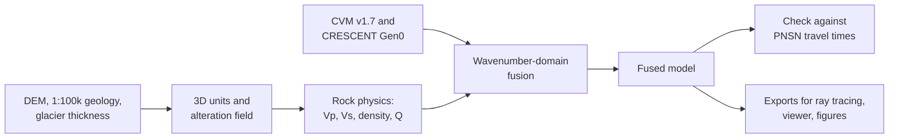

<header class="title">
<div class="kicker">Gaia Hazlab · Technical report · Model version M1</div>
<h1>rainier3d: a geology-driven 3D velocity model of Mount Rainier</h1>
<div class="byline">Marine Denolle, Department of Earth and Space Sciences, University of Washington<br>
23 September 2026 · Code: <a href="https://github.com/Denolle-Lab/mt-rainier-virtual-3d-model">github.com/Denolle-Lab/mt-rainier-virtual-3d-model</a></div>
</header>

<div class="abstract" markdown="1">
**Summary.** rainier3d is an open, Python-built model of P- and S-wave speed, density and attenuation beneath Mount Rainier and the West Rainier Seismic Zone (WRSZ). It covers a 70 × 75 km box from the ground surface to 20 km below sea level. Mapped geology is extended to depth with explicit rules and converted to seismic properties with a pressure-dependent rock-physics law. The result is then merged with the USGS Cascadia velocity model v1.7 in the wavenumber domain, so the regional model keeps the long wavelengths and the geology supplies the short ones.

Without station corrections, the merged model fits 1828 PNSN analyst P picks with an event-demeaned RMS of 0.135 s, against 0.160 s for the PNSN 1D model. It also accounts for part of the station terms that the 1D model needs (correlation 0.64). This first version is a working framework rather than a finished velocity model. Most rock-physics parameters are still placeholders, and they are flagged as such throughout.
</div>

[TOC]

## 1. Scope

Seismic monitoring at Mount Rainier relies on one-dimensional velocity models, with station corrections absorbing the effects of topography and near-surface structure. Regional three-dimensional models of Cascadia resolve the crust at wavelengths of several kilometres or more, but not the volcanic edifice, its hydrothermally altered core, its glaciers or the shallow units exposed around it. rainier3d aims to connect the two scales: a model that is tied to the mapped geology at the surface, stays consistent with regional tomography at depth, and reproduces the travel times used by the Pacific Northwest Seismic Network (PNSN).

This report documents version M1 in five parts:

- how the model is built (Sections 2–6);
- what it looks like (Section 7);
- how it compares with PNSN travel times (Section 8);
- how to extract it for ray tracing and earthquake location (Section 9);
- what it does not yet contain (Sections 10 and 11).

## 2. Domain, grids and workflow

The model uses Universal Transverse Mercator zone 10N (EPSG:32610) coordinates, with elevation in metres above NAVD88 (EPSG:5703), positive up. The box spans easting 553–623 km and northing 5149–5224 km. This is the geographic box 122.30–121.40° W, 46.50–47.15° N, projected and rounded outward to whole kilometres. Columbia Crest (4392 m) lies at easting 594.5 km, northing 5189.5 km.

Properties are stored on three stacked regular grids whose spacing coarsens with depth (Table 1). Cells above the ground surface carry no properties, and the depth of each cell below the local ground surface is stored with it.

| Level | Elevation range (m) | Horizontal spacing (m) | Vertical spacing (m) | Cells (z × y × x) |
|---|---|---|---|---|
| Surface grid | – | 100 | – | 750 × 700 |
| L1 | 4400 to 0 | 250 | 50 | 88 × 300 × 280 |
| L2 | 0 to −6000 | 500 | 250 | 24 × 150 × 140 |
| L3 | −6000 to −20000 | 1000 | 1000 | 14 × 75 × 70 |

<p class="note">Table 1. Model grids in version M1. The configuration also holds a finer target profile (L1 50 m × 20 m, L2 200 m, L3 500 m).</p>



The workflow runs as numbered scripts (S1–S10). Each layer records its data source, and every parameter lives in a version-controlled configuration file.

<figure>
<figcaption><b>Figure 1.</b> Model domain. The background shows the surface model units derived from the Washington 1:100,000 geologic map over a hillshade, with glacier outlines in blue. Symbols are operating sensors (FDSN metadata, GNSS site metadata and the 2025 node deployment), the white line is the Paradise–Nisqually Entrance DAS fiber, and dots are PNSN earthquakes since 2015 (M ≥ 0.5), coloured by depth. The dashed lines mark sections A–A′ and B–B′ (Figures 3–5).</figcaption></figure>

## 3. Surface layers

Three surface layers control the top of every model column: ground elevation, the mapped unit, and glacier ice thickness.

**Elevation** comes from the USGS 3D Elevation Program at 30 m, block-averaged to the 100 m surface grid. It ranges from 24 to 4380 m in the box.

**Geology** comes from the Washington Geological Survey 1:100,000 surface geology in the GeMS format. All 149 map symbols present in the box are assigned to 14 surface model units by rules on the symbol, checked against each unit's full name in the map's Description of Map Units, and every cell receives a unit. The park map of Fiske et al. (1963) is carried as a georeferenced image for display, not yet as model units.

**Glacier ice thickness** comes from the IceBoost v2 per-glacier grids for the 219 glaciers of the Randolph Glacier Inventory 6.0 (RGI Consortium, 2017) whose centroids fall in the box, 97.3 km² in all. The grids are area-averaged onto the 100 m grid. Each glacier is rescaled so that its volume matches the volume IceBoost reports for it, which removes an 18% overestimate from counting partly glacier-covered cells as full. The total is 5.50 km³, of which 5.32 km³ is on the cone.

The glacier bed is the ground elevation minus the ice thickness. Figure 2 compares the grids with the 1981 radar surveys of Driedger & Kennard (1986), as archived in GlaThiDa (WGMS, 2020). Maximum thickness agrees for Carbon, Nisqually and Tahoma glaciers, but IceBoost is thicker than the radar values on Emmons (273 vs 185 m) and Winthrop (237 vs 98 m). Part of any difference reflects thinning since 1981 (Sisson et al., 2011).

<figure style="max-width:420px">
<figcaption><b>Figure 2.</b> Mean (circles) and maximum (squares) ice thickness from IceBoost v2 against the 1981 ground-penetrating radar summaries in GlaThiDa, for seven Rainier glaciers. The dashed line is 1:1.</figcaption></figure>

Unconsolidated deposits are given fixed thicknesses in M1: glacial drift 15 m, alluvium and colluvium 10 m, lahar deposits 15 m, water 5 m. These are placeholders, thinner than one L1 cell.

## 4. Three-dimensional geology

Units are extended to depth with explicit column rules, in the manner of the San Francisco Bay region model (Aagaard & Hirakawa, 2021), where the geology comes first and the velocity rules second. No structural interpolation is used in M1. For a cell at elevation z and depth d below the ground, the rules of Table 2 are applied from the top down.

| Condition | Assigned unit |
|---|---|
| d < 0 | air |
| d < ice thickness | ice |
| d < ice + deposit thickness | mapped surface deposit |
| inside the edifice footprint, above the edifice base | Rainier andesite |
| young volcanics, or andesite outside the footprint, within 300 m of the bedrock top | that cap unit |
| above the base of the bedrock unit | bedrock unit (mapped, or nearest mapped basement unit) |
| otherwise | middle crust |

<p class="note">Table 2. Column rules for the 3D units.</p>

The edifice footprint is the andesite and ice mapped within 12 km of the summit, closed over 500 m. Its base is the pre-volcanic surface: the ground elevations where basement rocks crop out around the footprint, interpolated linearly across it. The base lies at 804–2234 m over 252 km².

Beneath deposits and the edifice, the basement unit is taken from the nearest outcrop. The supracrustal units (Ohanapecosh Formation, Fifes Peak and Stevens Ridge formations, Eocene volcanic rocks and the Puget Group) extend to 4 km below sea level. The Miocene plutons (Tatoosh, White River, Carbon River) extend to 10 km below sea level, and the Mashel Formation is capped at 300 m thickness.

Two further bodies are placeholders:

- **Magma body.** An ellipsoid below the summit, centred at 11.5 km below sea level, with semi-axes of 5 km horizontally and 6.5 km vertically. It is modelled on the low-Vp body imaged 5–18 km beneath the summit by Moran et al. (1999).
- **Alteration field.** A field between 0 and 1 that decays as a Gaussian away from the conduit axis (r₀ = 1.5 km) and linearly from the summit down to 1000 m elevation. It stands in for the altered volumes mapped by Finn et al. (2001) and John et al. (2008).

## 5. Rock physics

Each unit receives a P-wave speed that increases with effective pressure as cracks close:

$$V_P(P) = V_\infty - (V_\infty - V_0)\, e^{-P/P^{*}}, \qquad P = (\rho_{b} - \rho_{w})\, g\, d,$$

with bulk density \(\rho_b\) = 2500 kg/m³, water density \(\rho_w\) = 1000 kg/m³ (hydrostatic pore pressure) and d the depth below the local ground surface.

Where a unit has no Vp/Vs ratio or density of its own, both come from Brocher (2005): his regression of Vs on Vp, and the Nafe–Drake density relation, both valid for 1.5 < Vp < 8.5 km/s. Attenuation follows Qs = 0.05 Vs (Vs in m/s) and Qp = 2 Qs. Table 3 lists the unit parameters, all of which are placeholders chosen within published ranges and not yet sourced value by value.

| Unit | V₀ (km/s) | V∞ (km/s) | P* (MPa) | Vp/Vs | Density (g/cm³) |
|---|---|---|---|---|---|
| Ice | 3.80 | 3.80 | – | 1.98 | 0.917 |
| Glacial drift | 1.60 | 2.40 | 5 | 2.50 | 1.95 |
| Alluvium, colluvium | 1.50 | 2.20 | 5 | 2.80 | 1.90 |
| Lahar deposits | 1.80 | 2.80 | 8 | 2.30 | 2.00 |
| Rainier andesite | 2.80 | 5.60 | 30 | Brocher | Nafe–Drake |
| Young volcanic rocks | 3.00 | 5.60 | 30 | Brocher | Nafe–Drake |
| Miocene intrusive rocks | 4.50 | 6.20 | 40 | Brocher | Nafe–Drake |
| Miocene volcanic rocks | 3.20 | 5.80 | 40 | Brocher | Nafe–Drake |
| Ohanapecosh Formation | 3.40 | 5.90 | 40 | Brocher | Nafe–Drake |
| Eocene volcanic rocks | 3.50 | 6.00 | 40 | Brocher | Nafe–Drake |
| Puget Group and Eocene sedimentary rocks | 2.60 | 5.20 | 40 | Brocher | Nafe–Drake |
| Mashel Formation | 2.20 | 4.50 | 30 | Brocher | Nafe–Drake |
| Russell Ranch Formation | 4.00 | 6.00 | 40 | Brocher | Nafe–Drake |
| Middle crust | 6.00 | 6.50 | 50 | Brocher | Nafe–Drake |

<p class="note">Table 3. Unit parameters in version M1 (placeholders).</p>

Inside the magma body, Vp, Vs and density are reduced by 10%, 15% and 3%. The alteration field a scales Vp by (1 − 0.30a), Vs by (1 − 0.35a) and density by (1 − 0.12a), within the ranges reported for altered volcanic rock (Heap & Violay, 2021).

## 6. Fusion with the regional model

The regional model consists of two parts:

- **USGS Cascadia velocity model v1.7** (Wirth et al., 2025), for Vp and Vs down to 9.9 km below the ground. Its depth axis is below the ground surface. For the shallow level this is confirmed by a median top-sample Vs of about 206 m/s. For the deeper level it is inferred from continuity: at the summit, Vs is 2841 m/s at 1.2 km and 2870 m/s at 1.5 km.
- **CRESCENT Gen0 Vs** (He et al., 2026), below 9.9 km, with Vp from Brocher (2005).

The two models are combined in the logarithm of velocity. Vs and the Vp/Vs ratio are fused rather than Vp and Vs separately, so the fused Vp/Vs always lies between the two input ratios:

$$\ln V = \mathrm{LP}_{\lambda_c}\!\left(\ln V_{\mathrm{reg}}\right) + \left[\ln V_{\mathrm{geo}} - \mathrm{LP}_{\lambda_c}\!\left(\ln V_{\mathrm{geo}}\right)\right].$$

LP is a horizontal Gaussian low-pass filter with half power at the cutoff wavelength \(\lambda_c\), that is \(\sigma = \sqrt{2\ln 2}\,\lambda_c / 2\pi\). The cutoff grows with depth below the ground: 6 km at the surface, 10 km at 2 km and 20 km from 10 km down. These are placeholders for the resolution of the regional model. Air cells are excluded by normalised convolution.

A Gaussian high-pass filter overshoots at sharp contrasts, producing fast rims around slow bodies. To remove them, six alternating projections follow: each cell is clamped between its geology and regional values, and the regional low-pass is then restored. The top 300 m keeps the geology model unchanged, and a linear taper reaches the fused model at 1 km. Density follows Vp through the ratio of Nafe–Drake densities, which preserves the density contrasts between units.

<figure>
<figcaption><b>Figure 3.</b> Vs along section A–A′ (west–east through the summit): (a) geology-driven model, (b) regional model, (c) fused model. The fused model keeps the regional long wavelengths and the geological contrasts: the Puget Group sedimentary block near 572–582 km, the Tatoosh and White River plutons, and the slow edifice.</figcaption></figure>

| Level | RMS of LP(ln V) − LP(ln V_reg), Vp | Same, Vs | Mean ln(V / V_reg), Vp | Same, Vs |
|---|---|---|---|---|
| L1 | 0.032 | 0.033 | −0.086 | −0.092 |
| L2 | 0.003 | 0.003 | −0.003 | −0.002 |
| L3 | 0.0005 | 0.0006 | 0.0001 | 0.0001 |

<p class="note">Table 4. Departure of the fused model from the regional model at the regional wavelengths, below 1 km depth, and mean offset over all cells. L1 exceeds the 0.03 target: in the top level the clamp and the long-wavelength constraint conflict.</p>

## 7. The fused model

Figures 4 and 5 show the fused model along the two sections through the summit, and Figure 6 compares vertical profiles.

- **The edifice.** The edifice and the top kilometre are slower than the regional model, about 9% on average in L1. This follows from the low-pressure velocities of the geology model in the top kilometre, where the regional model has little resolution.
- **Plutons.** The Miocene plutons stand out as fast columns to 10 km below sea level.
- **Puget Group.** The Puget Group block west of the summit is slow down to 4 km below sea level.
- **Seismicity.** Summit earthquakes form a column from the edifice to about 3 km below sea level. WRSZ earthquakes concentrate 4–12 km below sea level, 12–18 km west of the summit.

The placeholder magma body is largely removed at 7–10 km below sea level. This happens because neither the Cascadia velocity model nor CRESCENT holds a slow body there at the wavelengths they resolve. Whether a body of the size imaged by Moran et al. (1999) and Pang et al. (2025) should survive the fusion is one of the questions the next version will test.

<figure>
<figcaption><b>Figure 4.</b> Fused model along A–A′ (west–east through the summit): (a) Vp, (b) Vs, (c) density, (d) model units. Light blue at the surface is glacier ice (IceBoost v2). White dots are PNSN earthquakes within 2 km of the section. The dashed line is sea level.</figcaption></figure>

<figure>
<figcaption><b>Figure 5.</b> Fused model along B–B′ (south–north through the summit): (a) Vs, (b) Vp/Vs, (c) model units. The step in Vp/Vs near 9 km depth below the ground marks the change from the Cascadia velocity model to CRESCENT with Brocher's Vp.</figcaption></figure>

<figure>
<figcaption><b>Figure 6.</b> Vertical profiles of Vp (solid) and Vs (dashed) at the summit, at Longmire and in the WRSZ, for the geology-driven, regional and fused models and the PNSN 1D model used for comparison in Section 8.</figcaption></figure>

## 8. Consistency with PNSN travel times

The test uses the 89 PNSN earthquakes of magnitude 2 or larger in the box between 2015 and 2026, with their origins and analyst picks from the USGS ComCat catalogue: 1828 P and 1280 S picks at 50 stations. Travel times are computed with an eikonal solver (fteikpy) on a 500 m grid, one solve per station and phase, and sampled at the PNSN hypocentres.

The one-dimensional reference is the western Washington layered model with linear gradients, as tabulated in the Gaia Hazlab Cascadia catalogue project. Its depths are taken below sea level, with the top gradient extrapolated above sea level. Residuals are compared after removing the mean residual of each event, which absorbs errors in origin time.

| Phase | RMS, 1D (s) | RMS, 3D (s) | RMS, 1D, event mean removed (s) | RMS, 3D, event mean removed (s) | PNSN reported RMS (s) | Correlation of station terms |
|---|---|---|---|---|---|---|
| P | 0.197 | 0.348 | 0.160 | 0.135 | 0.140 | 0.64 (50 stations) |
| S | 0.388 | 0.803 | 0.291 | 0.286 | 0.227 | 0.53 (45 stations) |

<p class="note">Table 5. Travel-time residuals. The last column is the correlation, across stations, between the mean 1D residual and the mean 3D − 1D predicted delay.</p>

With the mean of each event removed, the fused model fits the P picks better than the 1D model (0.135 vs 0.160 s), and about as well as the residuals PNSN reports for its own locations (0.140 s), which include station corrections. The per-station 3D − 1D delay correlates with the mean 1D residual (Figure 7b), so the 3D structure explains part of what station corrections absorb.

The fused model also predicts later arrivals than the 1D model at every station: by 0.32 s on average for P (0.13–0.60 s) and 0.94 s for S (0.44–1.36 s). These offsets explain the larger raw RMS. Part of them is expected, since the events remain at their 1D hypocentres. The size of the S offset, however, points to near-surface Vs that is too slow, which is consistent with the placeholder rock physics in the top kilometre.

<figure>
<figcaption><b>Figure 7.</b> (a) Distribution of P residuals after removing each event's mean, for the PNSN 1D model and the fused model. (b) Mean 3D − 1D predicted delay against mean 1D residual for each station with at least five picks.</figcaption></figure>

Two caveats apply. Which PNSN regional model (P3 or C3) the one-dimensional table represents has not been confirmed with the network. And ComCat depths are treated as depths below sea level.

## 9. Extracting the fused model for ray tracing

The master product is `data/processed/model.zarr`, an xarray DataTree with one node per level. Ray tracers need a single regular grid, so script S9 resamples the three levels onto one and writes three formats (Table 6).

In the resampling, values are interpolated linearly within each level. Cells above the ground surface are filled with the value of the first rock cell beneath them, so receivers placed at the surface sit in rock, and a mask variable `air` flags those cells. The exporter was checked against the stored levels: at level cell centres the grid reproduces `model.zarr` exactly, and the NonLinLoc buffers read back to the same velocities.

| File | Format | Coordinates | Variables | Use |
|---|---|---|---|---|
| `rainier3d_fused_500m.nc` | CF netCDF4 | UTM 10N x, y (m); z = elevation (m, up) | vp, vs (m/s), rho (kg/m³), qp, qs, air, surface_elevation | pykonal, fteikpy, custom codes |
| `nll/rainier3d.{P,S}.mod.hdr/.buf` | NonLinLoc 3D grid, SLOW_LEN, float32 | x, y in UTM 10N km; depth (km, down, below sea level); TRANSFORM NONE | slowness × cell size | Grid2Time, NLLoc |
| `rainier3d_emc.nc` | EMC-style netCDF3 | longitude, latitude; depth (km below sea level) | vp, vs (km/s), rho (g/cm³); NaN above ground | IRIS/EarthScope EMC tools, comparison with other models |

<p class="note">Table 6. Exports written by <code>pixi run s9</code> to <code>outputs/grids/</code>. The default spacing is 500 m in all directions (140 × 150 × 49 nodes, 4.25 km above to 19.75 km below sea level); <code>--dx</code> and <code>--dz</code> change it.</p>

To build the model and the exports from a clean checkout:

```
pixi install
pixi run all            # S1-S8: surface, geology, rock physics, fusion, PNSN check, figures, atlas
pixi run s9 -- --dx 250 --dz 250   # uniform grids at 250 m
```

Travel times with fteikpy from the netCDF export:

```python
import numpy as np, xarray as xr
from fteikpy import Eikonal3D

g = xr.open_dataset("outputs/grids/rainier3d_fused_500m.nc")
dx = float(g.attrs["dx_m"]); dz = float(g.attrs["dz_m"])
vel = np.transpose(g.vp.values, (0, 2, 1))               # (depth down, x, y) for fteikpy
eik = Eikonal3D(vel, gridsize=(dz, dx, dx),
                origin=(-float(g.z[0]), float(g.x[0]), float(g.y[0])))
# source at a station: (depth below sea level, easting, northing) in metres
tt = eik.solve((-1500.0, 594500.0, 5189500.0))
print(tt((5000.0, 604500.0, 5189500.0)))                 # 2.08 s to 5 km depth, 10 km east
```

For NonLinLoc, the grids go in the model directory used by Grid2Time (`GTFILES <model dir>/rainier3d <time dir>/rainier3d P`). Because the transform is `NONE`, station and search-grid coordinates must be given in the same UTM 10N kilometre frame, with depth positive down (`GTSRCE <sta> XYZ <x_km> <y_km> <z_km> 0.0`). The grids have been read back and checked, but a full NonLinLoc relocation has not yet been run with them.

To sample the stored levels directly, open the DataTree:

```python
import xarray as xr
tree = xr.open_datatree("data/processed/model.zarr", engine="zarr", consolidated=False)
L2 = tree["L2"].to_dataset()          # 0 to -6 km, 500 m x 250 m cells
vs = L2.vs.interp(x=594500, y=5189500, z=-2000)   # m/s at 2 km below sea level
```

An interactive viewer (`pixi run atlas`) draws vertical sections and depth slices of every property along any line, with seismicity projected onto them, and a three-dimensional underground view.

## 10. Water: what the model does not yet contain

The model contains no hydrological state. The rock-physics law assumes hydrostatic pore pressure everywhere and does not vary saturation or porosity with depth or season. Table 7 lists the water-related layers available to the project and whether they cover the model box.

| Layer | Source | Resolution | Covers the box | Status |
|---|---|---|---|---|
| Stream network | NHDPlus High Resolution flowlines (1998 reaches) | 1:24,000 | yes | available, not in the model |
| Flow routing from topography | to be derived from the 3DEP DEM | 10 m | yes | not done |
| Stream gauges | USGS NWIS via Synoptic (15 gauges) | points | yes | shown in the viewer |
| Water-table depth | Gaia soil-reanalysis baseline | 90 m | only 47.07–47.15° N | available, not in the model |
| Water-table depth | HydroGEN prior used by the soil reanalysis | 1 km | yes | available, not in the model |
| Aquifer extents | none found for the park; mostly bedrock with glacial and alluvial valley fill | – | – | – |

<p class="note">Table 7. Water-related layers. The groundwater study of the upper White River (Fuhrig et al., 2024, U.S. Geological Survey Scientific Investigations Report 2024-5015) is the only park-scale groundwater assessment found.</p>

Adding water would change the shallow model in three ways. A water table would separate dry from saturated cells in Gassmann-type fluid substitution, raising Vp and Vp/Vs below it. Valley-fill aquifers would appear as slow, high-Vp/Vs bodies along the major drainages. And the hydrothermal system described by Frank (1995) would add a fluid-saturated core to the alteration field.

## 11. Limitations and next steps

The structure of the model is in place, but its values should not yet be used as a published velocity model. The main limitations and the planned remedies are:

- **Rock-physics parameters.** All parameters in Table 3, the perturbation factors and the Q rule are placeholders. They will be replaced by a table extracted from laboratory and field measurements on Cascade and analogue volcanic rocks (for example, Watters et al., 2000; Heap & Violay, 2021).
- **Geometry by rules.** Contacts are vertical and unit bases are flat. Structural modelling from the map contacts and the GeMS orientation measurements is the next step.
- **Placeholder bodies.** The magma body and the alteration field are placeholders. Alteration will be constrained by the helicopter electromagnetic and magnetic data of Rystrom et al. (2000) and Finn et al. (2001). The Southern Washington Cascades Conductor (Stanley et al., 1996) is not yet represented.
- **Fusion cutoffs.** The cutoff wavelengths are not yet tied to the resolution of the regional models, and L1 exceeds the misfit target (Table 4).
- **Regional model below 9.9 km.** Below this depth the regional model is CRESCENT Vs with Brocher's Vp only; the deep level of the Cascadia velocity model has still to be added.
- **Resolution.** The M1 grids are coarse (L1 is 250 m × 50 m), and thin deposit layers fall below the cell size.
- **Travel-time check.** The check uses fixed PNSN hypocentres and a one-dimensional reference whose identity is unconfirmed. Relocation in 3D, the PNSN station delays and the PNSN AI-ready pick dataset (Ni et al., 2023) will extend it.
- **Glaciers.** IceBoost exceeds the 1981 radar thicknesses on Emmons and Winthrop glaciers. Its total should be compared with the lidar-based ice volume of Sisson et al. (2011).

## 12. Data and code availability

The code, configuration and this report are in the repository [Denolle-Lab/mt-rainier-virtual-3d-model](https://github.com/Denolle-Lab/mt-rainier-virtual-3d-model) (BSD-3-Clause). The environment is managed with pixi, and each result in this report is regenerated by the scripts named in the text (S1–S10). The data sets are public and are listed in Appendix A with their DOIs or service addresses.

The Cascadia velocity model v1.7 must be downloaded by hand from ScienceBase. The model files will be archived with a DOI once the rock-physics parameters are sourced.

<div class="note" markdown="1">
The model code and this report were prepared with an AI coding assistant (Claude, Anthropic) under the direction of the author. All numbers are produced by the scripts in the repository, and all DOIs were resolved against the Crossref and DataCite registries on 23 September 2026.
</div>

## Appendix A. Data sets

| Data set | Role in the model | DOI or address |
|---|---|---|
| Cascadia velocity model v1.7 (Wirth et al., 2025) | regional Vp and Vs to 9.9 km | [10.3133/ofr20251045](https://doi.org/10.3133/ofr20251045); data [10.5066/P14HJ3IC](https://doi.org/10.5066/P14HJ3IC) |
| CRESCENT Gen0 community velocity model (He et al., 2026) | regional Vs below 9.9 km | [10.1029/2025JB033216](https://doi.org/10.1029/2025JB033216); data [10.6084/m9.figshare.31902061](https://doi.org/10.6084/m9.figshare.31902061) |
| Washington 1:100,000 surface geology (GeMS) | surface units | [feature service](https://gis.dnr.wa.gov/site1/rest/services/Public_Geology/100K_Surface_Geology_WA_GeMS/FeatureServer) |
| Geology of Mount Rainier National Park (Fiske et al., 1963) | stratigraphy; map overlay | [10.3133/pp444](https://doi.org/10.3133/pp444) |
| USGS 3D Elevation Program | elevation | [usgs.gov/3d-elevation-program](https://www.usgs.gov/3d-elevation-program) |
| IceBoost v2 per-glacier thickness | ice thickness | [OGGM data server](https://cluster.klima.uni-bremen.de/~oggm/ice_thickness/iceboost_v2/) |
| Randolph Glacier Inventory 6.0 | glacier identifiers | [10.7265/N5-RGI-60](https://doi.org/10.7265/N5-RGI-60) |
| GlaThiDa (WGMS, 2020); Driedger & Kennard (1986) | glacier thickness check | [10.5904/wgms-glathida-2020-10](https://doi.org/10.5904/wgms-glathida-2020-10); [10.3133/pp1365](https://doi.org/10.3133/pp1365) |
| PNSN origins and phase data (USGS ComCat) | travel-time check | [earthquake.usgs.gov/fdsnws/event/1](https://earthquake.usgs.gov/fdsnws/event/1/) |
| EarthScope FDSN station metadata | station coordinates, sensor inventory | [service.earthscope.org/fdsnws/station/1](https://service.earthscope.org/fdsnws/station/1/) |
| PNSN regional 1D models | 1D reference | [PNSN Quarterly Report 2003-A](https://assets.pnsn.org/legacy_reports/Sum03/Quarterly2003A.pdf) |

## References

{{REFERENCES}}

<footer>rainier3d M1 · Gaia Hazlab, University of Washington · Generated by <code>scripts/10_report.py</code> on 23 September 2026.</footer>
