<header class="title">
<div class="kicker">Gaia Hazlab · Technical report · Model version M1</div>
<h1>rainier3d: a geology-driven 3D velocity model of Mount Rainier</h1>
<div class="byline">Marine Denolle<sup>1</sup> and Derek Yao<sup>2</sup><br>
<sup>1</sup> Department of Earth and Space Sciences, University of Washington; <sup>2</sup> Computer Science and Art, University of Washington<br>
23 September 2026, revised 24 September 2026 · Code: <a href="https://github.com/Denolle-Lab/mt-rainier-digital-model">github.com/Denolle-Lab/mt-rainier-digital-model</a></div>
</header>

<div class="abstract" markdown="1">
**Summary.** rainier3d is an open, Python-built model of P- and S-wave speed, density and attenuation beneath Mount Rainier and the West Rainier Seismic Zone (WRSZ). It covers a 70 × 75 km box from the ground surface to 20 km below sea level. Mapped geology is extended to depth with explicit rules and converted to seismic properties with a pressure-dependent rock-physics law. The result is then merged with the USGS Cascadia velocity model v1.7 in the wavenumber domain, so the regional model keeps the long wavelengths and the geology supplies the short ones.

The model is calibrated on 1823 P and 1280 S analyst picks from 88 PNSN earthquakes. Every event is relocated in 3D in every trial model, with topography honoured, and the fit is scored on held-out events. Two things are fitted: three rock-physics multipliers of the geology model, and a depth-dependent correction to the regional models. On the held-out half, the RMS after relocation falls from 0.121 to 0.093 s for P and from 0.317 to 0.188 s for S; the PNSN 1D model, relocated the same way, leaves 0.132 and 0.268 s. The data require near-surface rock about 31% faster than the placeholder law. They also require Vs 5–9% faster than the Cascadia velocity model at 2–7 km depth, lowering Vp/Vs there from about 1.83 to 1.74.

An independent check against the iMUSH local-earthquake tomography (Ulberg et al., 2020) confirms the Vs correction beneath Rainier. It also shows that the correction does not hold farther south, near Mount St. Helens.

The same grid carries soil thickness, two water-table estimates, NHDPlus HR streams, canopy height, land cover and a Sentinel-2 composite. This first version is a working framework rather than a finished velocity model. The unit-by-unit rock-physics parameters are still placeholders, scaled by the three calibrated multipliers, and they are flagged as such throughout.
</div>

[TOC]

## 1. Scope

Seismic monitoring at Mount Rainier relies on one-dimensional velocity models, with station corrections absorbing the effects of topography and near-surface structure. Regional three-dimensional models of Cascadia resolve the crust at wavelengths of several kilometres or more, but not the volcanic edifice, its hydrothermally altered core, its glaciers or the shallow units exposed around it. rainier3d aims to connect the two scales: a model that is tied to the mapped geology at the surface, stays consistent with regional tomography at depth, and reproduces the travel times used by the Pacific Northwest Seismic Network (PNSN).

This report documents version M1 in five parts:

- how the model is built (Sections 2–6);
- what it looks like (Section 7);
- how it compares with PNSN travel times (Section 8);
- how to extract it for ray tracing and earthquake location (Section 9);
- which surface layers it carries: soil, water, vegetation, imagery (Section 10);
- what it does not yet contain (Section 11).

## 2. Domain, grids and workflow

The model uses Universal Transverse Mercator zone 10N (EPSG:32610) coordinates, with elevation in metres above NAVD88 (EPSG:5703), positive up. The box spans easting 553–623 km and northing 5149–5224 km. This is the geographic box 122.30–121.40° W, 46.50–47.15° N, projected and rounded outward to whole kilometres. Columbia Crest (4392 m) lies at easting 594.5 km, northing 5189.5 km.

Properties are stored on three stacked regular grids whose spacing coarsens with depth (Table 1). Cells above the ground surface carry no properties, and the depth of each cell below the local ground surface is stored with it.

| Level | Elevation range (m) | Horizontal spacing (m) | Vertical spacing (m) | Cells (z × y × x) |
|---|---|---|---|---|
| Surface grid | – | 100 | – | 750 × 700 |
| L1 | 4400 to 0 | 250 | 50 | 88 × 300 × 280 |
| L2 | 0 to −6000 | 500 | 250 | 24 × 150 × 140 |
| L3 | −6000 to −20000 | 1000 | 1000 | 14 × 75 × 70 |

<p class="note">Table 1. Model grids in version M1. The configuration also holds a finer target profile (L1 50 m × 20 m, L2 200 m, L3 500 m).</p>

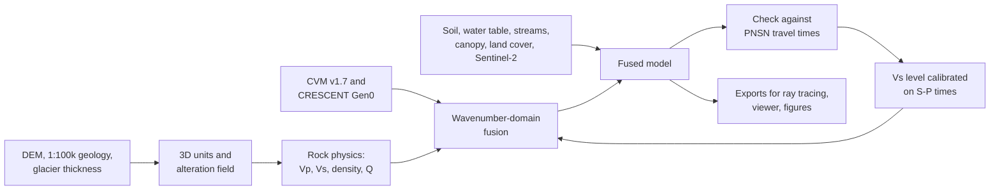

The workflow runs as numbered scripts (S1–S12). Each layer records its data source, and every parameter lives in a version-controlled configuration file.

<figure>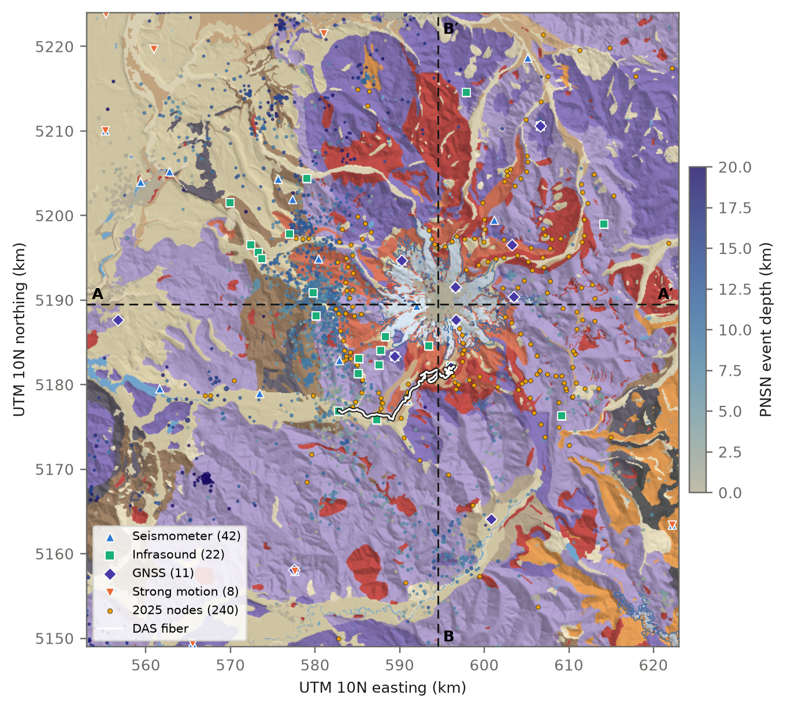
<figcaption><b>Figure 1.</b> Model domain. The background shows the surface model units derived from the Washington 1:100,000 geologic map over a hillshade, with glacier outlines in blue. Symbols are operating sensors (FDSN metadata, GNSS site metadata and the 2025 node deployment), the white line is the Paradise–Nisqually Entrance DAS fiber, and dots are PNSN earthquakes since 2015 (M ≥ 0.5), coloured by depth. The dashed lines mark sections A–A′ and B–B′ (Figures 3–5).</figcaption></figure>

## 3. Surface layers

Three surface layers control the top of every model column: ground elevation, the mapped unit, and glacier ice thickness. The environmental layers carried on the same grid (soil, water table, streams, vegetation and imagery) are described in Section 10.

**Elevation** comes from the USGS 3D Elevation Program at 30 m, block-averaged to the 100 m surface grid. It ranges from 24 to 4380 m in the box.

**Geology** comes from the Washington Geological Survey 1:100,000 surface geology in the GeMS format. All 149 map symbols present in the box are assigned to 14 surface model units by rules on the symbol, checked against each unit's full name in the map's Description of Map Units, and every cell receives a unit. The park map of Fiske et al. (1963) is carried as a georeferenced image for display, not yet as model units.

**Glacier ice thickness** comes from the IceBoost v2 per-glacier grids for the 219 glaciers of the Randolph Glacier Inventory 6.0 (RGI Consortium, 2017) whose centroids fall in the box, 97.3 km² in all. The grids are area-averaged onto the 100 m grid. Each glacier is rescaled so that its volume matches the volume IceBoost reports for it, which removes an 18% overestimate from counting partly glacier-covered cells as full. The total is 5.50 km³, of which 5.32 km³ is on the cone.

The glacier bed is the ground elevation minus the ice thickness. Figure 2 compares the grids with the 1981 radar surveys of Driedger & Kennard (1986), as archived in GlaThiDa (WGMS, 2020). Maximum thickness agrees for Carbon, Nisqually and Tahoma glaciers, but IceBoost is thicker than the radar values on Emmons (273 vs 185 m) and Winthrop (237 vs 98 m). Part of any difference reflects thinning since 1981 (Sisson et al., 2011).

<figure style="max-width:420px">
<figcaption><b>Figure 2.</b> Mean (circles) and maximum (squares) ice thickness from IceBoost v2 against the 1981 ground-penetrating radar summaries in GlaThiDa, for seven Rainier glaciers. The dashed line is 1:1.</figcaption></figure>

Unconsolidated deposits are given fixed thicknesses in M1: glacial drift 15 m, alluvium and colluvium 10 m, lahar deposits 15 m, water 5 m. These are placeholders, thinner than one L1 cell.

## 4. Three-dimensional geology

Units are extended to depth with explicit column rules, in the manner of the San Francisco Bay region model (Aagaard & Hirakawa, 2021), where the geology comes first and the velocity rules second. No structural interpolation is used in M1. For a cell at elevation z and depth d below the ground, the rules of Table 2 are applied from the top down.

| Condition | Assigned unit |
|---|---|
| d < 0 | air |
| d < ice thickness | ice |
| d < ice + deposit thickness | mapped surface deposit |
| inside the edifice footprint, above the edifice base | Rainier andesite |
| young volcanics, or andesite outside the footprint, within 300 m of the bedrock top | that cap unit |
| above the base of the bedrock unit | bedrock unit (mapped, or nearest mapped basement unit) |
| otherwise | middle crust |

<p class="note">Table 2. Column rules for the 3D units.</p>

The edifice footprint is the andesite and ice mapped within 12 km of the summit, closed over 500 m. Its base is the pre-volcanic surface: the ground elevations where basement rocks crop out around the footprint, interpolated linearly across it. The base lies at 804–2234 m over 252 km².

Beneath deposits and the edifice, the basement unit is taken from the nearest outcrop. The supracrustal units (Ohanapecosh Formation, Fifes Peak and Stevens Ridge formations, Eocene volcanic rocks and the Puget Group) extend to 4 km below sea level. The Miocene plutons (Tatoosh, White River, Carbon River) extend to 10 km below sea level, and the Mashel Formation is capped at 300 m thickness.

Two further bodies are placeholders:

- **Magma body.** An ellipsoid below the summit, centred at 11.5 km below sea level, with semi-axes of 5 km horizontally and 6.5 km vertically. It is modelled on the low-Vp body imaged 5–18 km beneath the summit by Moran et al. (1999).
- **Alteration field.** A field between 0 and 1 that decays as a Gaussian away from the conduit axis (r₀ = 1.5 km) and linearly from the summit down to 1000 m elevation. It stands in for the altered volumes mapped by Finn et al. (2001) and John et al. (2008).

## 5. Rock physics

Each unit receives a P-wave speed that increases with effective pressure as cracks close:

$$V_P(P) = V_\infty - (V_\infty - V_0)\, e^{-P/P^{*}}, \qquad P = (\rho_{b} - \rho_{w})\, g\, d,$$

with bulk density \(\rho_b\) = 2500 kg/m³, water density \(\rho_w\) = 1000 kg/m³ (hydrostatic pore pressure) and d the depth below the local ground surface.

Where a unit has no Vp/Vs ratio or density of its own, both come from Brocher (2005): his regression of Vs on Vp, and the Nafe–Drake density relation, both valid for 1.5 < Vp < 8.5 km/s. Attenuation follows Qs = 0.05 Vs (Vs in m/s) and Qp = 2 Qs. Table 3 lists the unit parameters, all of which are placeholders chosen within published ranges and not yet sourced value by value.

| Unit | V₀ (km/s) | V∞ (km/s) | P* (MPa) | Vp/Vs | Density (g/cm³) |
|---|---|---|---|---|---|
| Ice | 3.80 | 3.80 | – | 1.98 | 0.917 |
| Glacial drift | 1.60 | 2.40 | 5 | 2.50 | 1.95 |
| Alluvium, colluvium | 1.50 | 2.20 | 5 | 2.80 | 1.90 |
| Lahar deposits | 1.80 | 2.80 | 8 | 2.30 | 2.00 |
| Rainier andesite | 2.80 | 5.60 | 30 | Brocher | Nafe–Drake |
| Young volcanic rocks | 3.00 | 5.60 | 30 | Brocher | Nafe–Drake |
| Miocene intrusive rocks | 4.50 | 6.20 | 40 | Brocher | Nafe–Drake |
| Miocene volcanic rocks | 3.20 | 5.80 | 40 | Brocher | Nafe–Drake |
| Ohanapecosh Formation | 3.40 | 5.90 | 40 | Brocher | Nafe–Drake |
| Eocene volcanic rocks | 3.50 | 6.00 | 40 | Brocher | Nafe–Drake |
| Puget Group and Eocene sedimentary rocks | 2.60 | 5.20 | 40 | Brocher | Nafe–Drake |
| Mashel Formation | 2.20 | 4.50 | 30 | Brocher | Nafe–Drake |
| Russell Ranch Formation | 4.00 | 6.00 | 40 | Brocher | Nafe–Drake |
| Middle crust | 6.00 | 6.50 | 50 | Brocher | Nafe–Drake |

<p class="note">Table 3. Unit parameters in version M1 (placeholders). For all rock units (Rainier andesite to middle crust, and the magma body), the calibration of Section 8.3 multiplies V₀ by 1.31 (capped at 0.98 V∞), P* by 0.91 and Vs by 0.976. Ice and the unconsolidated deposits keep their table values.</p>

The placeholders are kept in the table, and the calibration is applied on top of them as three multipliers (script S4, from `configs/velocity_calibration.yaml`). The contrasts between units therefore come from the table, and their overall level comes from the data. Rainier andesite starts at 3.7 km/s instead of 2.8 km/s, and the Ohanapecosh Formation at 4.5 instead of 3.4 km/s (Figure 8). Only V₀ is resolved by the travel times (Section 8.3).

Inside the magma body, Vp, Vs and density are reduced by 10%, 15% and 3%. The alteration field a scales Vp by (1 − 0.30a), Vs by (1 − 0.35a) and density by (1 − 0.12a), within the ranges reported for altered volcanic rock (Heap & Violay, 2021).

## 6. Fusion with the regional model

The regional model consists of two parts:

- **USGS Cascadia velocity model v1.7** (Wirth et al., 2025), for Vp and Vs down to 9.9 km below the ground. Its depth axis is below the ground surface. For the shallow level this is confirmed by a median top-sample Vs of about 206 m/s. For the deeper level it is inferred from continuity: at the summit, Vs is 2841 m/s at 1.2 km and 2870 m/s at 1.5 km.
- **CRESCENT Gen0 Vs** (He et al., 2026), below 9.9 km, with Vp from Brocher (2005).

The regional Vp and Vs are then multiplied by a static correction that depends only on depth below the ground. It is fitted to the PNSN arrivals together with the geology multipliers (Section 8.3). It is zero in the top kilometre, where the geology model rules, and the corrected Vs is floored at Vp/1.6.

The two models are combined in the logarithm of velocity. Vs and the Vp/Vs ratio are fused rather than Vp and Vs separately, so the fused Vp/Vs always lies between the two input ratios:

$$\ln V = \mathrm{LP}_{\lambda_c}\!\left(\ln V_{\mathrm{reg}}\right) + \left[\ln V_{\mathrm{geo}} - \mathrm{LP}_{\lambda_c}\!\left(\ln V_{\mathrm{geo}}\right)\right].$$

LP is a horizontal Gaussian low-pass filter with half power at the cutoff wavelength \(\lambda_c\), that is \(\sigma = \sqrt{2\ln 2}\,\lambda_c / 2\pi\). The cutoff grows with depth below the ground: 6 km at the surface, 10 km at 2 km and 20 km from 10 km down. These are placeholders for the resolution of the regional model. Air cells are excluded by normalised convolution.

A Gaussian high-pass filter overshoots at sharp contrasts, producing fast rims around slow bodies. To remove them, six alternating projections follow: each cell is clamped between its geology and regional values, and the regional low-pass is then restored. The top 300 m keeps the geology model unchanged, and a linear taper reaches the fused model at 1 km. Density follows Vp through the ratio of Nafe–Drake densities, which preserves the density contrasts between units.

<figure>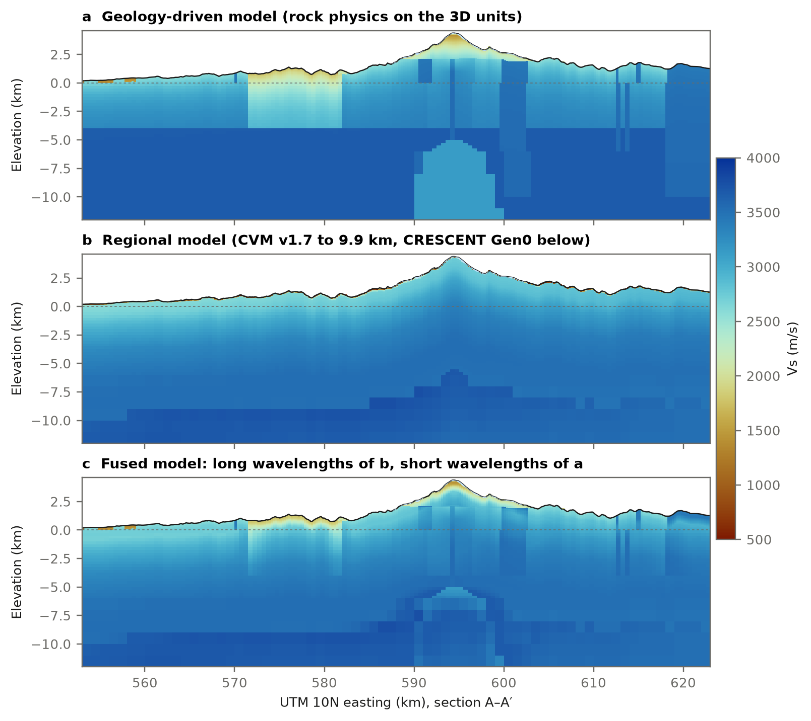
<figcaption><b>Figure 3.</b> Vs along section A–A′ (west–east through the summit): (a) geology-driven model, (b) regional model, (c) fused model. The fused model keeps the regional long wavelengths and the geological contrasts: the Puget Group sedimentary block near 572–582 km, the Tatoosh and White River plutons, and the slow edifice.</figcaption></figure>

| Level | RMS of LP(ln V) − LP(ln V_reg), Vp | Same, Vs | Mean ln(V / V_reg), Vp | Same, Vs |
|---|---|---|---|---|
| L1 | 0.012 | 0.012 | +0.046 | +0.077 |
| L2 | 0.002 | 0.002 | +0.001 | +0.001 |
| L3 | 0.0006 | 0.0006 | 0.0002 | 0.0001 |

<p class="note">Table 4. Departure of the fused model from the regional model at the regional wavelengths, below 1 km depth, and mean offset over all cells, after calibration (<code>outputs/fusion_report.csv</code>). All levels are within the 0.03 target. Before calibration L1 was at 0.032 (Vp) and 0.033 (Vs): the placeholder geology was 14–21% slower in Vp than the regional model at 0.3–2 km, and the clamp and the long-wavelength constraint conflicted. Fitting the geology removed that conflict.</p>

## 7. The fused model

Figures 4 and 5 show the fused model along the two sections through the summit, and Figure 6 compares vertical profiles.

- **The top kilometre.** After calibration, L1 is on average 5% faster in Vp and 8% faster in Vs than the regional model. The calibrated rock is stiffer than the placeholder law, and the shallowest layer of the Cascadia velocity model is a slow near-surface model (median Vs about 206 m/s). The travel times constrain this difference only beneath the stations (Section 8.5).
- **Plutons.** The Miocene plutons stand out as fast columns to 10 km below sea level.
- **Puget Group.** The Puget Group block west of the summit is slow down to 4 km below sea level.
- **Seismicity.** Summit earthquakes form a column from the edifice to about 3 km below sea level. WRSZ earthquakes concentrate 4–12 km below sea level, 12–18 km west of the summit.

The placeholder magma body is largely removed at 7–10 km below sea level. This happens because neither the Cascadia velocity model nor CRESCENT holds a slow body there at the wavelengths they resolve. Whether a body of the size imaged by Moran et al. (1999) and Pang et al. (2025) should survive the fusion is one of the questions the next version will test.

<figure>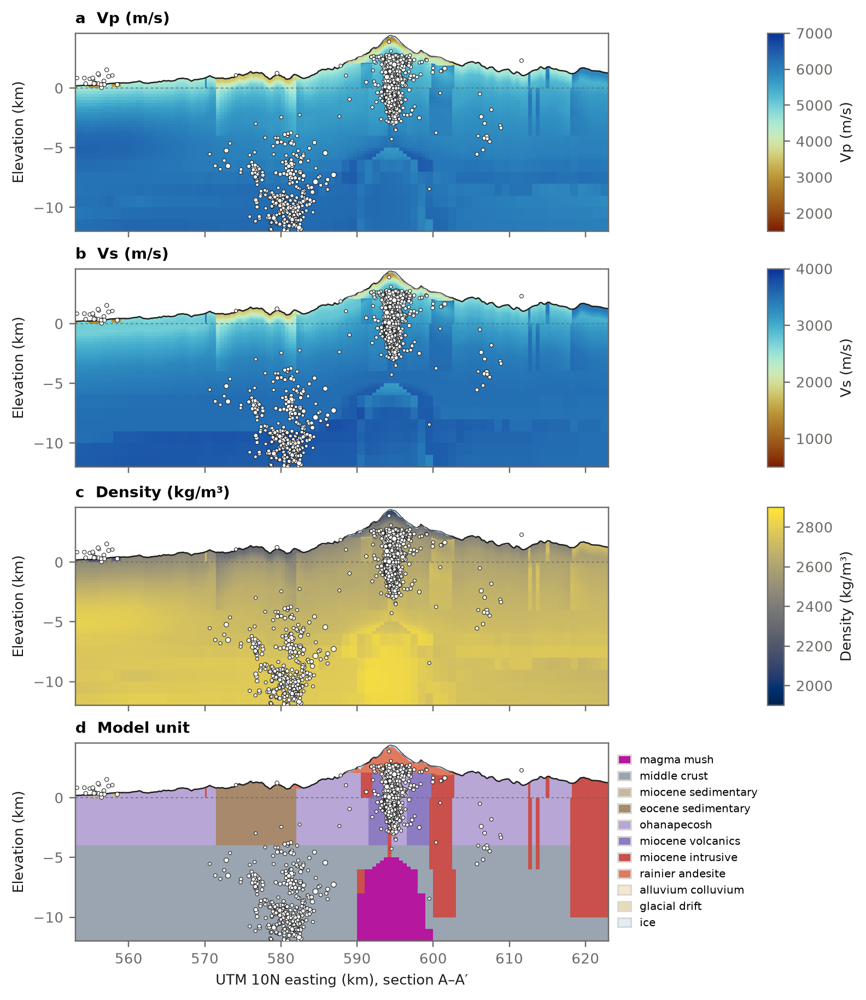
<figcaption><b>Figure 4.</b> Fused model along A–A′ (west–east through the summit): (a) Vp, (b) Vs, (c) density, (d) model units. Light blue at the surface is glacier ice (IceBoost v2). White dots are PNSN earthquakes within 2 km of the section. The dashed line is sea level.</figcaption></figure>

<figure>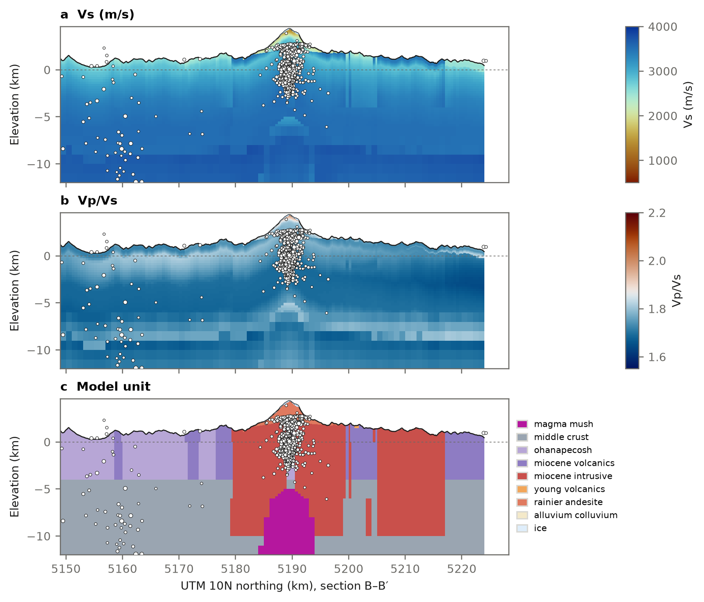
<figcaption><b>Figure 5.</b> Fused model along B–B′ (south–north through the summit): (a) Vs, (b) Vp/Vs, (c) model units. The step in Vp/Vs near 9 km depth below the ground marks the change from the Cascadia velocity model to CRESCENT with Brocher's Vp.</figcaption></figure>

<figure>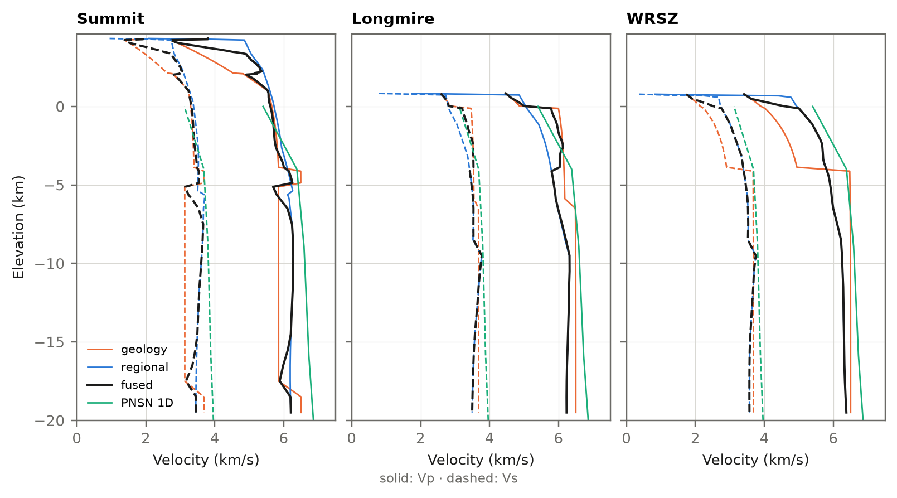
<figcaption><b>Figure 6.</b> Vertical profiles of Vp (solid) and Vs (dashed) at the summit, at Longmire and in the WRSZ, for the geology-driven, regional and fused models and the PNSN 1D model used for comparison in Section 8.</figcaption></figure>

## 8. Calibration and validation with PNSN arrivals

### 8.1 Data and travel times

The data are the 89 PNSN earthquakes of magnitude 2 or larger in the box between 2015 and 2026, with their origins and analyst picks from the USGS ComCat catalogue: 1828 P and 1280 S picks at 50 stations. The event list is stored with the code (`configs/validation_events.csv`), so every run uses the same set. The calibration keeps the 88 events with at least six picks, four of them P (1823 P and 1280 S picks). Picks are weighted by the RMS of PNSN's own location residuals: 0.14 s for P and 0.23 s for S.

Travel times are computed on a 500 m grid, with one solve per station and phase.

- **Solver.** pykonal's point-source solver (White et al., 2020), which refines the grid around the source. Against analytic travel times on this grid, its error is 2–3 times smaller than that of fteikpy, the solver used in the first version: an RMS of 8 ms against 22 ms in a uniform model, and 11 against 46 ms with a velocity gradient. It costs about 1.2 times as much. The comparison is in `docs/eikonal_benchmark.md`.
- **Topography.** Cells more than one cell (500 m) above the DEM carry the speed of sound in air. The rays therefore follow the rock and cannot cut across valleys. The one-cell skin keeps every station in rock; station elevations match the DEM to within 70 m. Against rock-filled air, station-mean residuals change by a median of 0.2 ms, with no station biased.
- **Reference.** The western Washington layered model with linear gradients, as tabulated in the Gaia Hazlab Cascadia catalogue project, with depths taken below sea level.

### 8.2 Locating the events in each model

A velocity model should be scored with hypocentres located in that model, not with catalogue hypocentres located in a 1D model with station corrections. Script S14 therefore relocates every event in whichever model is being tested, in the manner of NonLinLoc (Lomax et al., 2000):

1. an L1 grid search over the grid nodes at or below the ground, within 15 km of the catalogue epicentre;
2. Gauss–Newton refinement on interpolated travel times, with a Huber loss (Huber, 1964) and a penalty on hypocentres more than 50 m above the ground.

With this ground bound, no event is placed at the top of the grid, where 1–5 per model had been before. In the calibrated model, two of the 88 events end within 50 m above the ground surface. The relocated catalogue, with formal uncertainties (median 430 m in depth), is written with each run.

### 8.3 Fitting the geology model and a static correction of the regional model

The calibration (script S13) fits 15 parameters to the arrivals.

- **Geology (3).** Multipliers on V₀, P* and Vs for all rock units, applied in S4 (Section 5). Their prior standard deviations are 0.3, 0.7 and 0.1 in natural log.
- **Regional correction (12).** Log-factors on the regional Vp and Vs at 2, 4, 7, 11, 16 and 25 km below the ground, applied in S5 before fusion. They are zero at 0 and 1 km, so the top kilometre belongs to the geology model alone.

Every trial model is built by running S4 and S5 in memory; at zero calibration this reproduces the uncalibrated model exactly. The events are relocated in every trial model.

- **Derivatives.** For the geology, finite differences through S4, S5 and the eikonal solver. For the regional correction, ray integrals (Thurber, 1983).
- **Separation of hypocentres.** Each event's hypocentre and origin time are removed from the velocity update by parameter separation (Pavlis & Booker, 1980). Relocation and update alternate, as in the minimum 1D model of Kissling et al. (1994).
- **Validation.** Events alternate between a fitting half and a held-out half in origin-time order. The smoothing weight is chosen on the held-out half, and the held-out events are relocated in every iterate. After four iterations on the fitting half, two more run on all events.

The run takes 26 minutes on a 10-core laptop.

| Parameter | Multiplier | Posterior sd (ln) | Resolved |
|---|---|---|---|
| V₀, zero-pressure Vp | 1.31 | 0.018 | yes |
| P*, crack-closure pressure | 0.91 | 0.098 | no: it moved between 1.50 and 0.91 while the misfit changed by less than 1 ms |
| Vs of rock units | 0.976 | 0.012 | marginally |

<p class="note">Table 5. Geology multipliers (<code>configs/velocity_calibration.yaml</code>, block <code>geology</code>). Posterior standard deviations are linearised and scaled by the reduced χ².</p>

| Depth below ground (km) | 2 | 4 | 7 | 11 | 16 | 25 |
|---|---|---|---|---|---|---|
| Factor on regional Vp | 1.022 | 1.005 | 0.968 | 0.975 | 0.979 | 0.973 |
| Factor on regional Vs | 1.049 | 1.086 | 1.060 | 0.990 | 0.952 | 0.925 |

<p class="note">Table 6. Static correction of the regional models (block <code>regional_bias</code>). The Cascadia velocity model supplies depths to 9.9 km and CRESCENT the deeper ones. Formal standard deviations of the log-factors are 0.003–0.016. The deepest knots rest on few rays: 30 events are deeper than 11 km and 8 deeper than 16 km.</p>

Only V₀ is resolved among the geology parameters. The placeholder rock is too slow near the surface, and P* cannot be separated from the regional correction at 2 km. Because the V₀ multiplier is global, the Miocene plutons reach the cap of 0.98 V∞ and are nearly uniform from the surface down. Separate multipliers for volcanic, sedimentary and plutonic rocks need more stations on each; this is a test for the 2025 node array.

The regional correction changes Vp by less than 3.5% at every depth. Vs is 5–9% faster at 2–7 km and 5–8% slower at 16–25 km (Figure 7a). Vp/Vs at 2–4 km becomes 1.74, instead of 1.83 in the uncalibrated model. After calibration, the geology model and the corrected regional model agree to within 3.5% between 0.3 and 4 km depth; before, they differed by up to 24%.

<figure>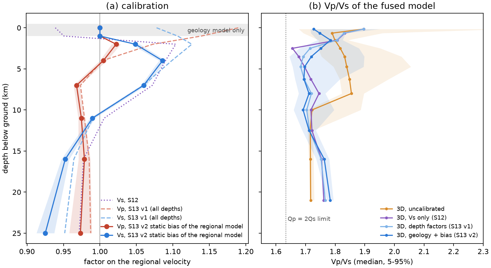
<figcaption><b>Figure 7.</b> (a) Static correction of the regional Vp and Vs (solid, with ±1 standard deviation); dashed and dotted lines are the two earlier calibrations described in the text. The grey band is the geology-only zone. (b) Median and 5–95% range of Vp/Vs of the fused model against depth below ground, before and after each calibration.</figcaption></figure>

<figure>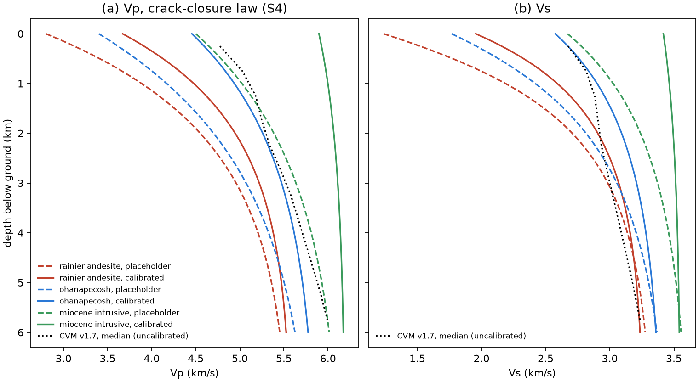
<figcaption><b>Figure 8.</b> Crack-closure Vp (a) and Vs (b) against depth below ground for three rock units, with placeholder (dashed) and calibrated (solid) parameters. Dotted: median of the uncalibrated Cascadia velocity model over the domain.</figcaption></figure>

Two earlier calibrations led to this one. The first (script S12) held the catalogue hypocentres fixed and changed only Vs. It pushed Vp/Vs to 1.60–1.67 at 2–4 km, low for crustal rock and lower still than expected beneath a volcano with a hydrothermal system. The second applied depth factors to the regional Vp and Vs at all depths, with relocation. It showed that relocation alone does not remove the S misfit, and that Vp had to rise 7–19% in the top 2 km. The fusion keeps the geology model there, so that rise belongs to the geology's rock physics. That is why the geology is fitted, and why the regional correction starts at 1 km.

### 8.4 Validation

**Held-out events.** On the 44 events not used in the fit, relocated in each model, the RMS falls from 0.121 to 0.093 s for P and from 0.317 to 0.188 s for S. The fitting half ends at 0.097 and 0.192 s, so there is no sign of overfitting.

**All models scored the same way.** Table 7 relocates all 88 events in each model with the same locator and topography.

| Model | P RMS (s) | S RMS (s) | Epicentre shift from ComCat, median (m) | Depth shift, median (m) |
|---|---|---|---|---|
| PNSN 1D | 0.132 | 0.268 | 1157 | +511 |
| 3D, uncalibrated | 0.122 | 0.316 | 1285 | +257 |
| 3D, Vs only (first calibration)¹ | 0.102 | 0.190 | 847 | +306 |
| 3D, calibrated (Section 8.3)¹ | 0.095 | 0.190 | 856 | +852 |

<p class="note">Table 7. Residuals after relocation (script S14, <code>outputs/relocation/&lt;model&gt;/stats.json</code>). Depth shifts are relocated minus ComCat, positive deeper. ¹ Fitted on these events; the held-out scores above are the fair measure.</p>

Relocation alone does not rescue the uncalibrated model: its S residuals stay larger than those of the 1D model. The S−P misfit therefore lies in the velocity model, not in the catalogue hypocentres.

<figure>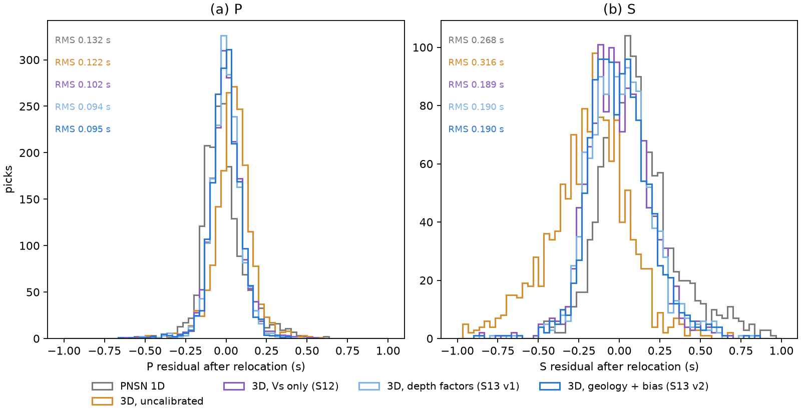
<figcaption><b>Figure 9.</b> P (a) and S (b) residuals after relocating all events in each model; the RMS of each model is printed in its colour.</figcaption></figure>

**Independent tomography.** The iMUSH project imaged Vp and Vs around Mount St. Helens from local earthquakes and explosions recorded by a 70-station array (Ulberg et al., 2020). The model is distributed by the Incorporated Research Institutions for Seismology Earth Model Collaboration.

- **Coverage.** Its grid spans our whole domain. Its Vp is resolved over 82–90% of the domain, and its Vs over 83–93% of the southern strip (south of 46.65°N) but only 11–19% of the northern half (north of 46.75°N).
- **Sampling.** Script S21 samples our models at the 51,300 resolved nodes below ground; the model's depths are below sea level.

| Depth below ground (km) | 1–2 | 2–3 | 3–4 | 4–6 | 6–8 | 11–15 | 15–20 |
|---|---|---|---|---|---|---|---|
| Vs, Cascadia/CRESCENT as distributed | +0.084 | +0.073 | +0.064 | +0.055 | +0.046 | −0.030 | −0.035 |
| Vs, with the correction of Table 6 | +0.061 | +0.016 | −0.010 | −0.019 | −0.009 | −0.005 | +0.017 |
| Vp/Vs, iMUSH | 1.770 | 1.759 | 1.754 | 1.757 | 1.755 | 1.744 | 1.765 |
| Vp/Vs, Cascadia/CRESCENT | 1.810 | 1.828 | 1.850 | 1.851 | 1.851 | 1.720 | 1.723 |
| Vp/Vs, rainier3d calibrated | 1.794 | 1.767 | 1.736 | 1.705 | 1.705 | 1.720 | 1.772 |

<p class="note">Table 8. North of 46.75°N (Rainier): mean ln(V<sub>iMUSH</sub>/V<sub>model</sub>) for Vs and median Vp/Vs, from <code>outputs/model_comparison/ulberg2020_by_depth.csv</code> (script S21).</p>

- **Beneath Rainier the correction is confirmed.** The iMUSH model finds the Cascadia velocity model's Vs 5–8% too slow at 1–8 km and 3–4% too fast at 11–20 km, the shape of Table 6. With the correction, the difference in Vs falls to 2% or less below 2 km. Vp/Vs moves from 1.83–1.85 towards the iMUSH value of 1.75–1.77.
- **Our Vp/Vs at 4–8 km is slightly too low.** It is 1.705, about 0.05 below the iMUSH value.
- **South of 46.65°N, inside the iMUSH array, the correction does not hold.** There the iMUSH Vs is within 1–2% of the Cascadia velocity model at 1–6 km, and the correction makes our Vs 5–7% too fast. The correction is local to Rainier; the next version should let it vary laterally.
- **The check is only partly independent.** Both studies use PNSN arrivals from 2015–2016. The iMUSH-only stations and the explosions make the comparison largely independent in the south, less so in the north.

<figure>
<figcaption><b>Figure 10.</b> rainier3d and the regional models against the iMUSH tomography (Ulberg et al., 2020). (a, b) Mean ln(V<sub>iMUSH</sub>/V<sub>model</sub>) against depth below ground, over the domain (solid) and north of 46.75°N (dotted). (c) Median Vp/Vs where the iMUSH matched P and S models are both resolved.</figcaption></figure>

**Catalogue hypocentres.** For continuity with the first version, script S6 scores the calibrated model at the ComCat hypocentres.

| Phase | RMS, 1D (s) | RMS, 3D (s) | RMS, 1D, event mean removed (s) | RMS, 3D, event mean removed (s) | PNSN reported RMS (s) | Correlation of station terms |
|---|---|---|---|---|---|---|
| P | 0.200 | 0.284 | 0.159 | 0.132 | 0.140 | 0.67 (50 stations) |
| S | 0.429 | 0.326 | 0.287 | 0.227 | 0.227 | 0.67 (45 stations) |

<p class="note">Table 9. Residuals at the ComCat hypocentres (script S6, <code>outputs/pnsn_report.txt</code>). The last column is the correlation, across stations, between the mean 1D residual and the mean 3D − 1D predicted delay.</p>

At these hypocentres the 3D model predicts later arrivals than the 1D model at every station: by 0.30 s on average for P (0.13–0.62 s) and 0.48 s for S (0.19–0.78 s). That offset inflates the raw RMS. It is expected, because the hypocentres were located in the 1D model; relocated, the 3D model fits better than the 1D model (Table 7). The per-station 3D − 1D delay correlates with the mean 1D residual (Figure 11b), so the 3D structure explains part of what station corrections absorb.

<figure>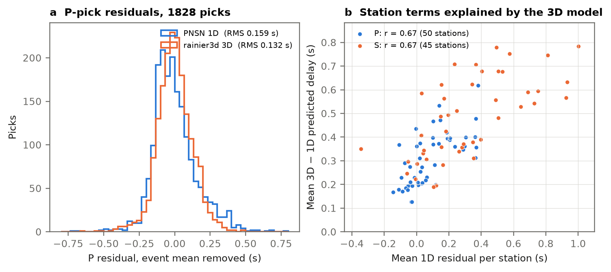
<figcaption><b>Figure 11.</b> At the ComCat hypocentres: (a) distribution of P residuals after removing each event's mean, for the PNSN 1D model and the fused model; (b) mean 3D − 1D predicted delay against mean 1D residual for each station with at least five picks.</figcaption></figure>

### 8.5 What the calibration does not settle

- **The top 300 m.** Our calibrated rock is 21% faster in Vp and 30% faster in Vs than the near-surface layer of the Cascadia velocity model. The arrivals constrain it only directly beneath the stations. Vs30 and near-surface Vs from the 2025 nodes and the fiber, or station terms estimated with a prior on their size, can settle it. If they side with the regional model, the weathered and unconsolidated layers need thickening rather than the rock slowing.
- **Station terms** were not estimated. Site effects may partly project onto V₀.
- **The PNSN 1D reference.** Which PNSN regional model (P3 or C3) the one-dimensional table represents has not been confirmed with the network. ComCat depths are treated as depths below sea level; this matters only for the starting point of the location.

## 9. Extracting the fused model for ray tracing

The master product is `data/processed/model.zarr`, an xarray DataTree with one node per level. Ray tracers need a single regular grid, so script S9 resamples the three levels onto one and writes three formats (Table 10).

In the resampling, values are interpolated linearly within each level. Cells above the ground surface are filled with the value of the first rock cell beneath them, so receivers placed at the surface sit in rock, and a mask variable `air` flags those cells. The exporter was checked against the stored levels: at level cell centres the grid reproduces `model.zarr` exactly, and the NonLinLoc buffers read back to the same velocities.

| File | Format | Coordinates | Variables | Use |
|---|---|---|---|---|
| `rainier3d_fused_500m.nc` | CF netCDF4 | UTM 10N x, y (m); z = elevation (m, up) | vp, vs (m/s), rho (kg/m³), qp, qs, air, surface_elevation | pykonal, fteikpy, custom codes |
| `nll/rainier3d.{P,S}.mod.hdr/.buf` | NonLinLoc 3D grid, SLOW_LEN, float32 | x, y in UTM 10N km; depth (km, down, below sea level); TRANSFORM NONE | slowness × cell size | Grid2Time, NLLoc |
| `rainier3d_emc.nc` | EMC-style netCDF3 | longitude, latitude; depth (km below sea level) | vp, vs (km/s), rho (g/cm³); NaN above ground | IRIS/EarthScope EMC tools, comparison with other models |

<p class="note">Table 10. Exports written by <code>pixi run s9</code> to <code>outputs/grids/</code>. The default spacing is 500 m in all directions (140 × 150 × 49 nodes, 4.25 km above to 19.75 km below sea level); <code>--dx</code> and <code>--dz</code> change it.</p>

To build the model and the exports from a clean checkout:

```
pixi install
pixi run all            # S1-S8: surface, layers, geology, rock physics, fusion, PNSN check, figures, atlas
pixi run s9 -- --dx 250 --dz 250   # uniform grids at 250 m
```

Travel times with pykonal (White et al., 2020), the solver used in Section 8, from the netCDF export:

```python
import numpy as np, xarray as xr, pykonal
from scipy.interpolate import RegularGridInterpolator

g = xr.open_dataset("outputs/grids/rainier3d_fused_500m.nc")
dx = float(g.attrs["dx_m"])                                  # 500 m, equal to dz
vel = np.transpose(g.vp.values, (2, 1, 0))                  # (x, y, depth down) in m/s
x, y, depth = g.x.values, g.y.values, -g.z.values            # z runs top-down
s = pykonal.solver.PointSourceSolver(coord_sys="cartesian")
s.velocity.min_coords = x[0], y[0], depth[0]
s.velocity.node_intervals = dx, dx, dx
s.velocity.npts = vel.shape
s.velocity.values = vel
s.src_loc = np.array([594500.0, 5189500.0, -1500.0])         # easting, northing, depth b.s.l. (m)
s.solve()
T = RegularGridInterpolator((x, y, depth), s.traveltime.values)
print(T([[604500.0, 5189500.0, 5000.0]]))                    # 2.05 s to 5 km depth, 10 km east
```

The same grids work with fteikpy (`Eikonal3D` with the velocity transposed to depth, x, y); on this ray it gives 2.08 s. `docs/eikonal_benchmark.md` compares the solvers against analytic travel times.

For NonLinLoc, the grids go in the model directory used by Grid2Time (`GTFILES <model dir>/rainier3d <time dir>/rainier3d P`). Because the transform is `NONE`, station and search-grid coordinates must be given in the same UTM 10N kilometre frame, with depth positive down (`GTSRCE <sta> XYZ <x_km> <y_km> <z_km> 0.0`). The grids have been read back and checked, but a full NonLinLoc relocation has not yet been run with them. Section 8.2 relocates the PNSN events with pykonal fields and a Python locator instead (script S14).

### 9.1 Locating earthquakes in 3D, so that none sits above the ground

Of the 15,660 PNSN earthquakes since 1980 drawn in the 3D viewer, 500 have ComCat hypocentres at or above the ground surface. These are mostly shallow edifice events. They were located in one-dimensional models that know neither the topography nor the slow edifice, and whose depths are measured from a single reference elevation, with station elevations absorbed into station corrections. Locating in the three-dimensional model, with the search restricted to the rock, removes the problem at its source.

NonLinLoc (Lomax et al., github.com/alomax/NonLinLoc, GPL-3) builds from source with CMake in about a minute on macOS, and it reads the S9 grids as written. For station UW/CC OBSR (OBSR is in the CC network), its Grid2Time P times agree with the pykonal times of Section 8 at the 85 events that station recorded: mean difference 12 ms, RMS 31 ms. NonLinLoc is not on conda-forge and is licensed separately, so it is used here as an external program.

The recipe:

- **Grid spacing.** NonLinLoc needs equal horizontal and vertical spacing. Use 250 m near the edifice (`pixi run s9 -- --dx 250 --dz 250`) or keep the 500 m default for the WRSZ.
- **Keep hypocentres out of the air.** Use NLLoc's `LOCTOPO_SURFACE`, which masks the search volume below a topography grid, and leave the velocities as exported: air cells carry the rock velocity below them, so travel times are unbiased. The alternative, slow air above a rock skin (`--nll-air-velocity 330`), needs a skin of at least two cells. With one 500 m cell, Grid2Time's finite-difference start box reached slow air around summit stations and delayed OBSR's P times by 0.41 s on average. The topography mask has not yet been tested with the UTM (`TRANS NONE`) grids.
- **Stations.** Give stations in the same UTM 10N kilometre frame, with depth = −elevation/1000: `GTSRCE <sta> XYZ <x_km> <y_km> <−elev_km> 0.0`. No station corrections are needed to start with.
- **Travel times.** Run `Grid2Time` with the finite-difference solver (`GTMODE GRID3D ANGLES_NO`, `GT_PLFD 1.0e-3 0`) for each phase and station.
- **Location.** Run `NLLoc` with the equal-differential-time likelihood (`LOCMETH EDT_OT_WT 9999.0 4 -1 -1 -1 -1 0 1`) and the oct-tree search, over a search grid from −4.5 km (above the highest station) to 20 km depth. Give model errors that grow with travel time (`LOCGAU 0.1 0.0`, `LOCGAU2 0.02 0.05 0.5`), and export picks with ObsPy (`write(format="NLLOC_OBS")`).
- **Depths.** Report depths below sea level, as NonLinLoc does. Depth below the local ground follows from `surface_elevation` in the netCDF export.

To sample the stored levels directly, open the DataTree:

```python
import xarray as xr
tree = xr.open_datatree("data/processed/model.zarr", engine="zarr", consolidated=False)
L2 = tree["L2"].to_dataset()          # 0 to -6 km, 500 m x 250 m cells
vs = L2.vs.interp(x=594500, y=5189500, z=-2000)   # m/s at 2 km below sea level
```

The 3D viewer (https://denolle-lab.github.io/mt-rainier-digital-model/) shows Vs, Vp, Vp/Vs, density and model units below the ground. It draws them on a vertical section along the terrain cut and on a horizontal depth slice, together with the stations and seismicity. The older map atlas (`pixi run atlas`) draws sections along any line.

## 10. Surface layers: soil, water, vegetation and imagery

The model's surface node carries eight environmental layers on the 100 m surface grid, next to elevation, units and ice (Table 11, Figure 12). Script S2 reads each source only over the model box (a window of a cloud-optimised GeoTIFF, a clipped download or an OPeNDAP subset), resamples it onto the grid and records its source. Continuous layers are averaged over each cell, and categorical layers take the most common class. The layers describe the ground surface; none of them changes the seismic properties yet.

| Layer | Source | Native resolution | Median (5th–95th percentile) over the box |
|---|---|---|---|
| Soil thickness | SOLUS100 depth to a lithic contact (Nauman et al., 2024) | 100 m | 1.41 m (0.54–1.97 m) |
| Water-table depth | Random-forest estimate for the conterminous US (Ma et al., 2026) | about 24 m | 10.1 m (4.8–20.4 m) |
| Water-table depth, for comparison | Global groundwater model (Fan et al., 2017) | 30″ (about 1 km) | 23 m (0–306 m) |
| Streams | NHDPlus High Resolution, 60,174 flowlines, Strahler orders 1–8, with mean annual flow | 1:24,000 | – |
| Canopy height | ETH global canopy height 2020 (Lang et al., 2023) | 10 m | 30 m (9–45 m) |
| Land cover | NLCD 2021 | 30 m | evergreen forest in 72.5% of cells |
| NDVI | Sentinel-2 L2A median composite, 1 August to 30 September 2025 | 20 m | 0.85 (0.26–0.92) |
| NDSI | same composite | 20 m | −0.48 (−0.60 to −0.24) |

<p class="note">Table 11. Environmental surface layers (script S2). Percentiles are over the cells of the box.</p>

A few notes on the individual layers:

- **Soil thickness.** SOLUS100 predicts soil depth only to 2.01 m. That value is its upper limit and is read as "at least 2 m".
- **Water table.** The two estimates differ in level and in pattern. Ma et al. (2026) keep the water table within about 20 m of the ground almost everywhere. Fan et al. (2017) place it hundreds of metres down under ridges. For the shallow model, the choice matters more than either value. The Ma et al. (2026) grid is used under its CC-BY-NC-ND licence for non-commercial research and is not redistributed; its uncertainty layer is served through HydroGEN and was not retrieved.
- **Imagery.** The Sentinel-2 composite follows the recipe of the Gaia Hazlab bedload study ([seis-hydro-2-sed](https://github.com/gaia-hazlab/seis-hydro-2-sed)):
    - the least-cloudy scenes (at most 25% cloud) are used, up to six per Sentinel-2 tile, so every part of the box is covered;
    - the scene classification keeps vegetation, bare soil, water, snow and unclassified pixels;
    - the median is taken per pixel.

    One correction is needed that the true-colour images did not require. Since processing baseline 04.00 (January 2022), Level-2A reflectance is stored with a +1000 offset, which neither the Planetary Computer nor Earth Search removes. Without the correction, median NDVI over this forest was 0.46 instead of 0.85.
- **Snow and ice.** Late in the 2025 melt season, NDSI above 0.4 covers 66 km². For comparison, the Randolph Glacier Inventory (about 2000) outlines 97 km² of glaciers. The difference is consistent with debris-covered glacier tongues (Carbon, Emmons, Winthrop), which read as rock in NDSI, and with 25 years of retreat.

<figure>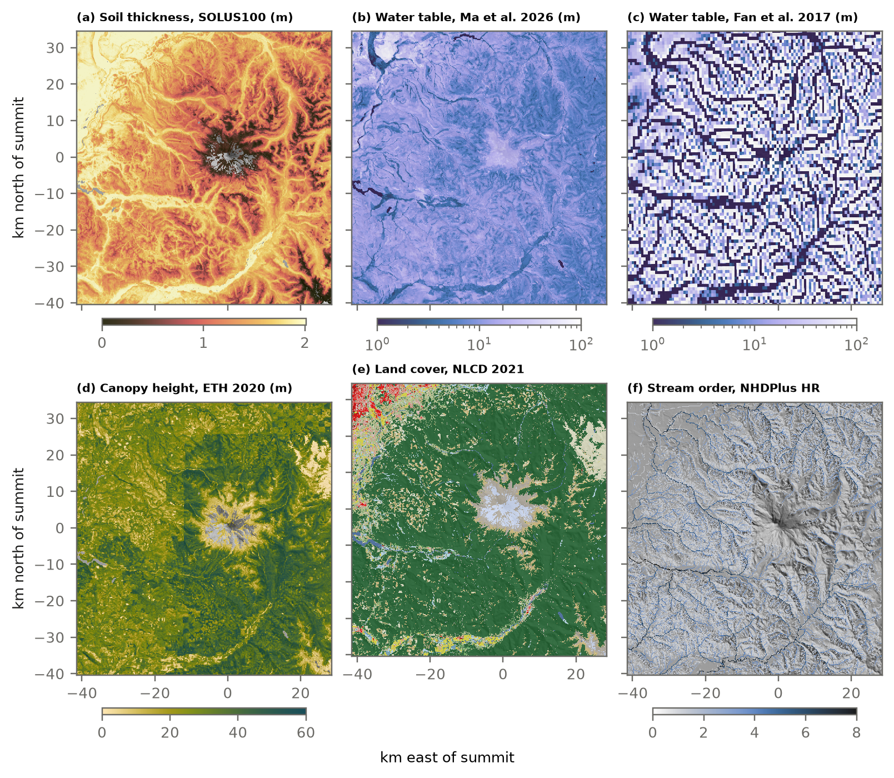
<figcaption><b>Figure 12.</b> Environmental surface layers on the model grid, over a hillshade: (a) soil thickness, (b, c) water-table depth from two estimates on the same logarithmic scale, (d) canopy height, (e) land cover, (f) Strahler order of the NHDPlus HR flowlines. A rectangular step in (d) near 12 km west and 20 km north of the summit comes from the canopy product itself.</figcaption></figure>

The model still has no hydrological state, and there are no aquifer maps for the park. The groundwater study of the upper White River (Fuhrig et al., 2024) is the only park-scale assessment found. These layers are the inputs needed to change that. A water table would separate dry from saturated cells in Gassmann-type fluid substitution, raising Vp and Vp/Vs below it. Valley fill along the mapped streams would appear as slow, high-Vp/Vs bodies. And the hydrothermal system described by Frank (1995) would add a fluid-saturated core to the alteration field.

## 11. Limitations and next steps

The structure of the model is in place, but its values should not yet be used as a published velocity model. The main limitations and the planned remedies are:

- **Rock-physics parameters.** The unit parameters in Table 3 are placeholders, scaled by three multipliers calibrated on travel times (Section 8.3), of which only V₀ is resolved. The perturbation factors and the Q rule are still placeholders. All will be replaced by a table extracted from laboratory and field measurements on Cascade and analogue volcanic rocks (for example, Watters et al., 2000; Heap & Violay, 2021), which the calibrated V₀ can then test.
- **Geometry by rules.** Contacts are vertical and unit bases are flat. Structural modelling from the map contacts and the GeMS orientation measurements is the next step.
- **Placeholder bodies.** The magma body and the alteration field are placeholders. Alteration will be constrained by the helicopter electromagnetic and magnetic data of Rystrom et al. (2000) and Finn et al. (2001). The Southern Washington Cascades Conductor (Stanley et al., 1996) is not yet represented.
- **Fusion cutoffs.** The cutoff wavelengths are not yet tied to the resolution of the regional models. All levels now meet the misfit target (Table 4).
- **Regional model below 9.9 km.** Below this depth the regional model is CRESCENT Vs with Brocher's Vp only; the deep level of the Cascadia velocity model has still to be added.
- **Resolution.** The M1 grids are coarse (L1 is 250 m × 50 m), and thin deposit layers fall below the cell size.
- **Calibration.** The correction of the regional models is one depth profile for the whole domain; the iMUSH comparison shows it holds beneath Rainier but overcorrects Vs by 5–7% in the south (Section 8.4), so it should vary laterally. The geology multipliers are global rather than per lithology, station terms are not estimated, and the 88 events leave the deepest knots weakly constrained. The PNSN AI-ready pick dataset (Ni et al., 2023), the 2025 nodes and the Rainier-specific models of Obrebski et al. (2015) and Flinders & Shen (2017) will extend it.
- **Water table and imagery.** The Ma et al. (2026) uncertainty layer requires a HydroGEN account and was not retrieved. The Sentinel-2 composite covers one late-summer window. The surface layers do not yet change the seismic properties.
- **Glaciers.** IceBoost exceeds the 1981 radar thicknesses on Emmons and Winthrop glaciers. Its total should be compared with the lidar-based ice volume of Sisson et al. (2011).

## 12. Acknowledgements

This material is based upon work supported by the U.S. National Science Foundation under Grant Nos. OAC-2608509, OAC-2608510 and OAC-2608511, the Fund for Future Science and Technology, and the Jerome and Linda Paros Geohazard Center. Any opinions, findings, and conclusions or recommendations expressed in this material are those of the author(s) and do not necessarily reflect the views of the National Science Foundation.

We thank the analysts of the Pacific Northwest Seismic Network, whose picks are the data of Section 8, and the teams that make the other data sets open:

- the U.S. Geological Survey, for 3DEP, NHDPlus HR, ComCat, NLCD and the Cascadia velocity model;
- the Washington Geological Survey, for the geologic map;
- the CRESCENT project, the OGGM and IceBoost teams, and the Randolph Glacier Inventory;
- the iMUSH project, for its tomography (Ulberg et al., 2020), distributed through the EarthScope Earth Model Collaboration;
- the USDA SOLUS project;
- the HydroGEN group, for the water-table estimates of Ma et al. (2026);
- the ETH EcoVision lab, for canopy height;
- the European Space Agency, for Copernicus Sentinel-2, served by the Microsoft Planetary Computer;
- EarthScope, for station metadata.

The Sentinel-2 recipe comes from the Gaia Hazlab seis-hydro-2-sed project.

**Author contributions.** M.D. designed the model and the validation and directed the work. D.Y. designed and built the three-dimensional viewer (rainier-seismic-atlas) that displays the model's surface layers and imagery on the terrain with the seismic network and seismicity.

## 13. Data and code availability

The code, configuration and this report are in the repository [Denolle-Lab/mt-rainier-digital-model](https://github.com/Denolle-Lab/mt-rainier-digital-model) (BSD-3-Clause). The environment is managed with pixi, and each result in this report is regenerated by the scripts named in the text (S1–S16 and S21). The calibration and its validation are described in more detail, with the source of every number, in `docs/joint_calibration.md`. The data sets are public and are listed in Appendix A with their DOIs or service addresses.

The three-dimensional viewer by Derek Yao (MIT licence, originally [yaoderek/rainier-seismic-atlas](https://github.com/yaoderek/rainier-seismic-atlas)) is in `web/viewer/` and is published at [denolle-lab.github.io/mt-rainier-digital-model](https://denolle-lab.github.io/mt-rainier-digital-model/). Script S11 writes the model layers it displays.

The Cascadia velocity model v1.7 must be downloaded by hand from ScienceBase. The model files will be archived with a DOI once the rock-physics parameters are sourced.

<div class="note" markdown="1">
The model code and this report were prepared with an AI coding assistant (Claude, Anthropic) under the direction of the authors. All numbers are produced by the scripts in the repository, and all DOIs were resolved against the Crossref and DataCite registries on 23 and 24 September 2026.
</div>

## Appendix A. Data sets

| Data set | Role in the model | DOI or address |
|---|---|---|
| Cascadia velocity model v1.7 (Wirth et al., 2025) | regional Vp and Vs to 9.9 km | [10.3133/ofr20251045](https://doi.org/10.3133/ofr20251045); data [10.5066/P14HJ3IC](https://doi.org/10.5066/P14HJ3IC) |
| CRESCENT Gen0 community velocity model (He et al., 2026) | regional Vs below 9.9 km | [10.1029/2025JB033216](https://doi.org/10.1029/2025JB033216); data [10.6084/m9.figshare.31902061](https://doi.org/10.6084/m9.figshare.31902061) |
| Washington 1:100,000 surface geology (GeMS) | surface units | [feature service](https://gis.dnr.wa.gov/site1/rest/services/Public_Geology/100K_Surface_Geology_WA_GeMS/FeatureServer) |
| Geology of Mount Rainier National Park (Fiske et al., 1963) | stratigraphy; map overlay | [10.3133/pp444](https://doi.org/10.3133/pp444) |
| USGS 3D Elevation Program | elevation | [usgs.gov/3d-elevation-program](https://www.usgs.gov/3d-elevation-program) |
| IceBoost v2 per-glacier thickness | ice thickness | [OGGM data server](https://cluster.klima.uni-bremen.de/~oggm/ice_thickness/iceboost_v2/) |
| Randolph Glacier Inventory 6.0 | glacier identifiers | [10.7265/N5-RGI-60](https://doi.org/10.7265/N5-RGI-60) |
| GlaThiDa (WGMS, 2020); Driedger & Kennard (1986) | glacier thickness check | [10.5904/wgms-glathida-2020-10](https://doi.org/10.5904/wgms-glathida-2020-10); [10.3133/pp1365](https://doi.org/10.3133/pp1365) |
| iMUSH local-earthquake Vp and Vs tomography (Ulberg et al., 2020) | independent check of the calibration | [10.17611/dp/emc.2020.imushloceq.1](https://doi.org/10.17611/dp/emc.2020.imushloceq.1); article [10.1029/2019GC008888](https://doi.org/10.1029/2019GC008888) |
| PNSN origins and phase data (USGS ComCat) | calibration and travel-time check | [earthquake.usgs.gov/fdsnws/event/1](https://earthquake.usgs.gov/fdsnws/event/1/) |
| EarthScope FDSN station metadata | station coordinates, sensor inventory | [service.earthscope.org/fdsnws/station/1](https://service.earthscope.org/fdsnws/station/1/) |
| PNSN regional 1D models | 1D reference | [PNSN Quarterly Report 2003-A](https://assets.pnsn.org/legacy_reports/Sum03/Quarterly2003A.pdf) |
| SOLUS100 soil properties (Nauman et al., 2024) | soil thickness | [10.15482/USDA.ADC/25033856](https://doi.org/10.15482/USDA.ADC/25033856) |
| US water-table depth, 30 m (Ma et al., 2026) | water-table depth | [10.5281/zenodo.18504963](https://doi.org/10.5281/zenodo.18504963) |
| Global water-table depth (Fan et al., 2017) | water-table depth, 1 km comparison | [GLOBALWTD server](http://thredds-gfnl.usc.es/thredds/catalog/GLOBALWTDFTP/annualmeans/catalog.html) |
| NHDPlus High Resolution | streams, order, mean annual flow | [staged geodatabases](https://prd-tnm.s3.amazonaws.com/StagedProducts/Hydrography/NHDPlusHR/Beta/GDB/) |
| ETH global canopy height 2020 (Lang et al., 2023) | canopy height | [10.3929/ethz-b-000609802](https://doi.org/10.3929/ethz-b-000609802) |
| NLCD 2021 land cover | land cover | [mrlc.gov/data](https://www.mrlc.gov/data) |
| Copernicus Sentinel-2 L2A | imagery, NDVI, NDSI | [Planetary Computer](https://planetarycomputer.microsoft.com/dataset/sentinel-2-l2a) |

## References

{{REFERENCES}}

<footer>rainier3d M1 · M. Denolle and D. Yao · Gaia Hazlab, University of Washington · Generated by <code>scripts/10_report.py</code> on 24 September 2026.</footer>
